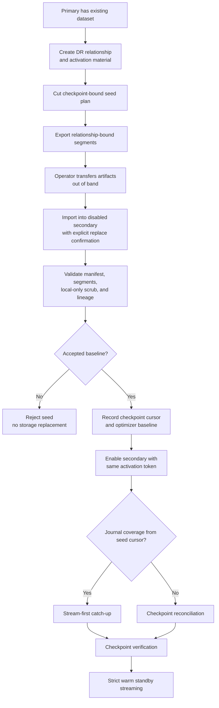

# DR Replication Pre-Seed and Resnapshot Design

This note contains the large-dataset base-copy lifecycle for native DR
replication. The top-level RFC is [RFC_DR_Replication.md](RFC_DR_Replication.md)
and protocol mechanics live in [DR_PROTOCOL_DESIGN.md](DR_PROTOCOL_DESIGN.md).

## Scope

Resnapshot and pre-seed are recovery and bootstrap paths for cases where a
secondary cannot cheaply converge from the stream journal.

- **Resnapshot** is online and protocol driven. The secondary replaces its
  replicated data plane by fetching checkpoint-scoped entries from the primary.
- **Pre-seed** is operator assisted. The primary creates relationship-bound
  checkpoint artifacts, the operator restores them into a disabled secondary,
  and the secondary then catches up through normal stream replay or checkpoint
  reconciliation.

Both paths preserve the same correctness boundary as normal reconciliation:
relationship authorization, checkpoint tuple binding, proof-before-delete,
local-only path exclusion, stale-lineage rejection, and promotion checks.

## Why This Exists

An old primary can have millions or billions of physical entries before DR is
enabled. A fresh secondary should not always have to pull that entire dataset
through ordinary reconcile RPCs. Pre-seed gives operators a way to move the
large base copy through a storage-appropriate artifact channel, then use DR for
the remaining delta and final proof.

This is a scale optimization, not a separate authority model. The primary
checkpoint and relationship material remain the authority for the seed.

## Lifecycle

The seed should be generated after relationship creation. A raw backup captured
before relationship creation can pre-populate bytes, but it cannot safely seed
KID/VID optimizer state because the relationship ID, replication salt, and
lineage binding are not known.

## Resnapshot

Resnapshot is the simpler online fallback. The secondary discards the
replicated data plane, fetches a checkpoint-scoped copy from the primary,
validates completeness, preserves local-only paths, then returns to streaming.

It is appropriate when:

- the dataset is small enough for online transfer;
- reconciliation is repeatedly budget-exhausted;
- optimizer state is missing or invalid and a clean base copy is cheaper than
  repair; or
- the operator wants a fresh base from the current authority.

Resnapshot must invalidate any optimizer state before non-atomic replacement.
If the process crashes mid-repair, restart cannot trust stale accumulator or
local KID-index metadata for partially repaired storage.

## Pre-Seed Authority Boundary

The seed manifest must bind:

- primary cluster ID and relationship ID
- checkpoint ID, checkpoint commit index, and checkpoint creation time
- projection parameters: replication salt identity, range version, range bits,
  checksum/digest algorithm versions, and local-only exclusion version
- artifact format version
- segment descriptors or full-bundle integrity hash
- replicated-path coverage metadata and local-only scrub version
- optional optimizer metadata version and seed cursor
- expiration or stale-seed acknowledgement policy
- signed provenance or equivalent primary-authorized proof in the production
  shape

Pre-seed validation fails closed if the manifest does not match the activation
token, primary identity, checkpoint tuple, artifact format, projection
versions, local-only exclusion version, or current lineage. Seed material from
stale pre-promotion lineage must be rejected.

## Artifact Formats

The prototype keeps two artifact boundaries:

- `inline-json-v1`: useful for PoC lifecycle validation and small fixtures.
- `segmented-json-v1`: production-shaped metadata with deterministic segment
  descriptors and resumable secondary staging.

Each segment descriptor carries:

- ordinal
- entry count
- canonical payload byte count
- SHA-256 digest
- lower and upper key bounds

Bundle validation recomputes descriptors from the canonical sorted
KID/VID/value-hash projection and rejects stale or tampered segment metadata.
The segmented path exports individual checkpoint-bound segments from checkpoint
artifact storage instead of rebuilding the full bundle for each request.

## Endpoint Surface

The prototype exposes this lifecycle:

- `sys/replication/dr/primary/preseed/manifest`
- `sys/replication/dr/primary/preseed/export`
- `sys/replication/dr/primary/preseed/export-plan`
- `sys/replication/dr/primary/preseed/export-plan-status`
- `sys/replication/dr/primary/preseed/export-segment`
- `sys/replication/dr/secondary/preseed/accept`
- `sys/replication/dr/secondary/preseed/import`
- `sys/replication/dr/secondary/preseed/import-begin`
- `sys/replication/dr/secondary/preseed/import-segment`
- `sys/replication/dr/secondary/preseed/import-complete`
- `sys/replication/dr/secondary/enable`

The production direction is to keep this first-class API surface, but move
large transfer bytes to external artifact storage or streaming segment
retrieval with signed provenance.

## Secondary Import and Enable

Import is allowed only while the secondary is disabled. It requires explicit
operator confirmation before replacing replicated storage. Local-only paths are
preserved or scrubbed according to the manifest's exclusion version.

Segmented import is durable:

1. `import-begin` validates the manifest and creates local staging.
2. `import-segment` validates and stores one segment. Retrying the same segment
   is idempotent.
3. `import-complete` verifies every segment, validates the reassembled bundle,
   replaces replicated storage, and records the accepted baseline.

`secondary/enable` consumes the accepted baseline only when the same activation
token is used. It applies the checkpoint high-water mark and durable stream
cursor/optimizer baseline before starting normal catch-up. If the process
crashes after secondary config is persisted but before the baseline is
consumed, config restore applies the accepted baseline before starting the
secondary controller.

## Catch-Up After Import

After a seed is accepted, the secondary first tries stream replay from the seed
checkpoint cursor. If the primary still retains journal or buffer coverage,
catch-up can avoid reconciliation entirely. If coverage is gone, the existing
stream failure path falls back to checkpoint reconciliation.

This makes pre-seed compatible with adversarial writes during seed transfer:
the seed is a base checkpoint, not a freeze of the primary.

## Optimizer Seeding

The clean production path should seed the flat accumulator and local KID-index
metadata from verified checkpoint/manifest state instead of forcing a post-seed
local scan. The prototype records the baseline cursor and can stay scan-free
when journal catch-up covers the post-seed delta.

Optimizer metadata remains non-authoritative. If relationship, cluster,
lineage, range version, algorithm, snapshot, delta, or bucket proofs fail, the
secondary falls back to scan/reconcile instead of committing convergence from
optimizer state alone.

## Current Evidence

The current local evidence includes:

- segmented single-node pre-seed smoke;
- HA pre-seed with post-accept primary and secondary active handoff;
- fixture-backed 100k pre-seed with 20k post-export writes and stream-first
  catch-up; and
- Go-harness parity for the HA pre-seed path.

The curated run index is [DR_VALIDATION_RESULTS.md](DR_VALIDATION_RESULTS.md).
Open production work is tracked in [DR_OPEN_WORK.md](DR_OPEN_WORK.md).
