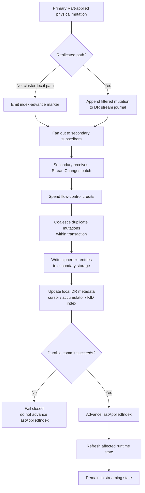
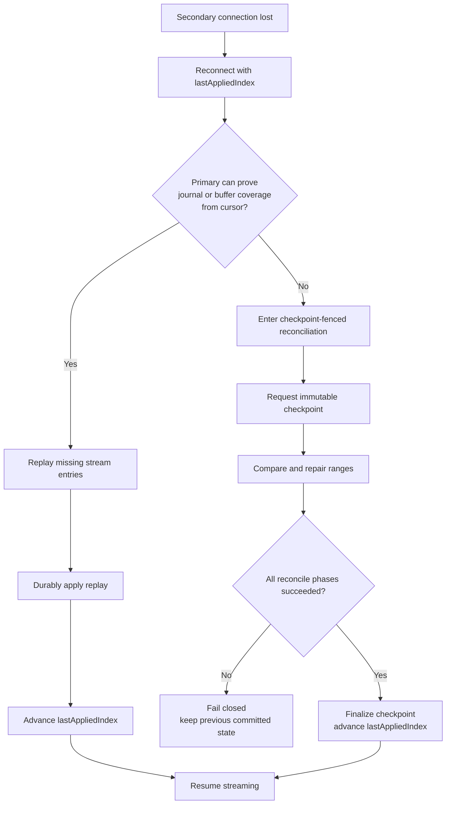
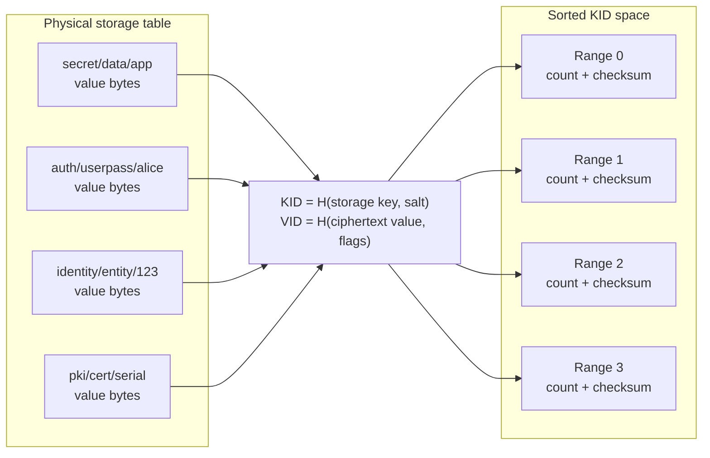
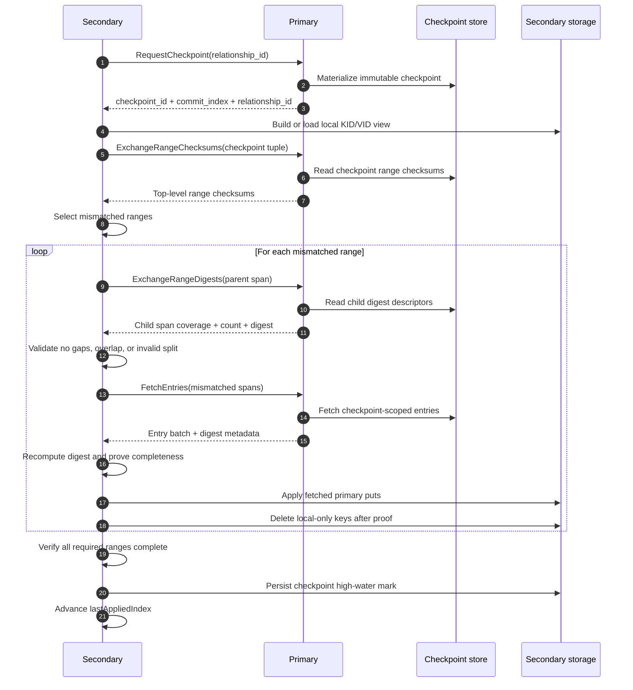
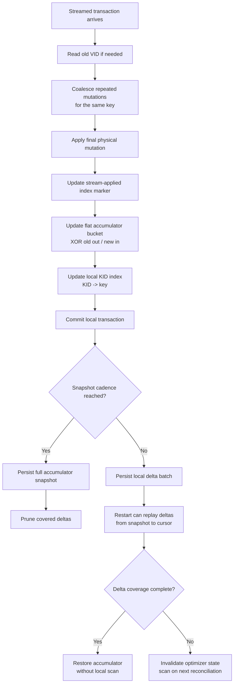

# DR Replication Protocol Design

This note contains the data-plane and reconciliation design for native DR
replication. The top-level RFC is [RFC_DR_Replication.md](RFC_DR_Replication.md).

## Scope

The initial protocol target is integrated-storage/Raft-backed OpenBao clusters.
The design assumes:

- ordered primary physical mutation indexes
- durable secondary apply
- local transaction support for replicated writes plus DR-local metadata
- a primary that is trusted as the data authority for its active relationships
- an untrusted network protected by mTLS and relationship authorization

Other storage backends are future work unless they can provide equivalent
ordering, replay, and transaction boundaries.

## Steady Streaming

The normal path is ordered physical mutation streaming:

```text
primary Raft-applied physical changes
  -> filter cluster-local paths
  -> append to DR stream journal
  -> active primary fans out batches to secondary subscribers
  -> secondary writes ciphertext bytes to local physical storage
  -> secondary advances lastAppliedIndex after durable apply
```

The primary has two replay horizons:

- an in-memory ring buffer for short reconnects
- a disk-backed stream journal for longer reconnects and HA leader handoff

Primary HA followers append the filtered stream journal as they apply Raft
entries. After leadership moves, the new active primary can replay journal
coverage even if its in-memory stream buffer is empty.

Flow control is credit-based. The secondary opens `StreamChanges` with its
current `lastAppliedIndex` and initial window. The primary sends only while
credits are available. The secondary replenishes credits after durable apply,
so stream throughput is bounded by secondary apply progress instead of
unbounded primary buffering.

If a primary Raft batch contains only cluster-local paths, the primary sends an
index-advance marker. The marker lets the secondary advance lag accounting
without writing replicated storage.

For transactional physical backends, secondary stream apply coalesces duplicate
mutations for the same physical key inside one streamed transaction. Only the
final put or delete for a key is materialized. This is safe because the batch
is applied atomically and intermediate states are not externally visible.

The secondary apply worker also adapts its local flush cadence. The configured
stream batch wait remains the low-load baseline. When the worker observes
backlog or commit pressure, it can temporarily stretch the wait window up to a
bounded cap so more received stream batches coalesce into each secondary
transaction. Under quiet conditions it decays back toward the baseline. This
reduces cursor, accumulator, and local index write amplification without
changing ordering or crash-atomic apply semantics.



## Replay Failure

Streaming fails closed. A lagging subscriber is disconnected instead of
silently dropping entries. On reconnect, the primary tries journal and buffer
replay from the secondary cursor. If replay coverage cannot be proven, the
secondary must enter checkpoint reconciliation.

The in-memory stream ring being full is a pressure signal, not by itself a
correctness failure. Correctness depends on whether the primary can still prove
journal or buffer coverage from the secondary cursor. If it cannot, the stream
path terminates and reconciliation becomes mandatory.

Stream journal retention is finite. The credit protocol protects an online
stream from overrunning the secondary, but it does not imply that a primary
retains days of mutation history for an offline secondary. If the secondary's
cursor falls behind the oldest retained journal/buffer entry, replay must fail
closed and the secondary must use checkpoint reconciliation, resnapshot, or an
operator pre-seeded base copy.



## Checkpoints

A checkpoint is an immutable primary-side view of replicated storage at a
specific commit index.

Checkpoint identity is:

- checkpoint ID
- checkpoint commit index
- relationship ID

Every reconciliation RPC is bound to that tuple. The secondary rejects
checksum, digest, fetch, or delete work that does not match its active
checkpoint tuple.

The primary serves `FetchEntries` from checkpoint artifacts rather than live
storage. This prevents live write races from corrupting reconciliation. If a
key disappears while a checkpoint artifact is being built, it is omitted from
the checkpoint live range set and can later be deleted as a proven local-only
key.

## KID and VID

Reconciliation compares storage through projected metadata:

- KID: keyed identifier derived from storage key and relationship replication
  salt.
- VID: value identifier derived from ciphertext value and seal-wrap metadata,
  or a tombstone marker for explicit point-delete fetches.

OpenBao physical storage is conceptually a key/value table:

```text
storage key                         value bytes
---------------------------------------------------------
auth/userpass/users/alice           ...
secret/data/app/config              ...
identity/entity/id/123              ...
```

Reconciliation projects that table into sorted KID space:

```text
storage key                         KID                 VID
----------------------------------------------------------------------------
auth/userpass/users/alice           0x91ab...           0x4410...
secret/data/app/config              0x04c2...           0xa183...
identity/entity/id/123              0x60fe...           0xff02...
```

The implementation divides the one-dimensional KID space into deterministic
ranges. Range checksums and digests are aggregates over KID/VID pairs.



## Reconciliation Flow

The reconciliation flow is:

1. Secondary requests a checkpoint.
2. Secondary obtains local KID/VID state from a trusted accumulator/index fast
   path or a full local scan.
3. Secondary selects ranges requiring verification.
4. Primary and secondary compare top-level range checksums.
5. Mismatched ranges enter mandatory digest drill-down.
6. Primary returns child digests that fully cover each parent span.
7. Secondary fetches mismatched spans from checkpoint artifacts.
8. Secondary validates fetched content against advertised digest proofs.
9. Secondary applies fetched primary entries.
10. Secondary deletes local-only keys only after fetched remote spans are
    proven complete.
11. Secondary advances `lastAppliedIndex` only after every phase succeeds.



## Range Checksums

Top-level range checksums are coarse filters. A checksum match can skip a range
only when range selection is complete for the checkpoint. A mismatch always
requires digest drill-down.

Dirty bitmaps are scheduling hints only. A checkpoint cannot advance
`lastAppliedIndex` unless the secondary has verified every relevant range or
has a checkpoint-bound proof that skipped ranges were unchanged. The prototype
uses the conservative rule: verify the complete top-level partition for each
checkpoint reconciliation.

## Strict Secondary Verification

Strict warm-standby secondaries do not serve replicated secret data before
promotion. Terminal correctness for a strict secondary is therefore proven
through the DR control plane:

1. The secondary requests an immutable primary checkpoint for its active
   relationship.
2. The secondary requires its local flat accumulator index to match the
   checkpoint commit index.
3. The secondary requests all top-level range checksums for the checkpoint
   tuple.
4. The secondary compares every checkpoint range with its local accumulator.

The `sys/replication/dr/secondary/verify-checkpoint` endpoint returns only
proof metadata: pass/fail, checkpoint identity, accumulator index, range
counts, and mismatch summaries. It does not expose replicated keys or values.
The endpoint is listed as unauthenticated in the framework only so strict
secondaries can reach it without relying on the replicated token backend; the
handler authenticates the caller with relationship-local control material that
was captured when the secondary was enabled. This keeps verification aligned
with warm-standby semantics while still giving the test harness a terminal
data-correctness proof for secondaries.

## Mandatory Digest Drill-Down

For each mismatched range, the secondary calls `ExchangeRangeDigests` with a
parent span. The primary returns child digest descriptors containing:

- child span
- count
- XOR of SHA-256 over KIDs
- XOR of SHA-256 over KID/VID pairs
- approximate value bytes for planning

The secondary rejects digest responses that are empty, invalid, overlapping,
outside the parent span, gapful, non-advancing for splittable parents, or
missing required digest fields.

This is a greenfield feature, so unsupported or failing drill-down does not
fall back to an unproven fetch path.

## Fetch Completeness Proof

For every fetched span, the secondary recomputes the digest accumulators over
received entries and compares them to the primary's advertised digest.

The secondary rejects fetched output that:

- has a checkpoint tuple mismatch
- contains `failed_kids`
- contains entries without resolvable KIDs
- contains duplicate KIDs
- contains KIDs outside requested spans
- omits entries required by the span digest
- includes entries that make the recomputed digest differ

Only after digest validation succeeds can the secondary treat the fetched set
as the complete primary set for those spans.

## Delete Inference

Range fetches list primary-present entries. They do not naturally list
secondary-local keys that no longer exist on the primary.

After fetch completeness is proven, the secondary compares local KIDs in the
fetched spans with the proven remote KID set. Local KIDs absent from the remote
set become candidate deletes. Deletes are applied after fetched puts complete
and before checkpoint finalization.

Absence is authority only after proof. This is the key safety boundary for
delete inference.

## Apply and Commit Rule

Reconciliation has distinct phases:

1. range comparison and drill-down
2. fetch proof validation
3. fetched put application
4. inferred delete application
5. checkpoint finalization

If any phase fails, the secondary does not advance `lastAppliedIndex`. A later
attempt retries from the previous committed state.

## Flat Accumulator

The secondary maintains a flat accumulator over top-level KID ranges. Each
bucket stores count and checksum for KID/VID pairs in that range. This is not a
Merkle tree: there are no persisted hierarchical nodes, no parent/child
traversal state, and no independent diff authority.

During stream apply, the secondary computes old and new VID contribution for
each replicated physical mutation, XORs the old contribution out of the bucket,
and XORs the new contribution in. For transactional backends, replicated
storage mutations, the stream-applied index marker, flat-accumulator cursor and
deltas, and local KID index create/delete updates are committed in the same
local transaction.

The full accumulator snapshot is persisted on a bounded cadence and graceful
stream shutdown. Between snapshots, the secondary persists local-only delta
batches in the same transaction as stream apply. Empty delta batches are still
written for cursor-only advances, so restart can prove accumulator coverage to
the durable cursor.

On restart, the secondary loads a relationship-bound snapshot and replays
delta batches from snapshot index to cursor index. If coverage is complete and
all deltas validate, the accumulator is restored without scanning local
storage. If any delta is missing, corrupt, incompatible, or fails apply checks,
the secondary deletes stale optimizer state and falls back to scan-based
reconciliation when reconciliation is next required.



## Local KID Index

The secondary also maintains a local-only bucketed point index:

```text
KID -> physical key
```

The index is scoped to the same top-level buckets as the flat accumulator and
is stored under never-replicated local DR paths. It lets the secondary repair a
non-empty divergent bucket without scanning unrelated storage because
local-only KIDs can be resolved back to physical keys for delete application.
The index deliberately does not persist VID. When indexed repair loads a
bucket, the secondary reads the indexed local physical keys and recomputes VIDs
from current ciphertext values before comparing the bucket checksum against
the flat accumulator. This makes hot-key value updates avoid local KID-index
rewrites; only key creation and deletion need point-index changes. The index
metadata commit index is therefore a key-set index and may lag the accumulator
value index after value-only batches.

The index is an optimization, not authority. If metadata is absent, stale,
relationship-mismatched, cluster-mismatched, or inconsistent with the
accumulator bucket count/checksum, or if an indexed key no longer resolves to
the expected local value, the secondary invalidates the index and falls back to
full local scan.

After indexed repair, the secondary recomputes the repaired bucket's count and
checksum. If it does not exactly match the checkpoint remote checksum, the
secondary performs a bounded full-bucket remote fetch. If that retry still
cannot prove the bucket, the secondary invalidates the optimizer state and
falls back to the full scan path.

## Resnapshot and Pre-Seed

Resnapshot and pre-seed are lifecycle choices for cases where bounded
reconciliation is too expensive or cannot converge.

Resnapshot is online and protocol driven: the secondary replaces its replicated
data plane with checkpoint-scoped entries fetched from the primary, validates
the resulting checkpoint, preserves local-only paths, and returns to streaming.

Pre-seed is operator assisted: the primary creates relationship-bound
checkpoint artifacts, the operator restores them into a disabled secondary,
the secondary validates the manifest and local-only scrub, and normal DR then
catches up from the seed checkpoint through stream replay or checkpoint
reconciliation.

Neither path changes the authority boundary. The secondary still must bind to
fresh relationship material, reject stale lineage, preserve local-only state,
prove checkpoint convergence, and keep optimizer metadata non-authoritative.
The detailed lifecycle, artifact formats, endpoint surface, and current
evidence are in
[DR_PRESEED_RESNAPSHOT_DESIGN.md](DR_PRESEED_RESNAPSHOT_DESIGN.md).

## Resource Controls

The protocol needs bounded:

- checkpoint artifact retention
- checkpoint build concurrency
- checkpoint build CPU and scan cadence on the primary
- stream buffer and journal retention
- stream initial window and credit updates
- reconcile in-flight work
- per-relationship digest/fetch RPC rate
- per-checkpoint secondary compute, byte, entry, retry, and wall-time budgets
- digest split depth and split count
- fetch request selectors
- fetch response bytes
- apply batch entries and bytes
- adaptive stream apply wait cadence
- wall-clock reconciliation time
- primary-side backpressure when secondaries cannot converge

Tuning inputs must be validated before persistence or runtime apply. Cross
field invariants matter: for example, the primary stream buffer must be at
least as large as the secondary's effective initial stream window.

Capacity modeling must separate three costs: primary checkpoint construction,
primary digest/fetch serving, and secondary reconcile execution. The secondary
coordinates reconciliation, but a massively fragmented reconnect can still
consume primary CPU and I/O through checkpoint materialization, child digest
lookups, fetch serialization, and TLS/gRPC overhead. Production defaults should
therefore include per-relationship admission limits and status counters for
primary checkpoint pressure, not only secondary lag.

On the secondary, reconcile should use a first-class budget ledger rather than
implicit goroutine or timeout limits. When the ledger is exhausted, the
secondary should stop with an observable `budget_exhausted` reason and wait for
operator tuning, resnapshot, or pre-seed instead of continuing until it harms
the local cluster.

The budget ledger should be checkpoint-scoped and relationship-scoped. At
minimum it should account for:

- wall-clock reconcile time
- range checksum and child digest RPC count
- fetched bytes and fetched entries
- fetched delete candidates
- local KID-index bucket loads and fallback scans
- apply batches, physical mutations, and delete batches
- retry count by phase
- primary checkpoint artifact build attempts caused by the relationship

Primary-side pressure must be enforced independently from secondary-side
cooperation. A secondary cannot be allowed to request unbounded child digests
or checkpoint artifacts simply because it has local CPU available. The primary
should cap build concurrency, checkpoint rebuild frequency, digest/fetch RPC
rate, response byte budget, and retained checkpoint artifacts per
relationship. When these limits fire, the secondary receives a bounded failure
and reports the phase and budget that stopped progress.

## Observability

Protocol status should distinguish:

- normal streaming
- journal/buffer replay
- checkpoint reconciliation
- resnapshot fallback
- authz failure
- checkpoint tuple mismatch
- digest/fetch proof failure
- apply failure
- delete safety failure
- budget exhaustion
- backpressure
- HA standby key-transition deferral versus active-node fail-closed transition
  failure

The prototype exposes stream transaction shape, flush reasons, apply and commit
timing, flat-accumulator cursor/snapshot/delta state, local KID index load and
fallback counters, journal replay counters, range task counts, and lag/apply
rates so stress runs can measure both correctness and optimization behavior.

## Protocol Invariants

- Request relationship IDs are selectors, not authority.
- `lastAppliedIndex` advances only after durable apply.
- Stream replay is used only when coverage from the secondary cursor is proven.
- Checkpoint work is bound to checkpoint ID, commit index, and relationship ID.
- Range selection must be complete before checkpoint advancement.
- A checksum mismatch requires digest drill-down.
- Fetched spans must prove completeness before delete inference.
- Optimizer state can avoid scans only when relationship, cluster, range
  version, algorithm, snapshot, delta, and bucket proofs validate.
- Optimizer failure degrades to scan/reconcile; it must not produce committed
  convergence by itself.
- HA standby runtime/key-transition deferral is not authority. Active and
  activation paths must reload current replicated state before streaming,
  promotion, or any supported data-serving path.
