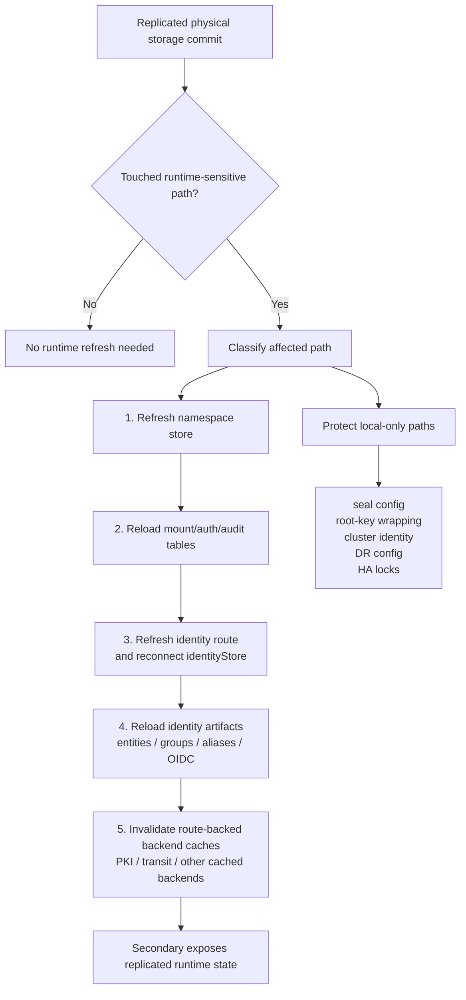

# DR Replication Runtime Refresh Design

This note describes how replicated physical storage becomes usable OpenBao
runtime state. The top-level RFC is [RFC_DR_Replication.md](RFC_DR_Replication.md).

## Why Runtime Refresh Is Required

DR applies replicated ciphertext storage below normal local API write paths.
Physical storage convergence alone is not enough because OpenBao also keeps
in-memory runtime structures:

- namespace store
- mount and auth route tables
- audit table state
- identity store and in-memory artifacts
- backend-specific caches

Without refresh, a secondary can have correct bytes on disk while APIs still
serve stale route, namespace, identity, or backend-cache state.

## Replicated Runtime Domain

The replicated domain includes storage-backed runtime state needed for the
recovery cluster to work after bootstrap, reconnect, reconciliation, promotion,
or reseed:

- namespace records
- namespace-scoped mount/auth entries
- root mount/auth tables
- audit tables
- ACL policies
- identity entities, groups, aliases, OIDC clients, and identity mount metadata
- route-backed backend state such as PKI, transit, SSH, TOTP, database config,
  and auth method storage

Whole-cluster DR replicates namespaces as cluster state. It does not provide
namespace-selective replication or independent namespace failover.

## Local-Only Domain

Some paths are local to a cluster and must not be streamed, fetched, or inferred
as deletes:

- local seal configuration
- local root-key wrapping state
- local cluster identity
- DR relationship configuration
- HA coordination state and locks
- local optimizer metadata such as flat accumulator snapshots, delta batches,
  stream-applied index markers, and local KID index entries
- topology-local audit sink assumptions

The same exclusion rules must be applied consistently to stream apply,
checkpoint fetch apply, and inferred deletes.

## Refresh Triggers

DR apply records which replicated paths changed during a durable apply or
reconciliation repair. Paths are classified into refresh triggers:

- namespace records
- mount table
- auth table
- audit table
- identity mount and identity artifacts
- route-backed backend keys
- keyring/root-key bootstrap paths

The refresh runs after storage commit. If storage commit fails, no runtime
refresh is allowed to expose partial state.

## Refresh Order

The normative order is:

1. namespace store
2. mount and auth tables
3. identity route and identity store artifacts
4. audit table refresh
5. route-backed backend cache invalidation

Namespace refresh comes first because namespace-scoped mounts and singleton
routes depend on namespace records. Identity refresh comes after route refresh
because the identity store must attach to the replicated identity route, not
the old local route.

## Runtime Areas

| Area | Storage class | Runtime object | Ordering requirement | Failure mode if missed |
| --- | --- | --- | --- | --- |
| Namespaces | namespace records | namespace store | before namespace routes | namespace paths missing |
| Mounts | mount table | router/backend table | after namespaces | replicated paths unreadable |
| Auth | auth table | auth router/backend table | after namespaces | auth methods missing |
| Audit | audit table | audit devices | topology aware | false parity or unusable sink |
| Identity route | singleton mount metadata | identity route/backend | after mount refresh | identity reads use stale backend |
| Identity artifacts | identity storage | identity store/memdb | after identity route | stale entities/groups/aliases |
| Route-backed backends | backend storage | backend caches | after commit and route refresh | stale plugin reads |

## Namespaces

Namespace records are replicated state. After namespace records are applied,
the secondary refreshes the namespace store so namespace-scoped paths can
resolve before mount/auth reload work depends on them.

Namespace-scoped singleton routes, such as namespace `sys/`, namespace
`token/`, and namespace `identity/`, are required for replicated namespaces to
function. Root-local singleton routes remain protected and must not be
overwritten by generic namespace refresh.

## Mount and Auth Tables

Mount/auth table replication updates the router and backend mount tables. This
must run after namespace refresh so namespace-scoped mounts attach to existing
namespace records.

The refresh must preserve protected local routes while loading replicated
routes for the copied dataset. Local DR control paths remain local, even though
the replicated dataset includes normal mount/auth state.

## Audit Tables

Audit tables are storage-backed runtime configuration and are part of
whole-cluster DR state. Audit device usability is topology-dependent: a
replicated file audit device only works if the path exists in the secondary
cluster.

The default local matrix should treat audit parity as an opt-in topology
profile rather than a required self-contained engine check. A future harness
profile can create deterministic audit sinks on all clusters and then validate
audit table replication.

## Identity

Identity is replicated DR state even though it is a singleton mount type.

The secondary must:

1. refresh the identity route from replicated mount metadata when needed
2. reconnect `core.identityStore` to the replicated identity backend
3. reset in-memory identity artifacts
4. reload entities, groups, aliases, and OIDC clients from replicated storage
5. keep the secondary read-only for replicated identity writes while in
   secondary mode

This avoids the failure mode where storage contains replicated identity data
but reads still use the old local identity route UUID/accessor or stale memdb
artifacts.

## Route-Backed Backend Caches

Backends such as PKI and transit can cache storage reads. After DR-applied
storage commits, affected route-backed keys must invalidate backend caches so
subsequent reads observe replicated storage.

Generic invalidation must not be applied to namespace metadata in a way that
collides with mounted namespace singleton routes. Namespace records use the
namespace store refresh path instead.

## Promotion and Reseed

Runtime refresh is required before a promoted cluster serves as write
authority. Promotion clears secondary read-only enforcement only after DR
activity has stopped and local runtime state is consistent with replicated
storage.

Promoted-authority reseed also depends on runtime refresh. The reseeded
secondary must load namespace, mount/auth, identity, and backend-cache state
from the promoted authority's checkpoint, not from stale old-primary lineage.

## Validation Focus

Runtime refresh validation should cover:

- namespace metadata replication
- namespace-scoped KV and singleton routes
- root KV v2 and KV v1
- transit key metadata
- PKI CA, roles, and issued cert reads
- SSH CA and role state
- TOTP key state
- database config and roles
- userpass, AppRole, cert auth, JWT auth, and token roles
- ACL policies
- service-token lookup
- identity entities, groups, and aliases
- lifecycle before failover, after promotion, and after promoted-authority
  reseed
- route-backed cache invalidation after stream apply and reconciliation apply

Current validation is tracked in
[DR_VALIDATION_RESULTS.md](DR_VALIDATION_RESULTS.md) and
[DR_TEST_MATRIX.md](DR_TEST_MATRIX.md).
