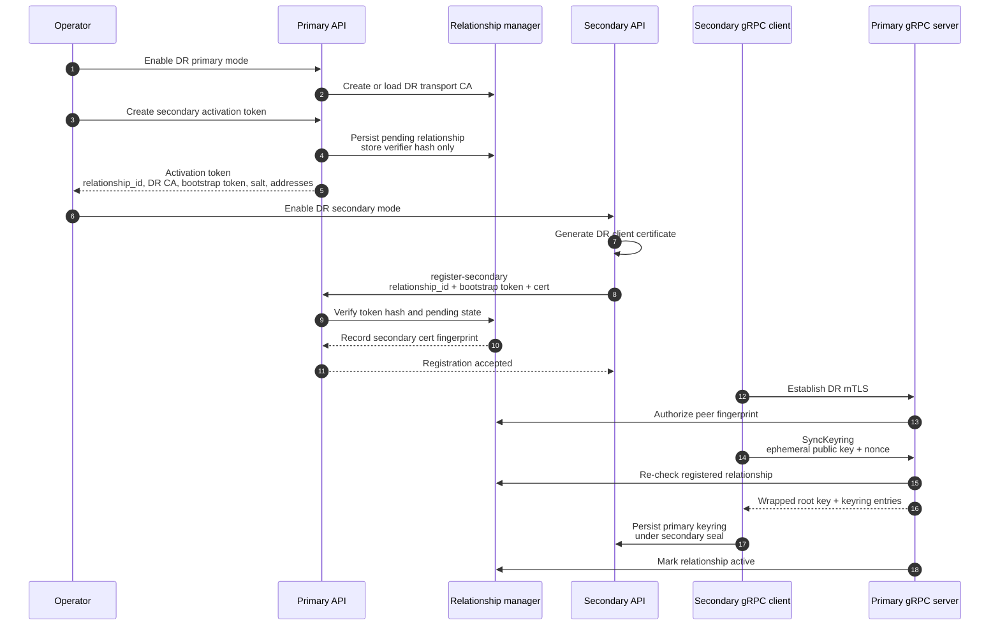
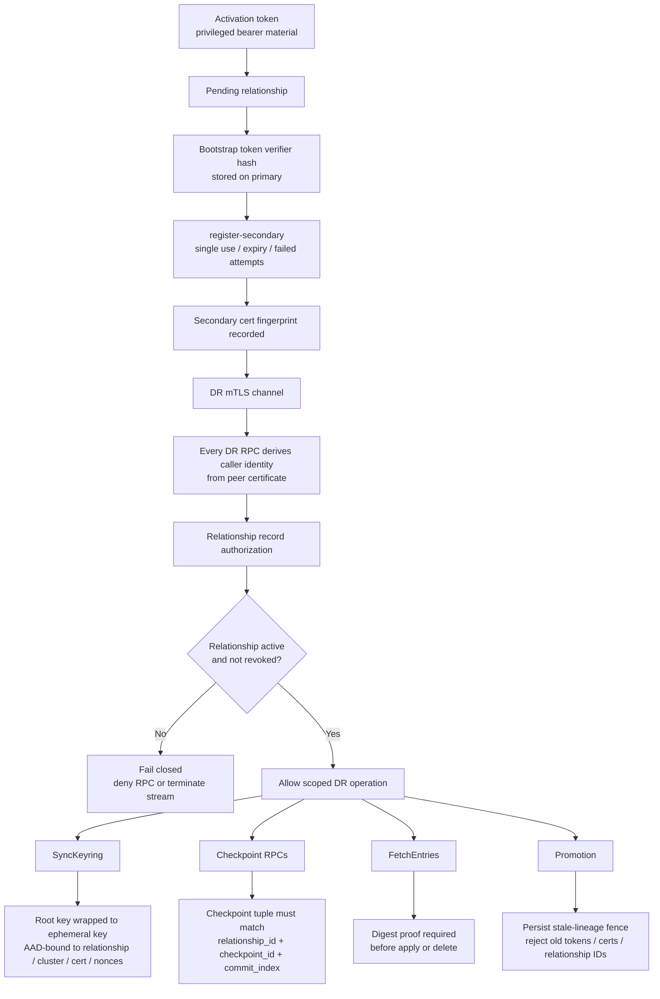

# DR Replication Security Design

This note contains the security model for native DR replication. The top-level
RFC is [RFC_DR_Replication.md](RFC_DR_Replication.md).

## Trust Model

The DR primary is trusted as data authority for active relationships. A
secondary trusts the primary for replicated ciphertext entries, checkpoint
artifacts, range digests, and promotion status while it remains in secondary
mode.

The network is untrusted. A network attacker may observe, replay, delay, drop,
reorder, or inject packets, but must not be able to authenticate as a
relationship peer without the required certificate material and persisted
relationship state.

A bootstrapped secondary is a disaster recovery copy of the replicated
dataset. Compromise of a bootstrapped secondary is a serious cluster-data
compromise, not merely a channel compromise.

## Protected Assets

The most sensitive assets are:

- primary root key and keyring material
- activation tokens and bootstrap tokens
- secondary DR client private keys
- DR transport CA private keys and trust anchors
- relationship records and certificate fingerprints
- checkpoint artifacts and provenance metadata
- local-only storage paths such as seal state, local root-key wrapping,
  cluster identity, DR configuration, and HA coordination state
- promotion lineage records

## Relationship Lifecycle

A DR relationship has a `relationship_id`, persisted state, and a certificate
fingerprint binding. Request-supplied relationship IDs are never authority on
their own. Primary-side authorization derives the caller identity from the mTLS
peer certificate and checks the persisted relationship record.

Lifecycle:

1. Operator enables DR primary mode.
2. Primary creates or loads its DR transport CA.
3. Operator creates a secondary activation token, creating a pending
   relationship.
4. Secondary enables DR using the activation token and generates DR client
   certificate material.
5. Secondary registers its certificate with the primary HTTP API using the
   single-use bootstrap token.
6. Secondary connects over DR mTLS and calls `SyncKeyring`.
7. Successful keyring sync moves the relationship to active.
8. Primary authorizes every DR RPC against relationship state and mTLS
   fingerprint.
9. Revocation denies new RPCs and terminates matching streams.
10. Promotion lineage prevents stale old-primary material from creating or
    reviving relationships after failover.

## Activation Token and Bootstrap

The activation token carries:

- relationship ID
- primary DR cluster identity
- primary DR gRPC addresses
- primary HTTP API address
- DR transport CA certificate
- optional primary API CA certificate and server name
- replication salt for KID derivation
- single-use bootstrap token for secondary certificate registration

The primary stores only a relationship-bound verifier hash for the bootstrap
token. The bearer token exists only in the activation token. Successful
registration clears verifier material and records the secondary certificate
fingerprint.

Bootstrap registration is accepted only for pending, unexpired relationships.
Expiry is terminal. Repeated failed attempts can revoke the relationship and
clear remaining bootstrap material. Replay against registered or revoked
relationships must be rejected without mutating the relationship.

Certificate fingerprints are unique across active, pending, previous, and
revoked relationship records so stale credential material cannot create or
revive a relationship.

## Why Keyring Material Crosses the Boundary

A DR secondary must be able to become a usable recovery authority after
promotion. That requires the primary keyring/root-key material needed to open
the replicated ciphertext storage domain.

The activation token must not carry the plaintext root key. Instead, after
certificate registration, the secondary calls `SyncKeyring` over relationship
mTLS with an ephemeral public key and nonce. The primary wraps the plaintext
root key to that ephemeral key and returns wrapped root-key material plus the
encrypted keyring storage entries.

The wrapping AAD binds:

- relationship ID
- DR cluster ID
- primary identity
- secondary certificate fingerprint
- client nonce
- server nonce
- protocol AAD version

This prevents cross-cluster replay and unknown-key-share behavior. Operators
continue to use the secondary cluster's local unseal mechanism after the
primary keyring is installed; the primary keyring is persisted under the
secondary's local seal.

## SyncKeyring Invariants

`SyncKeyring` is a single-shot transition for a registered relationship:

- malformed requests do not activate a relationship
- successful wrapping marks the relationship active
- repeated or replayed keyring sync after activation is denied
- revocation racing with keyring sync wins fail-closed before wrapped material
  is returned
- the response is bound to nonces, relationship, cluster, primary identity,
  secondary fingerprint, and AAD version

## Transport Trust

DR traffic uses mTLS. The primary owns a dedicated DR transport CA stored in
barrier storage. Primary nodes present leaf certificates signed by this CA.
The secondary pins an ordered primary DR transport CA trust set from the
activation token or persisted secondary config and rejects primary
certificates that do not chain to one of those anchors.

The secondary persists its DR client certificate and private key in local DR
configuration. The primary accepts that certificate only after bootstrap
registration and binds subsequent RPC authorization to the registered
fingerprint.

Heartbeat responses may advertise active primary leaf certificates, but the
secondary accepts them only if they chain to a configured DR transport CA.
There is no trust-on-first-use path and no insecure fallback.

## Certificate Lifecycle

Primary DR transport leaf certificates are renewed from the active DR transport
CA.

The secondary config now carries both:

- `primary_ca_cert`: the active primary CA, used as the primary identity for
  `SyncKeyring` AAD fallback before a verified transport connection exists; and
- `primary_ca_certs`: the ordered transport trust set used during CA rotation.

This supports a fail-closed overlap window where the secondary can accept
primary leaves signed by either the current CA or a staged replacement CA.
For `SyncKeyring`, the secondary binds unwrap AAD to the CA that actually
verified the primary leaf on the current mTLS connection, so overlap windows do
not depend on the secondary having already promoted `primary_ca_cert` locally.
Leaves signed by unknown CAs remain rejected, and cached leaves stop validating
when their CA is removed from the accepted trust set.

DR transport CA rotation is operator driven:

1. The primary stages a replacement CA and persists it as pending.
2. The primary returns a signed public trust bundle containing active, staged,
   and optional previous CA certificates.
3. Operators apply that trust bundle on each secondary before activation.
4. The primary activates the staged CA and renews its transport leaf from the
   new active CA.
5. Operators apply the post-activation trust bundle so secondaries update
   `primary_ca_cert` to the new active CA.
6. After the overlap window, the primary retires the previous public CA from
   future bundles.

Trust bundles are signed by a currently trusted DR transport CA. A secondary
accepts a bundle only if the signature chains to an already trusted CA, the
cluster ID matches, and the bundle's certificate set validates. After the
previous CA is retired, stale bundles that would reintroduce that retired CA are
rejected. This prevents stale or attacker-supplied CA sets from replacing or
reviving primary trust roots.

Secondary DR client certificates are relationship credentials. The design does
not silently renew them. Healthy relationships rotate through a two-phase
protocol:

1. Current credential signs a request to stage a pending certificate.
2. Primary trusts both current and pending certificates for a bounded pending
   period.
3. Pending credential signs final confirmation.
4. Primary promotes pending to current, records previous fingerprint, clears
   pending state, and terminates active streams so the secondary reconnects
   with the new credential.

If the current credential is lost, expired, compromised, revoked, or stale
after promotion, recovery is relationship replacement from the current
authority, not bootstrap token reuse.

## gRPC Authorization

Every DR gRPC call requires mTLS and relationship authorization. Request
relationship IDs are selectors only. The primary first authorizes the
relationship against the mTLS peer fingerprint and persisted relationship
state.

Checkpoint-scoped RPCs also carry checkpoint identity. The primary authorizes
the relationship before checkpoint lookup, then requires the checkpoint's
persisted relationship ID to match the authorized relationship.

RPCs that can perform substantial work or return sensitive material must
re-check relationship authorization before continuing or returning:

- `StreamChanges`
- `Heartbeat`
- `RequestCheckpoint`
- `ExchangeDirtyBitmap`
- `ExchangeRangeChecksums`
- `ExchangeRangeDigests`
- `FetchEntries`
- `SyncKeyring`

## Unauthenticated HTTP Boundary

The complete unauthenticated DR HTTP surface is limited to:

- `sys/replication/dr/status`
- `sys/replication/dr/primary/register-secondary`
- `sys/replication/dr/primary/rotate-secondary-certificate`
- `sys/replication/dr/primary/confirm-secondary-certificate`

All other DR administrative HTTP endpoints require root or sudo capability.

Bootstrap registration uses the bootstrap token as its credential. Rotation
uses proof-of-possession signatures from the current or pending relationship
certificate. These endpoints must bound request sizes and perform cheap shape,
timestamp, and base64 checks before expensive certificate parsing or signature
verification.

## Error Oracles

Unauthenticated bootstrap and rotation endpoints must not reveal relationship
existence, active/revoked state, duplicate fingerprint binding, lockout
timestamps, stale promotion lineage, pending operation IDs, or pending
fingerprint mismatches through public error messages.

Specific field-shape failures can remain specific. Once relationship state,
token validation, signature validation, duplicate fingerprint checks, lockout,
stale lineage, or pending rotation state is involved, public errors must be
generic. Detailed reasons belong in logs and root-protected status.

## Pre-Seed Artifact Provenance

Pre-seed manifests are primary-authorized artifacts. The primary signs the
canonical manifest payload with the DR transport CA private key after the
checkpoint tuple, relationship identity, primary cluster identity, bundle
integrity hash, segment descriptors, projection metadata, local-only scrub
metadata, and expiry are finalized.

The secondary verifies the manifest signature with the DR transport CA
certificate pinned in the activation token. Unsigned manifests, manifests
signed by another CA, or manifests whose signed metadata has been changed are
rejected before import or accept can trust the seed.

This does not make external artifact storage trusted. The external channel may
transport bytes, but validation still requires:

- CA-backed manifest provenance;
- relationship and activation-token binding;
- bundle integrity or segment descriptor integrity;
- KID/VID recomputation with the relationship replication salt;
- local-only path exclusion; and
- stale-lineage rejection.

## Revocation

Revocation fails closed:

- new RPCs are denied
- active streams for the relationship are terminated
- cached current and pending certificate trust is removed
- in-progress checkpoint, fetch, keyring sync, heartbeat, and rotation paths
  re-check authorization
- pending rotation material cannot keep a stale authorization path alive

Revocation does not erase lineage needed to reject stale credentials later.

## Status and Audit Redaction

Broad status responses must be allowlist-based. They must not expose
relationship IDs, certificate fingerprints, primary API addresses, activation
tokens, bootstrap tokens, certificate material, private keys, or stale
promotion-lineage identifiers.

Root-protected relationship APIs may expose relationship IDs, state, current
certificate fingerprints, failed-attempt counters, lockout timestamps, and
registration metadata. They must not return bootstrap verifier hashes,
plaintext bootstrap tokens, certificate DER/PEM material, pending or previous
fingerprints, pending rotation operation IDs, or private key material.

Audit output and logs must not disclose activation tokens, bootstrap tokens,
secondary certificate material, signatures, root-key wrapping material, or
stale credential lineage. Schema fields carrying these values must be marked
sensitive and regression-tested against raw-value audit leaks.

## Resource Exhaustion

Resource budgets are security controls. A valid but compromised secondary must
not exhaust primary memory, disk, CPU, or goroutines through unbounded
checkpoint creation, digest drill-down, range fetches, stream window updates,
or resnapshot requests.

Unauthenticated callers must not be able to force unbounded certificate parsing
or signature verification by replaying stale bootstrap or rotation material.
Relationship and pending-operation state gates should happen before expensive
cryptographic work whenever possible.

## Security Non-Goals

DR replication does not protect against a fully compromised primary. A
malicious primary can send malicious but well-formed replicated state.

DR replication does not protect secrets from a fully compromised bootstrapped
secondary. The secondary is a disaster recovery copy by design.

DR replication does not automatically solve split-brain traffic routing after
promotion. The protocol prevents stale relationship reuse and automatic merge,
but operators must still fence the old primary from clients.
