# DR Replication Manual Test Matrix

This matrix defines manual and automated validation for DR replication in this repository.

For curated validation evidence, see
[DR_VALIDATION_RESULTS.md](DR_VALIDATION_RESULTS.md). For scale interpretation,
see [DR_PERFORMANCE_NOTES.md](DR_PERFORMANCE_NOTES.md). For unresolved
production work, see [DR_OPEN_WORK.md](DR_OPEN_WORK.md).

## Scope

- Unit and integration tests under the repository root.
- End-to-end validation against a local multi-cluster Docker test environment.
- Failure-path checks: reconnect/reconcile, revoke, failover, and sustained load.

```mermaid
flowchart TD
    A["DR validation harness"] --> B["Bootstrap and relationship tests"]
    A --> C["Streaming and replay tests"]
    A --> D["Checkpoint reconciliation tests"]
    A --> E["Runtime refresh and engine matrix"]
    A --> F["Promotion and reseed tests"]
    A --> G["HA stress and soak tests"]
    A --> H["Security invariant tests"]

    B --> B1["token expiry<br/>single use<br/>relationship binding"]
    B --> B2["mTLS fingerprint authz<br/>cert rotation<br/>revocation"]

    C --> C1["ordered apply"]
    C --> C2["lastAppliedIndex advancement"]
    C --> C3["journal replay horizon"]

    D --> D1["checkpoint tuple mismatch"]
    D --> D2["digest coverage failures"]
    D --> D3["fetch proof failures"]
    D --> D4["delete inference safety"]

    E --> E1["namespaces"]
    E --> E2["mount/auth/audit tables"]
    E --> E3["identity route replacement"]
    E --> E4["route-backed cache invalidation"]

    F --> F1["clean promotion"]
    F --> F2["forced promotion"]
    F --> F3["promotion lineage persistence"]
    F --> F4["promoted-authority reseed"]

    G --> G1["sustained writes"]
    G --> G2["leader stepdown"]
    G --> G3["active handoff"]
    G --> G4["lag and convergence"]

    H --> H1["SyncKeyring AAD binding"]
    H --> H2["unauthenticated endpoint bounds"]
    H --> H3["stale-lineage rejection"]
```



## Environment Assumptions

- Run commands from the OpenBao repository root.
- Tools available: `docker`, `jq`, `bao`, `rg`.
- Local compose topology: `docker-compose.dr-test.yml`
- Local HA compose topology: `docker-compose.dr-ha-test.yml`
- DR endpoints and tokens are exported by `scripts/dr_local_test.sh bootstrap` into `.dr-test.env`:
  - `DR_PRIMARY_ADDR`, `DR_PRIMARY_TOKEN`
  - `DR_SECONDARY1_ADDR`, `DR_SECONDARY1_TOKEN`
  - `DR_SECONDARY2_ADDR`, `DR_SECONDARY2_TOKEN`

---

## 1. Automated Matrix (`go test`)

| ID | Area | Command | Expected |
|---|---|---|---|
| A1 | DR unit suite | `go test ./vault -run 'TestDR' -count=1` | Pass |
| A2 | DR integration suite | `go test ./vault -run 'TestDRIntegration' -count=1 -v` | Pass |
| A3 | DR race subset | `go test -race ./vault -run 'TestDRIntegration_(StreamReplication|DisconnectAndReconcile|ReadOnlyEnforcement|GapDetection|BufferOverflowDetection)' -count=1` | Pass, no races |
| A4 | DR range reconciliation | `go test ./vault -run 'TestDRIntegration_(RangeManifestDeterminism|RangeIBLTDecodeSuccess|RangeIBLTDecodeAdaptiveSplit|RangeRefinementPrefixFallback|ReconcileFailsOnBudgetExceeded|NoIndexAdvanceOnPartialRangeFailure|MultiRelationshipRangeIsolation|RevokeDuringRangeReconcileAborts)' -count=1` | Pass |
| A5 | DR stream cursor/replay correctness | `go test ./vault -run 'TestDRIntegration_(StreamAppliesSameRaftIndexBatchEntries|PrimaryStreamReplayIncludesLastAppliedIndex)' -count=1` | Pass |
| A6 | DR bootstrap/authz hardening | `go test ./vault -run 'TestDR(RelationshipManager_ActivationToken|RelationshipManager_LegacyPlaintextBootstrapTokenMigratesToVerifier|RelationshipManager_BootstrapTokenExpires|RelationshipManager_BootstrapTokenAttemptLockout|RelationshipManager_BootstrapTokenSourceIPBinding|RelationshipManager_BootstrapReplayDoesNotMutateRegisteredRelationship|RelationshipManager_HeartbeatLastSeenWriteThrottle|Primary_RevokeRelationshipTerminatesOnlyMatchingStreams)' -count=1` | Pass |
| A7 | DR manager persistence rollback | `go test ./vault -run 'TestDRRelationshipManager_(EnablePrimary_SaveConfigFailureRollsBackState|EnableSecondary_SaveConfigFailureRollsBackState|UpdateTuningAppliesSecondaryRuntime)' -count=1` | Pass |
| A8 | Sketch package | `go test ./physical/replication/sketch -count=1` | Pass |
| A9 | Reconciler package | `go test ./physical/replication/reconciler -count=1` | Pass |
| A10 | Raft stream hooks | `go test ./physical/raft -run 'Test.*ChangeStream|Test.*HookChangeStream|Test.*ApplyBatch' -count=1` | Pass |
| A11 | Artifact fetch + budget semantics | `go test ./vault -run 'TestDRPrimary_ReadCheckpointEntryChange_(ExpectedVIDMismatch|UsesArtifactNotLiveStorage)|TestDRCheckpointArtifactStore_(EvictsByGlobalBudget|RejectsOversizedArtifact)' -count=1` | Pass |
| A12 | Reconcile failure taxonomy | `go test ./vault -run 'TestClassifyReconcileFailure_(Stalled|CheckpointClasses)' -count=1` | Pass |
| A13 | DR correctness hardening | `go test ./vault -run 'TestDRIntegration_(RangeReconciliationFinalizeFailureIsRetryable|ResnapshotRejectsSilentFetchOmission|CheckpointHighWaterLoadSeedsLastAppliedIndex|RootKeyReplicationFailsClosed)|TestDRCheckpointArtifactStore_DoesNotEvictRetainedArtifact|TestDRSecondary_Start_HeartbeatPermissionDeniedCancelsStream' -count=1` | Pass |
| A14 | DR endpoint/audit boundary | `go test ./vault -run 'TestSystemBackend_DRSpecialPaths|TestSystemBackend_DRSensitiveFields|TestSystemBackend_DRAuditHMACsBootstrapAndRotationMaterial|TestSystemBackend_RootPaths' -count=1` | Pass |
| A15 | DR response disclosure boundary | `go test ./vault -run 'TestDRSystemBackend_StatusDoesNotExposePromotionSecrets|TestDRSystemBackend_RelationshipResponsesDoNotExposeStoredSecrets' -count=1` | Pass |
| A16 | DR unauthenticated error-oracle hardening | `go test ./vault -run 'TestDRSystemBackend_BootstrapRegistrationFailureResponseIsGeneric|TestDRSystemBackend_CredentialRotationFailureResponseIsGeneric' -count=1` | Pass |
| A17 | DR gRPC data-plane authz | `go test ./vault -run 'TestDRPrimary_(StreamChangesRequiresRelationshipAuthorization|RequestCheckpointRequiresRelationshipAuthorization|HeartbeatRequiresRelationshipAuthorization|CheckpointRPCsRequireRelationshipAuthorization|ExchangeDirtyBitmap_RequiresRelationshipAuthorization|SyncKeyringRequiresRelationshipAuthorization)|TestDRIntegration_(MultiRelationshipRangeIsolation|RevokeDuringRangeReconcileAborts)' -count=1` | Pass |
| A18 | DR SyncKeyring crypto binding | `go test ./vault -run 'TestDRPrimary_SyncKeyringRequiresRelationshipAuthorization|TestDRRootKey(WrapAADBindingRejectsMismatches|WrapRequiresCompleteInputs|WrapProducesFreshEnvelopeForRepeatedClientNonce|UnwrapRejectsMalformedEnvelope)|TestDRIntegration_RootKeyReplicationFailsClosed' -count=1` | Pass |
| A19 | DR unauthenticated resource-exhaustion hardening | `go test ./vault -run 'TestDRRelationshipManager_SecondaryCredentialRotation(RejectsRegisteredBeforeParsingCertificate|ConfirmRejectsMissingPendingBeforeParsingCertificate|TwoPhase)|TestDRSystemBackend_CredentialRotationFailureResponseIsGeneric' -count=1` | Pass |
| A20 | DR revocation fail-closed semantics | `go test ./vault -run 'TestDRPrimary_(StreamChangesRequiresRelationshipAuthorization|RequestCheckpointRequiresRelationshipAuthorization|HeartbeatRequiresRelationshipAuthorization|CheckpointRPCsRequireRelationshipAuthorization|ExchangeDirtyBitmap_RequiresRelationshipAuthorization|SyncKeyringRequiresRelationshipAuthorization|SyncKeyringRevocationDuringWrapFailsClosed)|TestFetchEntries_RechecksRelationshipRevocationDuringStream|TestDRRelationshipManager_RevokeClearsPendingCredentialRotationTrust|TestDRIntegration_RevokeDuringRangeReconcileAborts' -count=1` | Pass |
| A21 | DR promotion lineage inheritance | `go test ./vault -run 'TestDRRelationshipManager_(EnableSecondaryRejectsStalePromotionLineage|RepeatedPromotionPreservesStaleLineage|BootstrapRejectsPrePromotionSecondaryFingerprint|LoadConfigSkipsStalePromotionRelationshipCerts)|TestDRSystemBackend_StatusDoesNotExposePromotionSecrets|TestDRFailoverToPrimary' -count=1` | Pass |
| A22 | DR promotion UX and safety contract | `go test ./vault -run 'TestDRFailover_(FromSecondary|ForcedRequiresAcceptDataLoss|ForcedWithAcceptDataLoss|ForcedWithZeroEstimatedLossExplainsCleanProofUnavailable|ToPrimary)|TestDRFailoverToPrimary|TestDRSystemBackend_PromoteResponseExplainsForcedPromotion|TestDRSystemBackend_StatusDoesNotExposePromotionSecrets' -count=1` | Pass |
| A23 | DR promoted-authority reseed cursor reset | `go test ./vault -run 'TestDRRelationshipManager_EnableSecondaryClearsStaleCheckpointCursor' -count=1` | Pass |
| A24 | DR replicated runtime engine state | `go test ./vault -run 'TestDRIntegration_RuntimeStateRefreshReplacesIdentityRoute|TestDRIntegration_RuntimeStateRefreshReloadsIdentityArtifacts|TestDRIntegration_RuntimeStateRefreshLoadsReplicatedNamespace|TestDRIntegration_RuntimeRefreshProtectionAllowsNamespaceSingletons|TestDRIntegration_DRSecondarySetupSkipsExistingProtectedRoutes|TestDRSecondaryApplyFetchedChangeInvalidatesRouteBackedStorage' -count=1` | Pass |
| A25 | DR fetch/reconcile resource bounds | `go test ./vault -run 'TestFetchEntriesRejectsOversizedAndMalformedRequests|TestFetchEntriesSplitsResponseBatchesByByteBudget|TestFetchEntriesRejectsSingleEntryOverResponseByteBudget|TestDRIntegration_RangeTaskEnforcesFetchedValueByteBudget' -count=1` | Pass |
| A26 | DR checkpoint build admission and artifact drift handling | `go test ./vault -run 'TestDRPrimary_CheckpointBuildAdmissionLimitsCrossRelationshipConcurrency|TestDRCheckpointArtifactBuildDropsDisappearedKeysFromLiveRangeSet' -count=1` | Pass |
| A27 | DR tuning validation and rollback | `go test ./vault -run 'TestDRRelationshipManager_UpdateTuning|TestDRSystemBackend_DRTuningRejectsInvalidInputs|TestDRPrimary_AllowWriteRequest_BackpressureRejectsNonExempt|TestDRBackpressureExemptPath' -count=1` | Pass |
| A28 | DR flat accumulator persistence, durable stream-applied index, delta replay, local KID index repair, and stream transaction coalescing | `go test ./vault -run 'TestDR(CoalesceStreamTxnBatch|FlatRangeAccumulator_ResetAndApplyDeltas|SecondaryFlatAccumulatorAdvancesOnStreamApply|SecondaryStreamTxnPersistsFlatAccumulator|SecondaryLoadsPersistentStreamAppliedIndex|SecondaryHasInitialStreamBaselineRequiresCursorAndAccumulator|SecondaryStreamApplyWorkerRetriesTransactionalCommitFailure|SecondaryStreamApplyWorkerTransactionalFailureDoesNotFallbackSequentially|LocalKIDIndexChangesRequireCompleteBaseline|IndexedRepairProofMismatchObservability|LocalKIDIndexLoadReasons|SecondaryStreamTxnCadenceReplaysPersistedAccumulatorDeltas|SecondaryStreamTxnCadenceMissingDeltasFailsClosed|SecondaryApplyWorkerStopPersistsFinalFlatAccumulatorSnapshot|SecondaryQuiescentReconnectUsesFlatAccumulatorFastPath|FlatAccumulatorEmptyBucketRepairAvoidsLocalScan|FlatAccumulatorIndexedBucketRepairAvoidsLocalScan|FlatAccumulatorIndexedBucketRepairFullBucketFallbackAvoidsLocalScan|RangeReconciliationSeedsFlatAccumulatorOnPhaseAMatch|RangeReconciliationSeedsFlatAccumulatorAfterRepair|SystemBackend_StatusIncludesStreamOptimizationCounters)' -count=1` | Pass |
| A29 | DR HA standby runtime transition deferral | `go test ./vault -run 'TestInvalidation_(DRReadOnlyStandbyTransitionFailureDefers|DRActiveTransitionFailureDoesNotDefer|TransientDecryptFailureClassifier)|TestShouldRunSecondaryControllerLocked|TestDRSecondaryControllerRunWasStable' -count=1` | Pass; read-only HA standby keyring-missing/read-only transition failures defer without sealing; active transition failures remain fail-closed; secondary controller does not run on HA standbys |
| A30 | DR strict-secondary checkpoint verification | `go test ./vault -run 'TestDRSecondaryVerifyCheckpoint' -count=1 && (cd scripts/dr-stress && go test . -run 'TestDRVerifyCheckpointParsesControlPlaneResult' -count=1)` | Pass; strict secondaries can be verified through checkpoint proofs without serving replicated data reads |
| A31 | DR pre-seed manifest, bundle export/import, and accept/apply lifecycle | `go test ./vault -run 'TestDRPreSeed|TestDRRelationshipManager.*PreSeed|TestSystemBackend_DRSpecialPaths|TestSystemBackend_DRSensitiveFields' -count=1` | Pass; pre-seed manifests are relationship-bound, reject stale lineage, relationship mismatch, algorithm mismatch, missing local-only scrub metadata, expired material, and invalid segmented artifact metadata; bundle validation rejects integrity drift, local-only paths, and tampered segment descriptors; primary export uses checkpoint artifacts and excludes local-only paths; segmented export plans produce per-segment descriptors and checkpoint-bound segment payloads; secondary segmented import durably stages segments across manager restart, rejects incomplete or tampered staging, requires explicit replacement confirmation, replaces replicated storage while preserving cluster-local paths, and applies the checkpoint baseline only when secondary mode is enabled or restored with the same relationship material |

Recommended compile pre-step:

```bash
go test ./... -run '^$' -count=1
```

---

## 2. Docker E2E Matrix

Set shell environment:

```bash
OPENBAO_REPO_DIR="${OPENBAO_REPO_DIR:-$(pwd)}"
DR_RESULTS_DIR="$OPENBAO_REPO_DIR/dr-stress-results"
cd "$OPENBAO_REPO_DIR"
```

Build OpenBao image and refresh local test clusters:

```bash
make docker-dev
scripts/dr_local_test.sh reset
```

The reset command starts `docker-compose.dr-test.yml`, initializes and unseals the
three single-node Raft clusters, enables DR primary mode, enables both
secondaries, waits for `secondary_state=streaming` and `lag_entries=0`, and writes
tokens to `.dr-test.env`.

For full-feature local validation, use the HA topology:

```bash
make docker-dev
scripts/dr_local_test.sh --topology ha reset
scripts/dr_local_test.sh --topology ha engine-matrix
scripts/dr_local_test.sh --topology ha engine-lifecycle-matrix
scripts/dr_local_test.sh --topology ha reset
scripts/dr_local_test.sh --topology ha quiescent-reconnect-smoke
scripts/dr_local_test.sh --topology ha accumulator-cold-restart-smoke
scripts/dr_local_test.sh --topology ha smoke --duration 900 --concurrency 48 --stepdown-interval 300
scripts/dr_local_test.sh --topology ha tuning-load-smoke --duration 900 --concurrency 36 --stepdown-interval 90 --first-tune-after 60 --second-tune-after 180 --max-wait-seconds 900 --progress-interval 30 --monitor-interval 2
scripts/dr_local_test.sh --topology ha indexed-repair-smoke
scripts/dr_local_test.sh --topology ha verify --sample 0
# To force legacy secondary API reads for a read-serving experiment:
# scripts/dr_local_test.sh --topology ha verify --sample 0 --secondary-method api
scripts/dr_local_test.sh --topology ha smoke --duration 7200 --concurrency 24 --put-percent 55 --get-primary-percent 25 --status-s1-percent 10 --status-s2-percent 10 --max-wait-seconds 600 --progress-interval 30
scripts/dr_local_test.sh --topology ha failover-smoke
scripts/dr_local_test.sh --topology ha promoted-durability-smoke
scripts/dr_local_test.sh --topology ha reseed-secondary-smoke
scripts/dr_local_test.sh --topology ha failover-load-lifecycle
```

The HA topology runs nine containers: three Raft nodes for the primary cluster,
three for secondary #1, and three for secondary #2. This is the local topology
for active stepdown, standby forwarding, Raft peer behavior, DR stream recovery,
promotion tests, promoted-cluster durability checks, and explicit secondary
reseed validation. Run the promoted durability and reseed smokes after
`failover-smoke` without resetting; they intentionally consume the promoted
state created by the failover smoke.

Useful local shortcuts:

```bash
make dr-test-status
make dr-test-smoke
make dr-test-verify
make dr-test-engine-matrix
make dr-test-preseed-smoke
make dr-test-down
make dr-test-ha-reset
make dr-test-ha-smoke
make dr-test-ha-verify
make dr-test-ha-engine-matrix
make dr-test-ha-engine-lifecycle-matrix
make dr-test-ha-failover-smoke
make dr-test-ha-promoted-durability-smoke
make dr-test-ha-reseed-secondary-smoke
make dr-test-ha-preseed-smoke
make dr-test-ha-indexed-repair-smoke
make dr-test-ha-failover-load-lifecycle
make dr-test-ha-down
```

### E2E Scenarios

| ID | Scenario | Steps | Expected |
|---|---|---|---|
| E1 | Baseline DR bootstrap | Enable primary, register/enable secondaries, wait for `streaming`. | Both secondaries: `mode=secondary`, `secondary_state=streaming`. |
| E2 | Initial sync correctness | Verify the baseline dataset through the supported terminal verification path: primary API reads plus secondary checkpoint verification by default. | Baseline values are present with no confirmed missing keys or checkpoint mismatches. |
| E3 | Stream replication correctness | Write a new key on primary, wait for both secondaries to report `streaming` with lag 0, then verify through the supported terminal verification path. | The value is present on the primary verification path and both secondaries pass checkpoint verification. |
| E4 | Revoke enforcement | Revoke one relationship while stream active. | Only revoked relationship terminated/denied; other remains healthy. |
| E5 | Re-enable after revoke | Disable revoked secondary, issue new token, re-enable. | Secondary returns to `streaming`; new writes replicate. |
| E6 | Disconnect + reconcile | Disrupt primary connectivity, continue writes, restore connectivity. | Secondary transitions through reconcile and converges. |
| E7 | Secondary read-only gate | Attempt data write on secondary and DR control operation. | Data write denied; allowed control operation accepted. General data reads remain outside strict warm-standby semantics before promotion; checkpoint verification remains available. |
| E8 | Failover path | Hard-stop old primary, promote secondary #1 with `accept_data_loss=true`, restart old primary, and compare key visibility. Use `scripts/dr_local_test.sh --topology ha failover-smoke`. | Forced promotion requires explicit acknowledgement; promoted cluster keeps its own post-promotion writes; resurrected old primary and non-promoted secondary form a separate timeline with no automatic merge. |
| E9 | Promotion lineage fence | `go test ./vault -run 'TestDRRelationshipManager_EnableSecondaryRejectsStalePromotionLineage' -count=1`; also asserted by `scripts/dr_local_test.sh --topology ha failover-smoke`. | After promotion, stale activation tokens from the old primary cluster or old relationship cannot re-enable the promoted cluster as a secondary. Fresh lineage remains possible for explicit rebuild/reconfiguration flows. |
| E10 | Promotion durability | Run after E8: `scripts/dr_local_test.sh --topology ha promoted-durability-smoke`. | Promoted HA cluster remains `mode=disabled` with the same promotion record, keeps all raft voters unsealed, preserves writes across full promoted-cluster restart, rejects stale old-primary tokens after restart, and accepts writes after HA active handoff. |
| E11 | Explicit secondary reseed | Run after E8/E10: `scripts/dr_local_test.sh --topology ha reseed-secondary-smoke`. | Promoted cluster can be explicitly enabled as the new DR primary; secondary2 can be disabled from the old lineage and re-enabled from a fresh promoted-authority token; promoted-only keys replicate, old-primary-only keys are removed, and old primary remains separate. |
| E12 | Failover-under-load lifecycle | Run `scripts/dr_local_test.sh --topology ha failover-load-lifecycle` or `make dr-test-ha-failover-load-lifecycle`. The command resets the HA topology, runs the `scripts/dr-stress` mixed KV workload against the old primary, hard-stops all old-primary nodes mid-run, promotes secondary1 with explicit `accept_data_loss=true`, exhaustively verifies the promoted secondary1 truth log, then runs E10 and E11 without resetting. | No-ack promotion fails closed; accepted promotion reports clean/forced semantics, reason codes/details, acknowledgement state, and data-loss estimate basis; promoted secondary1 has no confirmed missing keys or mismatches; promoted durability passes; secondary2 can be re-seeded from the promoted authority and reaches `streaming` with `lag_entries=0`. |
| E13 | Steady-state HA soak | Reset the HA topology, run `scripts/dr_local_test.sh --topology ha smoke --duration 7200 --concurrency 24 --put-percent 55 --get-primary-percent 25 --status-s1-percent 10 --status-s2-percent 10 --max-wait-seconds 600 --progress-interval 30`, then run terminal verification through the supported path. | No put/get/status failures, no dropped stress events, no backpressure rejections, both secondaries remain `streaming` with `lag_entries=0`, final sentinel converges, and terminal verification proves no confirmed missing keys or mismatches. |
| E14 | Engine/runtime feature matrix | Run `scripts/dr_local_test.sh --topology ha engine-matrix` or `make dr-test-ha-engine-matrix`. | Primary, secondary1, and secondary2 all verify namespace creation, namespace-scoped KV v2 state, root KV v2 data, KV v1 data, transit key material, PKI CA/role/issued certificate reads, SSH CA/role state, TOTP key state, database engine config with connection verification disabled, userpass/AppRole/cert/JWT auth mount state, token roles, ACL policy replication, service-token self lookup, and identity entity/group/alias replication. This is the default self-contained parity matrix; dependency-backed auth/secret engines still need opt-in profiles. |
| E15 | Engine/runtime lifecycle matrix | From a clean streaming HA topology, run `scripts/dr_local_test.sh --topology ha engine-lifecycle-matrix` or `make dr-test-ha-engine-lifecycle-matrix`. | The E14 engine/runtime matrix passes before failover on both secondaries, still passes on promoted secondary1 after forced failover, and still passes on secondary2 after explicit reseed from the promoted authority. |
| E16 | Dynamic tuning under HA load | From a clean streaming HA topology, run `scripts/dr_local_test.sh --topology ha tuning-load-smoke --duration 900 --concurrency 36 --stepdown-interval 90 --first-tune-after 60 --second-tune-after 180 --max-wait-seconds 900 --progress-interval 30 --monitor-interval 2`. | Constrained and relaxed tuning updates succeed despite HA movement; the harness retries transient active-node/control-plane races; workload status checks do not fail; both secondaries return to `streaming` with lag 0; terminal primary API verification and strict-secondary checkpoint verification pass; strict-secondary verification remains on the accumulator path with no physical scan or optimizer reseed. PUT/GET failures during handoff windows are availability signals unless terminal verification shows missing or mismatched data. |

### Command Snippets (address-based, no container-name dependency)

Enable DR primary and seed baseline key:

```bash
source .dr-test.env
BAO_ADDR="$DR_PRIMARY_ADDR" BAO_TOKEN="$DR_PRIMARY_TOKEN" bao write -f sys/replication/dr/primary/enable
BAO_ADDR="$DR_PRIMARY_ADDR" BAO_TOKEN="$DR_PRIMARY_TOKEN" bao secrets enable -path=kv kv-v2 || true
BAO_ADDR="$DR_PRIMARY_ADDR" BAO_TOKEN="$DR_PRIMARY_TOKEN" bao kv put kv/dr-baseline msg=hello ts="$(date +%s)"
```

Enable secondary #1:

```bash
ACT1=$(BAO_ADDR="$DR_PRIMARY_ADDR" BAO_TOKEN="$DR_PRIMARY_TOKEN" bao write -f -format=json sys/replication/dr/primary/secondary-token | jq -r '.data.token')
BAO_ADDR="$DR_SECONDARY1_ADDR" BAO_TOKEN="$DR_SECONDARY1_TOKEN" bao write sys/replication/dr/secondary/enable token="$ACT1"
```

Enable secondary #2:

```bash
ACT2=$(BAO_ADDR="$DR_PRIMARY_ADDR" BAO_TOKEN="$DR_PRIMARY_TOKEN" bao write -f -format=json sys/replication/dr/primary/secondary-token | jq -r '.data.token')
BAO_ADDR="$DR_SECONDARY2_ADDR" BAO_TOKEN="$DR_SECONDARY2_TOKEN" bao write sys/replication/dr/secondary/enable token="$ACT2"
```

Live stream check:

```bash
BAO_ADDR="$DR_PRIMARY_ADDR" BAO_TOKEN="$DR_PRIMARY_TOKEN" bao kv put kv/dr-live ts="$(date -u +%Y-%m-%dT%H:%M:%SZ)" src=primary
sleep 2
BAO_ADDR="$DR_SECONDARY1_ADDR" BAO_TOKEN="$DR_SECONDARY1_TOKEN" bao read sys/replication/dr/secondary/verify-checkpoint
BAO_ADDR="$DR_SECONDARY2_ADDR" BAO_TOKEN="$DR_SECONDARY2_TOKEN" bao read sys/replication/dr/secondary/verify-checkpoint
```

---

## 3. Log Checks

Secondary logs:

```bash
docker logs --since=10m bao-secondary-1 | rg 'dr-secondary|reconciliation|change stream|revoke|PermissionDenied|gap detected'
docker logs --since=10m bao-secondary-2 | rg 'dr-secondary|reconciliation|change stream|revoke|PermissionDenied|gap detected'
```

Primary logs:

```bash
docker logs --since=10m bao-primary-1 | rg 'dr-replication|checkpoint|change stream subscriber|revoked|terminated|lagging'
```

---

## 4. Known Gotchas

- `stream_buffer_entries` is retained ring-history depth, not ACK backlog.
- `stream_lagging_subscribers_total` is cumulative; use `stream_lagging_subscribers_active` for current pressure.
- `stream_journal_*` shows replay horizon health; if `stream_journal_oldest_index` is ahead of a secondary start index, reconcile is expected.
- `journal_replay_attempts_total`, `journal_replay_success_total`, `journal_range_too_old_total` explain reconnect behavior before reconcile.
- `checkpoint_conflicts_storage_drift_total` may increase under live write
  pressure while checkpoint artifacts are being built. It is not a correctness
  failure by itself if fetches remain artifact-scoped and secondary
  proof/fallback counters stay clean.
- `secondary_apply_rate_eps`, `primary_write_rate_eps`, and `lag_slope_eps` are the primary convergence signals under sustained load.
- `dr_backpressure_state` and `dr_backpressure_effective_qps_cap` indicate when ingress throttling is active.
- Sustained `dr_backpressure_rejections_total` growth means the cluster is protecting convergence with bounded write admission (expected under overload tests).
- If both secondaries enter long `reconciling` with flat `last_applied_index`, reduce write pressure or increase secondary reconcile/stream batch tuning.
- Strict TLS and relationship authz are fail-closed; stale bootstrap/tokens/certs correctly break reconnect.
- Secondary API read verification may fail with `transaction is read-only` in
  strict warm-standby mode. Do not treat that as a data mismatch. Use
  secondary checkpoint verification or promoted-cluster API verification for
  terminal data proof.
- In the HA Docker topology, `api_addr` uses container DNS names. Host-side arbitrary-token lookup against a DR secondary can redirect to those internal names; the engine matrix uses service-token self lookup to verify replicated token usability without relying on host DNS for secondary leader redirects.
- Direct-to-node HA tests should pass all nodes in a secondary cluster to `dr-stress` as a comma-separated address list when the active node can move during the test. The harness scores DR status responses and follows the node reporting current `streaming` state instead of relying on a fixed host port.
- Forced out-of-horizon tests may shrink the stream buffer/journal, but `stream_buffer_max_entries` must remain at least the secondary's initial stream window. With the current defaults that means `>=1024`; smaller values exercise `ResourceExhausted` stream admission rather than journal-too-old replay fallback.
- Namespace replication requires runtime refresh rather than generic invalidation. Generic invalidation of `core/namespaces/*` can collide with already-mounted namespace singleton routes; the lifecycle matrix verifies namespace lookup, namespace `sys/mounts`, and namespace KV after failover and reseed.
- Audit devices are declarative/config-managed in OpenBao and cannot be enabled through the API by the default matrix. Audit parity should be validated by a separate topology profile with audit devices predeclared in config.
- The default engine matrix intentionally covers self-contained built-ins. LDAP, Kubernetes, RADIUS, Kerberos, RabbitMQ, and live database credential issuance require external services and should be covered by explicit dependency-backed profiles rather than making the default lifecycle test brittle.

---

## 5. Stress Test Matrix

Use `scripts/dr_local_test.sh` for local compose runs. Lower-level stress
scripts remain available under `scripts/`.

The active local entrypoints for `smoke`, `preseed-smoke`,
`quiescent-reconnect-smoke`, `accumulator-cold-restart-smoke`,
`secondary-outage-smoke`, `secondary-outage-reconcile-smoke`, and
`indexed-repair-smoke`, and `tuning-load-smoke` are backed by the typed Go
harness in `scripts/dr-harness`. `scripts/dr_local_test.sh` remains the
compatibility wrapper and retains legacy shell bodies under `_legacy` command
functions while parity is being proven.

| ID | Profile | Command Flags | Goal | Pass Criteria |
|---|---|---|---|---|
| S1 | Single-secondary baseline | `dr_stress_test.sh run --write-count 10000 --concurrency 24 --payload-bytes 1024` | Establish baseline throughput/lag | Sentinel replicated before timeout; no stuck reconcile loop |
| S2 | Dual-secondary baseline | `dr_stress_dual_secondary.sh run --write-count 20000 --concurrency 32 --payload-bytes 1024` | Compare secondary lag under same workload | Both secondaries complete; bounded lag delta |
| S3 | Dual-secondary heavy | `dr_stress_dual_secondary.sh run --write-count 100000 --concurrency 32 --payload-bytes 1024 --progress-interval 2 --ensure-kv --monitor-interval 2` | Sustained load convergence | No indefinite flat `last_applied_index`; eventual catch-up; journal remains within configured budget |
| S4 | Payload stress | `dr_stress_dual_secondary.sh run --write-count 30000 --concurrency 24 --payload-bytes 8192` | High byte pressure behavior | No crash/panic; explicit fail reasons if budgets exceeded |
| S5 | Churn stress | Run S3 while periodically disrupting secondary network/leader | Reconnect + reconcile robustness | Bounded retries, no silent divergence |
| S6 | Cancellation safety | Start any stress run, press `Ctrl-C`, verify no stray workers | Process hygiene | No lingering `dr_stress*`/`bao kv put` worker processes |
| S7 | Mixed realism profile | `dr_stress_mixed_workload.sh run --duration-seconds 1800 --concurrency 24 --put-percent 55 --get-primary-percent 25 --get-secondary1-percent 10 --get-secondary2-percent 10 --hot-key-percent 80 --payload-small-bytes 512 --payload-large-bytes 8192 --large-payload-percent 15` | More production-like traffic mix | Stable ops rate, bounded errors, no prolonged flat secondary indexes |
| S8 | Convergence-controller trigger | S3 with reduced reconcile throughput tuning (for test) | Verify automatic fallback behavior | `fallback_count` increments, secondaries return to `streaming`, `last_applied_index` resumes growth |
| S9 | Backpressure enforcement | S3 with high write concurrency and low secondary apply tuning | Verify bounded ingress on overload | `dr_backpressure_state` reaches `degraded/critical`, `dr_backpressure_rejections_total` increases, secondaries avoid permanent flatline |
| S10 | HA steady-state soak | `scripts/dr_local_test.sh --topology ha smoke --duration 7200 --concurrency 24 --put-percent 55 --get-primary-percent 25 --status-s1-percent 10 --status-s2-percent 10 --max-wait-seconds 600 --progress-interval 30` | Measure non-failover DR behavior under sustained but non-adversarial load | 0 workload failures, 0 dropped events, both secondaries converge with lag 0, and terminal verification passes through the supported verification path |
| S11 | Dynamic tuning under HA load | `scripts/dr_local_test.sh --topology ha tuning-load-smoke --duration 900 --concurrency 36 --stepdown-interval 90 --first-tune-after 60 --second-tune-after 180 --max-wait-seconds 900 --progress-interval 30 --monitor-interval 2` | Update primary and secondary DR tuning while mixed load is running, then force HA handoffs | Tuning writes succeed or retry through transient active-node/control-plane races, new active nodes report the updated profile, workload exits cleanly, status failures remain zero, both secondaries return to `streaming` with lag 0, terminal verification passes through the supported verification path, and strict-secondary checkpoint verification uses the accumulator path without physical scan or optimizer reseed |
| S12 | HA quiescent reconnect optimization | `scripts/dr_local_test.sh --topology ha quiescent-reconnect-smoke` | Verify active primary handoff avoids scanned reconciliation when stream replay can resume | Both secondaries return to `streaming` lag 0, marker data verifies through the supported path, and either `reconcile_count` is unchanged or `flat_accumulator_fast_path_total` increments |
| S13 | HA accumulator cold restart | `scripts/dr_local_test.sh --topology ha accumulator-cold-restart-smoke` | Verify a full secondary cluster restart reloads the persisted flat accumulator cursor and resumes stream replay without scanned reconciliation | Secondary #1 returns to `streaming` lag 0, marker data verifies through the supported path, post-restart cursor covers the pre-restart `last_applied_index`, scan/reconcile/fallback counters do not increase, and restart logs show no local scan or reconciliation. Process-local counters may reset across a full secondary-cluster restart. With cadence-delayed snapshots, status should show either full snapshot load, snapshot+delta replay, or cursor-only fail-closed recovery |
| S14 | HA hot-key stream coalescing validation | `scripts/dr_local_test.sh --topology ha reset --build && scripts/dr_local_test.sh --topology ha smoke --duration 300 --concurrency 48 --stepdown-interval 100 --progress-interval 10 --monitor-interval 2` | Measure secondary apply behavior after transactional stream coalescing and flat-accumulator snapshot cadence under hot-key load and HA handoff pressure | Terminal verification passes through the supported verification path; sentinel convergence is near-immediate; both secondaries end `streaming` with `lag_entries=0`; no journal drops; status timelines expose stream transaction counts, coalesced physical-entry counts, flush reasons, apply/commit timing, flat-accumulator cursor writes, skipped snapshots, and snapshot persist counters |
| S15 | HA indexed-repair validation | `scripts/dr_local_test.sh --topology ha indexed-repair-smoke` or `make dr-test-ha-indexed-repair-smoke` | Force secondary #1 beyond the primary journal horizon and prove reconciliation uses indexed-bucket repair instead of full local scan | Primary `journal_range_too_old_total` increases; secondary #1 `reconcile_count`, `flat_accumulator_indexed_repair_total`, `flat_accumulator_indexed_repair_ranges_total`, `local_kid_index_bucket_loads_total`, and `local_kid_index_entries_loaded_total` increase; `scan_failures_total`, `local_kid_index_fallback_scans_total`, full-bucket fallback, proof mismatches, and local KID-index load failures do not increase; both secondaries return to `streaming` with `lag_entries=0`, sentinel convergence succeeds, and terminal verification passes through the supported verification path |
| S16 | HA secondary outage within journal horizon | `scripts/dr_local_test.sh --topology ha secondary-outage-smoke --duration 120 --concurrency 32 --outage-after 20 --outage-seconds 40 --progress-interval 10 --monitor-interval 2` | Stop all nodes in secondary #1 while writes continue, restart it before the stream journal horizon expires, and verify replay catch-up without reconciliation | Secondary #1 may elect a different active node after restart; the stress harness follows active DR status across the secondary node list. Both secondaries converge with nonzero `primary_index`, secondary #1 advances its flat accumulator cursor to the final applied index, `reconcile_count` remains zero after restart, `scan_failures_total`, `local_kid_index_fallback_scans_total`, full-bucket fallback, proof mismatches, and primary `journal_range_too_old_total` remain zero, and terminal verification passes through the supported verification path |
| S17 | HA secondary outage beyond journal horizon | `scripts/dr_local_test.sh --topology ha secondary-outage-reconcile-smoke --progress-interval 10 --monitor-interval 2` | Shrink the primary stream buffer/journal for the test, stop all nodes in secondary #1 while writes continue, restart it after replay is no longer possible, and verify reconciliation repair | Primary `journal_range_too_old_total` increments, secondary #1 runs reconciliation and returns to `streaming` with `lag_entries=0`, `reconcile_phase=idle`, and final `last_applied_index=primary_index`; flat accumulator cursor covers the final applied index, scan failures, local KID fallback scans, full-bucket fallback, and indexed proof mismatches remain zero, and terminal verification passes through the supported verification path |
| S18 | HA adaptive batching and standby key-transition regression | `scripts/dr_local_test.sh --topology ha reset --build && scripts/dr_local_test.sh --topology ha smoke --duration 900 --concurrency 48 --stepdown-interval 300 --progress-interval 30 --monitor-interval 5` | Validate adaptive batching, indexed repair after HA handoff, and read-only standby key-transition deferral under adversarial load | Workload exits cleanly; `status_fail=0`; dropped events are zero; both sentinels converge; both secondaries end `streaming` with lag 0; if reconciliation occurs, indexed repair has zero local KID fallback scans, zero full-bucket fallback, and zero proof mismatches; logs contain no `fatal DR key-transition resync error` and no `OpenBao is sealed`; keyring-missing standby transitions, if present, log `DR key transition deferred on read-only standby`; PUT/GET failures are availability/backpressure signals unless terminal verification shows missing or mismatched data |
| S19 | Pre-seed/resnapshot lifecycle validation | `scripts/dr_local_test.sh preseed-smoke --build`, `scripts/dr_local_test.sh dataset-fixture-create NAME --seed-keys 100000`, `scripts/dr_local_test.sh preseed-smoke --dataset-fixture NAME --async-export-plan`, `make dr-test-preseed-smoke`, or `make dr-test-ha-preseed-smoke` | Validate the operator workflow for seeding a secondary from a primary-authorized base copy, then catching up only the delta through stream replay or checkpoint reconciliation | The active local `preseed-smoke` entrypoint is Go-harness backed through `scripts/dr-harness`; shell remains a compatibility wrapper for topology reset and make targets. Primary segmented export-plan cuts a checkpoint for a fresh relationship; async export-plan status can be polled until the manifest is ready; segmented planning uses checkpoint artifact metadata instead of materializing a full bundle in the request path; per-segment export reads only the requested segment's checkpoint artifact records; secondary import-begin/import-segment/import-complete requires explicit replacement confirmation while DR is disabled, validates bundle integrity, KID/VID projection, expiry, lineage, artifact-format metadata, segment descriptors, and local-only exclusions, replaces replicated storage while preserving cluster-local paths, and records the checkpoint baseline; the smoke writes a post-export delta before enable, secondary enable applies the imported checkpoint baseline and durable optimizer state before stream start, attempts stream journal catch-up before initial reconciliation when the primary still has coverage, terminal checkpoint verification passes, both baseline and delta remain present on the primary, and replay/reconcile cost is proportional to the post-seed delta rather than the full dataset. In HA topology the smoke also forces primary and pre-seeded secondary active handoff after accept, then requires streaming lag 0 and a second checkpoint verification with zero missing or mismatched ranges. |
| S20 | Reconcile budget exhaustion | `go test ./vault -run TestDRRangeReconciliationBudgetExhaustionDoesNotAdvanceCheckpoint -count=1` | Configure an intentionally low checkpoint-scoped secondary reconcile budget and verify the secondary stops cleanly instead of saturating itself | Secondary reports `budget_exhausted` with phase, consumed bytes, entries, RPCs, and retry snapshot; `reconcile_count` does not advance; `last_applied_index` and the durable checkpoint high-water mark do not advance on incomplete repair |
| S21 | Primary checkpoint pressure bounds | `go test ./vault -run 'TestDRPrimary_ExchangeRangeChecksumsRejectsOversizedRequests|TestDRPrimary_ExchangeRangeDigestsRejectsMalformedParentSpan|TestFetchEntriesRejectsOversizedAndMalformedRequests|TestFetchEntriesRejectsSingleEntryOverResponseByteBudget|TestDRPrimary_CheckpointBuildAdmissionLimitsCrossRelationshipConcurrency' -count=1` | Configure or trigger low primary checkpoint/digest/fetch limits and verify primary-side admission and request/response caps fire predictably | Primary exposes checkpoint build/admission, range-checksum, range-digest, fetch-request, and fetch-response budget counters; callers receive bounded retryable or invalid-request failures; no relationship can force unbounded checkpoint build concurrency, digest fanout, or fetch serialization in these covered paths |
| S22 | DR pre-seed manifest and bundle validation | `go test ./vault -run 'TestDRPreSeed|TestDRRelationshipManager.*PreSeed' -count=1` | Generate, export, accept, stage, complete, or import seed material with relationship, checkpoint, algorithm, lineage, expiry, integrity, KID/VID, artifact-format, segment descriptor, and local-only scrub mismatches | Valid seed material is accepted only for the matching fresh relationship; stale lineage, wrong primary cluster, wrong relationship, wrong range/checksum version, missing scrub metadata, expired seed material, tampered bundle bytes, incomplete staged imports, invalid segment metadata, and local-only seed entries are rejected before trusting restored storage |

### Stress Run Examples

Local compose smoke:

```bash
scripts/dr_local_test.sh smoke --duration 120 --concurrency 24
scripts/dr_local_test.sh verify --sample 0
```

Repo-local HA steady-state soak:

```bash
scripts/dr_local_test.sh --topology ha reset
scripts/dr_local_test.sh --topology ha smoke \
  --duration 7200 \
  --concurrency 24 \
  --put-percent 55 \
  --get-primary-percent 25 \
  --status-s1-percent 10 \
  --status-s2-percent 10 \
  --max-wait-seconds 600 \
  --progress-interval 30
scripts/dr_local_test.sh --topology ha verify <run-dir> --sample 0
```

Repo-local HA hot-key coalescing validation:

```bash
scripts/dr_local_test.sh --topology ha reset --build
scripts/dr_local_test.sh --topology ha smoke \
  --duration 300 \
  --concurrency 48 \
  --stepdown-interval 100 \
  --progress-interval 10 \
  --monitor-interval 2
scripts/dr_local_test.sh --topology ha verify <run-dir> --sample 0
```

Repo-local HA accumulator cold restart:

```bash
scripts/dr_local_test.sh --topology ha accumulator-cold-restart-smoke
```

Curated validation evidence lives in [DR_VALIDATION_RESULTS.md](DR_VALIDATION_RESULTS.md)
and [DR_VALIDATION_RUNS.json](DR_VALIDATION_RUNS.json). Keep this matrix focused
on scenario coverage and pass criteria; do not add "latest observed" result
claims here.

Single secondary:

```bash
bash scripts/dr_stress_test.sh run \
  --primary-addr "$DR_PRIMARY_ADDR" \
  --primary-token "$DR_PRIMARY_TOKEN" \
  --secondary-addr "$DR_SECONDARY1_ADDR" \
  --secondary-token "$DR_PRIMARY_TOKEN" \
  --write-count 10000 \
  --concurrency 24 \
  --payload-bytes 1024 \
  --output-dir "$DR_RESULTS_DIR"
```

Dual secondary:

```bash
bash scripts/dr_stress_dual_secondary.sh run \
  --primary-addr "$DR_PRIMARY_ADDR" \
  --primary-token "$DR_PRIMARY_TOKEN" \
  --secondary1-addr "$DR_SECONDARY1_ADDR" \
  --secondary1-token "$DR_PRIMARY_TOKEN" \
  --secondary2-addr "$DR_SECONDARY2_ADDR" \
  --secondary2-token "$DR_PRIMARY_TOKEN" \
  --secondary1-name secondary-a \
  --secondary2-name secondary-b \
  --write-count 100000 \
  --concurrency 32 \
  --payload-bytes 1024 \
  --progress-interval 2 \
  --output-dir "$DR_RESULTS_DIR"
```

Analyze all runs:

```bash
bash scripts/dr_stress_test.sh analyze --output-dir "$DR_RESULTS_DIR"
bash scripts/dr_stress_dual_secondary.sh analyze --output-dir "$DR_RESULTS_DIR"
bash scripts/dr_stress_mixed_workload.sh analyze --output-dir "$DR_RESULTS_DIR"
```

Quick convergence signal check:

```bash
BAO_ADDR="$DR_SECONDARY1_ADDR" BAO_TOKEN="$DR_PRIMARY_TOKEN" bao read -format=json sys/replication/dr/status | \
  jq '.data | {secondary_state, last_applied_index, primary_index, secondary_apply_rate_eps, primary_write_rate_eps, lag_entries, lag_slope_eps, fallback_count, fallback_last_reason, checkpoint_conflicts_storage_drift_total, dr_backpressure_state, dr_backpressure_rejections_total}'
```

Mixed workload example:

```bash
bash scripts/dr_stress_mixed_workload.sh run \
  --primary-addr "$DR_PRIMARY_ADDR" \
  --primary-token "$DR_PRIMARY_TOKEN" \
  --secondary1-addr "$DR_SECONDARY1_ADDR" \
  --secondary1-token "$DR_PRIMARY_TOKEN" \
  --secondary2-addr "$DR_SECONDARY2_ADDR" \
  --secondary2-token "$DR_PRIMARY_TOKEN" \
  --duration-seconds 1800 \
  --concurrency 24 \
  --put-percent 55 \
  --get-primary-percent 25 \
  --get-secondary1-percent 10 \
  --get-secondary2-percent 10 \
  --hot-key-count 200 \
  --cold-key-count 20000 \
  --hot-key-percent 80 \
  --payload-small-bytes 512 \
  --payload-large-bytes 8192 \
  --large-payload-percent 15 \
  --output-dir "$DR_RESULTS_DIR"
```

Cancellation check:

```bash
ps -Ao pid,ppid,pgid,command | rg 'dr_stress_dual_secondary\.sh run|dr_stress_test\.sh run|bao kv put .*(dr-stress|dr-stress-dual)'
```

Expected: no matches except the `rg` process itself.
