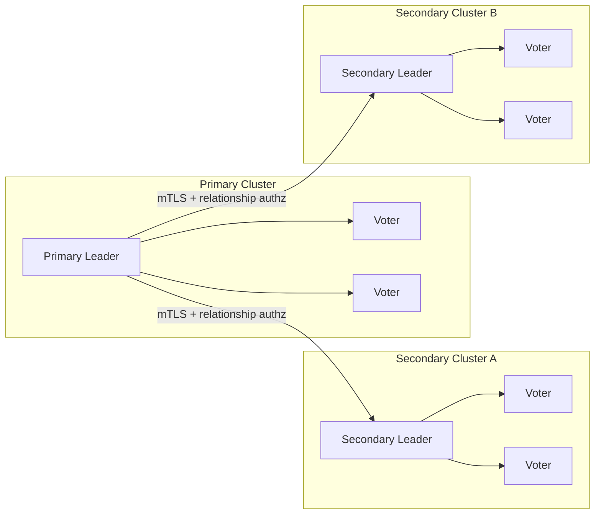
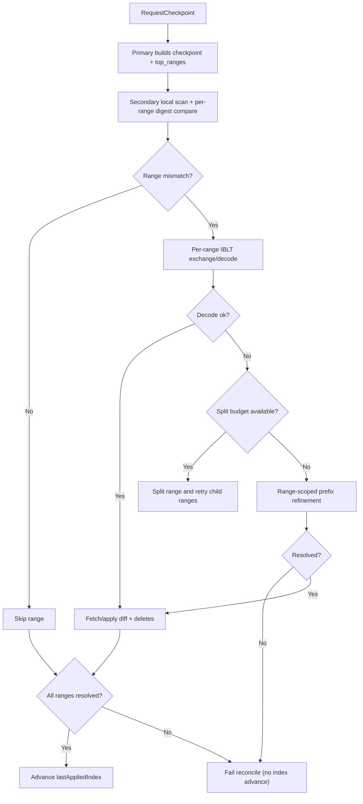

# RFC: Native Cross-Cluster DR Replication for OpenBao

## Status
Draft, implementation-backed.

## Summary
This RFC defines OpenBao Disaster Recovery (DR) replication as a native, cross-cluster feature with security-first bootstrap and fail-closed reconciliation.

The current architecture uses:
- Two independent Raft clusters (primary and secondary)
- Entry-level change streaming for normal operation
- Hybrid range-first reconciliation for recovery
- Strict relationship authorization (cert fingerprint + relationship state)
- Wrapped root-key bootstrap (no plaintext root-key transfer)
- Strict mTLS transport model (no insecure fallback)
- Multi-relationship primary support

## Problem Statement
OpenBao needed DR replication that is:
- Cross-cluster (true failure-domain isolation)
- Efficient for steady-state streaming and disconnection recovery
- Safe under revocation and partial failures
- Explicitly relationship-scoped for trust and lifecycle management
- Operable under high-keyspace and hotspot divergence without unbounded memory or bandwidth use

## Goals
1. Provide native DR with independent primary/secondary clusters.
2. Keep normal replication low-latency via ordered change stream.
3. Make recovery bandwidth scale with mismatch regions/diffs, not full keyspace.
4. Enforce strict security invariants (no plaintext root-key transfer, no insecure transport fallback).
5. Support multiple concurrently active DR relationships from one primary.
6. Fail closed on authorization, decode exhaustion, budget breaches, and partial apply failures.

## Non-Goals
1. Keyspace partitioning by tenant/namespace.
2. Backward compatibility with legacy plaintext bootstrap behavior.
3. Merkle-tree or WAL-shipping reconciliation.

## Architecture Overview

### Topology
- Primary cluster: source of truth, serves DR gRPC and reconciliation artifacts.
- Secondary cluster: independent Raft cluster, applies streamed/reconciled updates locally.
- Relationship model: one primary may serve multiple independent secondaries, each with its own `relationship_id`, certificate identity, and lifecycle state.



### Runtime Modes
1. Streaming mode:
   - Primary emits ordered `ChangeStreamEntry` mutations.
   - Secondary applies mutations and tracks `lastAppliedIndex`.

2. Reconciliation mode:
   - Triggered on stream gaps/disconnects or explicit catch-up failure.
   - Uses checkpoint-anchored hybrid range reconciliation.

### Security Invariants
1. No plaintext root key is transferred.
2. No insecure transport fallback is allowed.
3. Every DR RPC is relationship-authorized.
4. Revoked relationships are denied across all DR RPCs.

## Protocol and API Surface

### System API Endpoints
| Use | Method | Path |
|---|---|---|
| DR status | GET | `sys/replication/dr/status` |
| Enable primary | POST | `sys/replication/dr/primary/enable` |
| Disable primary | POST | `sys/replication/dr/primary/disable` |
| Generate activation token | POST | `sys/replication/dr/primary/secondary-token` |
| Register secondary cert | POST | `sys/replication/dr/primary/register-secondary` |
| List relationships | GET | `sys/replication/dr/primary/relationships` |
| Relationship status | GET | `sys/replication/dr/primary/relationships/:id/status` |
| Revoke relationship | POST | `sys/replication/dr/primary/relationships/:id/revoke` |
| Enable secondary | POST | `sys/replication/dr/secondary/enable` |
| Disable secondary | POST | `sys/replication/dr/secondary/disable` |
| Promote secondary | POST | `sys/replication/dr/secondary/promote` |

### gRPC Service
`vault/dr_replication_service.proto` defines:
- `StreamChanges`
- `RequestCheckpoint`
- `ExchangeStrataEstimator` (compatibility path)
- `ExchangeIBLT`
- `ExchangePrefixDigests`
- `FetchEntries`
- `Heartbeat`
- `SyncKeyring`

Additive range-aware protocol elements:
- `RangeSpan`
- `RangeDigest`
- `CheckpointResponse.top_ranges`
- `CheckpointResponse.range_plan_version`
- `IBLTMessage.span`
- `PrefixDigestRequest.span`
- `FetchEntriesRequest.ranges`

## Relationship and Bootstrap Model

### DRActivationToken
Relationship-scoped activation token fields:
- `cluster_id`
- `relationship_id`
- `primary_addr`
- `primary_api_addr`
- `repl_salt`
- `ca_cert`
- `primary_api_ca_cert` (optional)
- `primary_api_server_name` (optional)
- `bootstrap_token`

### DRRelationship Persistence
Per-relationship stored data:
- `relationship_id`
- `state` (`pending`, `registered`, `active`, `revoked`)
- `secondary_cert_fingerprint`
- `secondary_ca_cert`
- `bootstrap_token`
- `created_at`
- `last_seen_at`
- `expires_at`
- `failed_attempts`
- `locked_until`
- `registered_from_ip`
- `revoked_at`
- `last_error`

### Bootstrap Security
Bootstrap uses ECDH + AEAD wrapping:
1. Secondary sends `client_ephemeral_pubkey` and `client_nonce`.
2. Primary returns:
   - `wrapped_root_key`
   - `server_ephemeral_pubkey`
   - `wrap_nonce`
   - `wrap_aad_version`
   - encrypted `core/keyring` and `core/root-key` entries
3. Secondary unwraps locally and adopts key material.

No plaintext root key flow exists.

## Replication Data Model
Reconciliation operates over encrypted storage identity pairs:
- `KID = HMAC(repl_salt, canonical_storage_key)`
- `VID = hash(ciphertext bytes / tombstone representation)`

This keeps reconciliation below the barrier while preserving confidentiality of key names and values.

## Reconciliation Algorithm (Current)

### Phase A: Checkpoint + Range Manifest
1. Secondary requests checkpoint from primary.
2. Primary scans checkpoint state and computes deterministic top-level ranges (`top_ranges`) using balanced limits.
3. Primary caches checkpoint artifacts under strict budgets.

### Phase B: Local Compare by Range
1. Secondary performs local scan for the checkpoint.
2. Secondary computes local digest for each top range.
3. Matching ranges are skipped.
4. Mismatched ranges enter a work queue.

### Phase C: One-Shot Per-Range IBLT
For each mismatched range:
1. Secondary sizes IBLT from estimated diff.
2. Secondary requests range-scoped `ExchangeIBLT(span=...)`.
3. If decode succeeds:
   - fetch/add missing or changed items
   - delete secondary-only items

### Phase D: Adaptive Split on Decode Failure
If decode fails:
1. Split the range into two child spans.
2. Retry per-child IBLT while split budgets permit.
3. Continue until decoded or limits are reached.

### Phase E: In-Range Prefix Refinement
If decode remains stubborn:
1. Run range-scoped prefix digest refinement (`p=8 -> 12 -> 16`, bounded).
2. Fetch mismatched in-range buckets/ranges.
3. Apply puts/deletes.

### Phase F: Commit Rule
`lastAppliedIndex` advances only if all admitted range work succeeds:
- no unresolved `failed_kids`
- no apply failures
- no unresolved range failures

Any unresolved failure is a reconciliation failure and retries later.



### Compatibility Path
If `top_ranges` are absent (older peer behavior), the secondary uses legacy flow:
- strata estimation
- global IBLT
- prefix digest fallback

## Ordering and Correctness
1. Change stream delivery is ordered by Raft index.
2. Gap detection fails closed on forward jumps.
3. Duplicate/old entries (`<= lastAppliedIndex`) are ignored safely.
4. Seal-wrap metadata is preserved in replication operations.
5. Catch-up boundary handling uses `missing_from = last_applied_index + 1` semantics.

## Resource Controls and Fail-Closed Behavior

### Checkpoint Cache (Primary)
- Global budget: 256 MiB
- Per-relationship budget: 64 MiB
- Max checkpoints per relationship: 2
- TTL: 5 minutes

Eviction order:
1. Expired
2. Oldest within relationship
3. Oldest global

If admission still fails, `RequestCheckpoint` fails with precondition error.

### Reconcile Budgets (Secondary)
- Top ranges max: 256
- Max total ranges after split: 1024
- Max split depth: 6
- Max IBLT cells per range: 32768
- Max reconcile RPC bytes: 128 MiB
- Max reconcile wall time: 5 minutes
- Max inflight range tasks: 16 (scheduling target)

Budget breach is explicit failure (`budget_exceeded`), not silent degradation.

## Revocation and Authz Behavior
1. Revoke marks relationship state as `revoked` and persists it.
2. Trusted cert material for that relationship is removed.
3. Active streams for that relationship are terminated immediately.
4. Other relationships remain unaffected.
5. Stream path also performs periodic auth revalidation.

## Token Abuse Resistance
Bootstrap registration policy defaults:
- TTL: 15 minutes
- Max failed attempts: 5
- Lockout: 30 minutes
- Source-IP recording on successful registration

On failed validation:
- failed attempts are incremented and persisted
- lockout is applied when threshold is reached
- error context is recorded (`last_error`)

## Heartbeat and Persistence Throttling
- In-memory liveness updates are immediate.
- Persistent `last_seen_at` writes are throttled to once per 30 seconds per relationship.
- Durable writes are forced on key state transitions (for example registration/activation/revocation paths).

## Observability

### Status Endpoint
`GET sys/replication/dr/status` includes:
- Mode and cluster metadata
- Secondary counters/state (`last_applied_index`, `reconcile_count`, `connect_retries`, `connect_failures`)
- `reconcile_ranges_inflight`
- `reconcile_ranges_failed`
- `reconcile_budget_remaining_bytes`
- `checkpoint_cache_bytes`
- `checkpoint_cache_items`
- `checkpoint_cache_evictions`
- `revoked_streams_terminated`
- `relationship_count_by_state`

### Metrics
Representative metrics emitted include:
- stream subscribers/buffer/drop counters
- checkpoint cache bytes/items/evictions
- range reconciliation counts (`ranges_total`, `ranges_mismatched`, `ranges_split`)
- decode failures
- budget exceeded counts
- RPC bytes and IBLT cell usage

## Failover
Secondary promotion path:
1. Stop DR ingest.
2. Transition from DR secondary semantics to standalone primary semantics.
3. Resume serving client writes on promoted cluster.

## Testing Expectations
Core validation includes:
1. DR stream replication and gap handling.
2. Disconnect + reconcile flows.
3. Read-only enforcement on secondary.
4. Revoke isolation and active stream termination.
5. Bootstrap hardening (expiry, lockout, source IP tracking).
6. Range-path scenarios:
   - deterministic manifest
   - per-range IBLT success
   - adaptive split
   - in-range prefix refinement
   - budget-exceeded failure
   - no index advance on partial failure
   - multi-relationship isolation
   - revoke during reconcile abort

## Rationale and Alternatives
Chosen approach:
- Cross-cluster replication for true DR isolation.
- Entry stream + checkpointed set reconciliation for correctness and efficiency.
- Hybrid range-first flow for better large-keyspace/hotspot behavior.

Alternatives rejected:
- WAL shipping
- Merkle-tree reconciliation
- plaintext root-key bootstrap
- insecure transport fallback

## Operational Notes
1. Range partitioning is a performance partitioning mechanism, not a security or tenancy boundary.
2. Additive protocol evolution is used; no protocol version bump was required for current range fields.
3. Legacy reconcile path remains available when peers do not provide range manifest fields.

## Implementation Mapping

### Core Replication and Reconciliation
| RFC Area | Primary Implementation | Secondary/Supporting Implementation |
|---|---|---|
| DR primary server and subscriber model | `vault/dr_replication.go:42`, `vault/dr_replication.go:189` | `vault/dr_replication_secondary.go:253` |
| Checkpoint creation and cache admission | `vault/dr_replication.go:268`, `vault/dr_replication.go:868` | `vault/dr_replication_secondary.go:951` |
| Range manifest generation | `vault/dr_replication.go:293` | `physical/replication/reconciler/range.go:121` |
| Range-scoped IBLT exchange | `vault/dr_replication.go:350` | `vault/dr_replication_secondary.go:1135` |
| Range-scoped prefix refinement | `vault/dr_replication.go:393` | `vault/dr_replication_secondary.go:1294` |
| Range/range+bucket fetch semantics | `vault/dr_replication.go:457` | `vault/dr_replication_secondary.go:1737` |
| Legacy strata/global fallback path | `vault/dr_replication.go:330` | `vault/dr_replication_secondary.go:984` |

### Protocol Surface
| RFC Area | Proto Definition |
|---|---|
| DR service | `vault/dr_replication_service.proto:20` |
| Stream entry and request | `vault/dr_replication_service.proto:56`, `vault/dr_replication_service.proto:80` |
| Checkpoint + range manifest fields | `vault/dr_replication_service.proto:95`, `vault/dr_replication_service.proto:112`, `vault/dr_replication_service.proto:122` |
| Range-scoped IBLT request | `vault/dr_replication_service.proto:140` |
| Range-scoped prefix request | `vault/dr_replication_service.proto:155` |
| Range-aware fetch request | `vault/dr_replication_service.proto:185` |
| Heartbeat messages | `vault/dr_replication_service.proto:217`, `vault/dr_replication_service.proto:225` |
| Wrapped bootstrap key exchange | `vault/dr_replication_service.proto:233`, `vault/dr_replication_service.proto:241` |

### Security and Relationship Lifecycle
| RFC Area | Implementation |
|---|---|
| Activation token schema | `vault/dr_replication_state.go:75` |
| Relationship schema/state model | `vault/dr_replication_state.go:109`, `vault/dr_replication_state.go:118` |
| Token generation and expiry fields | `vault/dr_bootstrap_registration.go:29`, `vault/dr_bootstrap_registration.go:55` |
| Bootstrap validation, lockout, source IP | `vault/dr_bootstrap_registration.go:182` |
| Relationship authorization checks | `vault/dr_relationship_authz.go:50`, `vault/dr_replication.go:985` |
| Revocation semantics | `vault/dr_relationship_authz.go:13`, `vault/dr_replication.go:962` |
| Heartbeat last-seen throttling | `vault/dr_relationship_authz.go:110` |
| Cluster cert trust and fingerprint propagation | `vault/dr_cluster.go:37`, `vault/dr_cluster.go:93`, `vault/dr_cluster.go:139`, `vault/dr_cluster.go:158` |

### API and Operational Wiring
| RFC Area | Implementation |
|---|---|
| System DR routes | `vault/logical_system_dr.go:23` |
| Primary token endpoint route | `vault/logical_system_dr.go:109`, `vault/logical_system.go:89` |
| Register-secondary and relationship routes | `vault/logical_system_dr.go:201`, `vault/logical_system_dr.go:245`, `vault/logical_system_dr.go:262`, `vault/logical_system_dr.go:286` |
| Status handler fields | `vault/logical_system_dr.go:342` |
| Core manager wiring/load | `vault/core.go:1176`, `vault/core.go:2521` |
| Secondary write enforcement | `vault/request_handling.go:583` |
| Failover/promotion path | `vault/dr_failover.go:42`, `vault/dr_replication_state.go:444` |

### Storage/Hook Plumbing
| RFC Area | Implementation |
|---|---|
| Public change-stream interface | `sdk/physical/physical.go:74`, `sdk/physical/physical.go:98` |
| Raft backend hook registration | `physical/raft/raft.go:217` |
| Ordered FSM batch hook emission | `physical/raft/fsm.go:772`, `physical/raft/fsm.go:936`, `physical/raft/fsm.go:971` |
| Seal-wrap propagation in transaction log ops | `physical/raft/transaction.go:709` |

### Budgets and Defaults
| RFC Area | Implementation |
|---|---|
| Bootstrap policy defaults | `vault/dr_replication_state.go:33` |
| Last-seen persistence throttle | `vault/dr_replication_state.go:39` |
| Checkpoint cache budgets and TTL | `vault/dr_replication.go:30` |
| Range reconcile limits | `vault/dr_replication_secondary.go:74` |
| Deterministic range planner defaults | `physical/replication/reconciler/range.go:18`, `physical/replication/reconciler/range.go:40` |

### Test Coverage Map
| RFC Area | Tests |
|---|---|
| Range manifest determinism | `vault/dr_replication_integration_test.go:1932` |
| Per-range IBLT success | `vault/dr_replication_integration_test.go:1972` |
| Adaptive split path | `vault/dr_replication_integration_test.go:2022` |
| In-range prefix refinement | `vault/dr_replication_integration_test.go:2066` |
| Budget-exceeded fail-closed behavior | `vault/dr_replication_integration_test.go:2123` |
| No index advance on partial range failure | `vault/dr_replication_integration_test.go:2183` |
| Multi-relationship isolation | `vault/dr_replication_integration_test.go:2265` |
| Revoke-during-reconcile abort | `vault/dr_replication_integration_test.go:2316` |
| Checkpoint cache budget and eviction | `vault/dr_replication_test.go:880`, `vault/dr_replication_test.go:899` |
| Revoke stream termination isolation | `vault/dr_replication_test.go:824` |
| Bootstrap expiry/lockout/source-IP/throttle | `vault/dr_replication_test.go:125`, `vault/dr_replication_test.go:165`, `vault/dr_replication_test.go:202`, `vault/dr_replication_test.go:230` |

## Demo (CLI)

### Primary
```bash
bao write sys/replication/dr/primary/enable
bao write -format=json sys/replication/dr/primary/secondary-token > dr-token.json
bao read sys/replication/dr/primary/relationships
bao read sys/replication/dr/status
```

### Secondary
```bash
bao write sys/replication/dr/secondary/enable token="$(jq -r '.data.token' dr-token.json)"
bao read sys/replication/dr/status
```

### Revoke relationship
```bash
bao write sys/replication/dr/primary/relationships/<relationship-id>/revoke
```

### Promote secondary
```bash
bao write sys/replication/dr/secondary/promote
```
