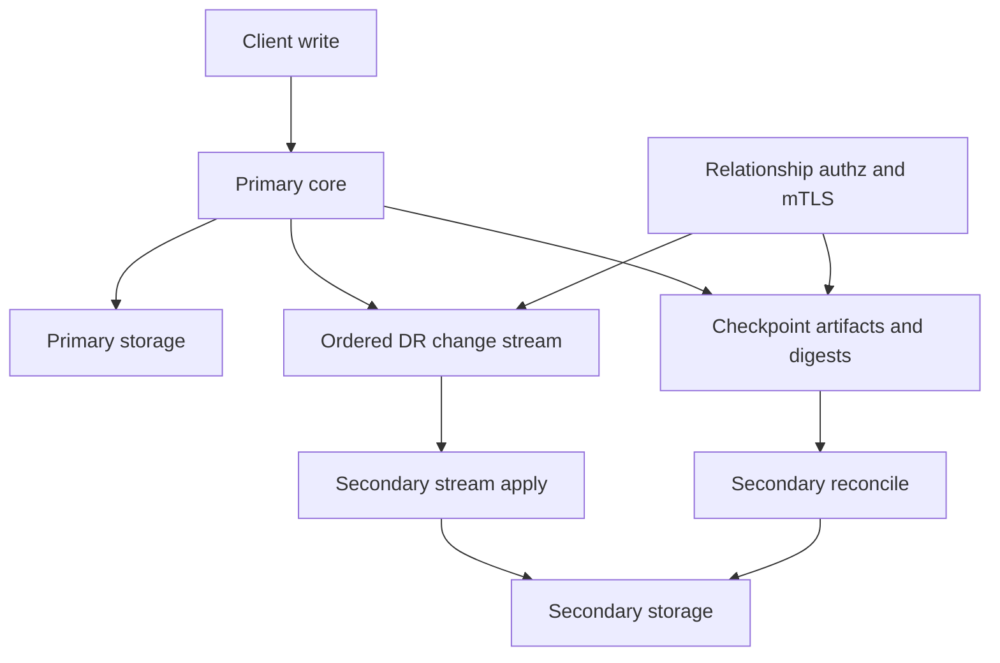

# Native cross-cluster DR replication

**Status**: draft, proof-of-concept under active correctness validation.

## Summary

This RFC proposes native disaster recovery (DR) replication for OpenBao across
independent clusters. A primary cluster streams ordered storage mutations to one
or more secondary clusters, and secondaries use checkpoint-fenced
reconciliation to recover from stream gaps or disconnects.

The design is intentionally fail-closed:

- DR transport uses mTLS with relationship-scoped authorization.
- Bootstrap never transfers the root key in plaintext.
- Reconciliation is bound to immutable checkpoint tuples.
- Fetched range contents must prove completeness before deletes are inferred.
- A secondary only advances `lastAppliedIndex` after every required apply and
  delete phase succeeds.

This RFC reflects the current PoC direction after stress-test hardening. It
does not treat dirty bitmaps, stream replay, or partial range fetches as
authoritative unless their coverage and completeness are proven.

## Problem statement

OpenBao does not currently provide native cross-cluster DR replication. Users
who need a warm disaster recovery cluster must rely on external backup,
restore, snapshot, or storage-level replication workflows. Those approaches
have several limitations:

- They do not provide a relationship-scoped OpenBao control plane.
- They are not naturally tied to OpenBao authorization, seal, or key lifecycle.
- They can couple primary and secondary failure domains.
- They make failover state and promotion semantics operator-specific.
- They do not give OpenBao a way to reason about stream gaps, divergence, or
  partial reconciliation failures.

The desired system is an OpenBao-native replication protocol that keeps a
secondary cluster close to the primary while preserving strict safety during
disconnects, revocation, failover, and high write load.

## User-facing description

Operators enable DR primary mode on a source cluster, create a bootstrap token
for each secondary relationship, and enable DR secondary mode on one or more
independent clusters.

In normal operation, the secondary is read-only for replicated data and applies
changes streamed from the primary. The secondary exposes status showing
relationship state, last applied index, reconnect/reconcile activity, lag, and
fallback counters.

If the stream disconnects and replay is still available, the secondary resumes
from its last applied index. If replay is not available, the secondary enters
reconciliation. Reconciliation compares checkpoint-fenced range digests,
fetches proven mismatched spans, applies fetched primary entries, deletes
secondary-local entries that are absent from the proven primary set, and then
advances its checkpoint.

If the primary is permanently unavailable, an operator can promote a secondary.
After promotion, the cluster becomes standalone and accepts local writes.

## Goals

1. Provide native DR replication across independent OpenBao clusters.
2. Support multiple secondary relationships from one primary.
3. Keep steady-state replication low-latency with ordered change streaming.
4. Recover from stream gaps without requiring full keyspace copy when possible.
5. Fail closed on authorization, checkpoint, transport, proof, budget, and apply
   failures.
6. Avoid plaintext root-key transfer during bootstrap.
7. Keep replicated data in the ciphertext storage domain.
8. Preserve local-only cluster state such as seal configuration and DR
   relationship configuration.
9. Provide explicit promotion semantics for disaster recovery failover.

## Non-goals

1. Active-active writes across clusters.
2. Tenant or namespace-level keyspace partitioning.
3. Compatibility with any legacy DR protocol.
4. Storage-layer replication outside OpenBao.
5. Merkle tree persistence as the primary reconciliation strategy.
6. A guarantee that secondaries can serve stale reads while still in secondary
   mode.

## Technical description

### Topology

The topology has one primary OpenBao cluster and one or more secondary OpenBao
clusters.

The primary cluster remains the source of truth while DR is active. It serves
DR gRPC endpoints, relationship management APIs, change streams, checkpoint
metadata, range digests, and checkpoint-fenced entry fetches.

Each secondary cluster is an independent OpenBao cluster with its own storage,
seal, Raft state, and cluster identity. Secondary mode makes replicated data
read-only to clients while allowing DR control operations.

### Relationship lifecycle

A DR relationship is identified by a `relationship_id` and is bound to the
secondary's certificate identity. Request-supplied relationship IDs are not
trusted on their own; primary-side authorization derives the caller identity
from the mTLS peer certificate and checks persisted relationship state.

The relationship lifecycle is:

1. Operator enables DR primary mode.
2. Primary generates or loads DR transport CA state.
3. Operator creates a secondary activation token.
4. Secondary enables DR using that activation token.
5. Secondary connects to the primary over mTLS.
6. Primary authorizes every DR RPC against the relationship record.
7. Operator can revoke the relationship, which denies further RPCs and
   terminates matching streams.

### Bootstrap

Bootstrap establishes trust and transfers only wrapped key material.

The activation token carries:

- `relationship_id`
- primary cluster identity
- DR transport CA certificate
- bootstrap endpoint information
- wrapped bootstrap material
- expiry and single-use semantics

The root key is not sent in plaintext. Bootstrap wrapping binds the exchange to
the primary identity, secondary identity, relationship ID, cluster ID, and
protocol version. This prevents cross-cluster replay and unknown-key-share
attacks.

After bootstrap, the secondary removes or preserves local-only state according
to the replication exclusion rules below.

### Transport trust model

DR traffic uses mTLS. The primary owns a dedicated DR transport CA. Primary
nodes present leaf certificates signed by this CA. The secondary pins the DR
transport CA from the activation token and rejects primary certificates that do
not chain to it.

Heartbeat responses can propagate active primary leaf certificates, but those
certificates are only accepted if they chain to the pinned DR transport CA. This
avoids trust-on-first-use behavior.

The protocol has no insecure fallback. If trusted certificate context is
missing or invalid, DR connection establishment fails.

### Replication domain

DR replication operates below the barrier in the ciphertext storage domain.
Fetched values and streamed values are stored as encrypted physical entries.
This avoids decrypting secrets for replication and preserves storage-level
representation.

Some paths are cluster-local and must not be replicated. Examples include local
seal configuration, local root-key wrapping state, local mount/auth/audit tables
when they represent secondary-local configuration, cluster identity, DR
relationship configuration, and leadership coordination locks.

The implementation must centralize these exclusions and apply them consistently
to stream apply, fetched entry apply, and inferred deletes.

### Streaming mode

Streaming mode is the normal operating mode.

The primary emits ordered physical storage changes with Raft indexes. The
secondary applies those changes in deterministic batches. `lastAppliedIndex`
only advances after the relevant batch has been durably applied.

The stream supports reconnect. If the primary can replay from the secondary's
last applied index, the secondary resumes streaming. If replay is unavailable
or a gap is detected, the secondary enters reconciliation.

The PoC includes an in-memory stream buffer and disk-backed stream journal.
The design intent is that journal replay extends the reconnect horizon and
survives primary-node restarts and leader changes.

### Checkpoints

A checkpoint is an immutable primary-side view of replicated storage at a
specific commit index.

Checkpoint identity is a tuple:

- checkpoint ID
- checkpoint commit index
- relationship identity

All reconciliation RPCs are bound to that tuple. A secondary rejects fetched
entry batches, range checksums, range digests, or delete phases that do not
match the active checkpoint tuple.

The primary stores checkpoint artifacts so `FetchEntries` reads from the
checkpoint view rather than live storage. This prevents live storage drift from
corrupting reconciliation.

### Reconciliation overview

Reconciliation repairs divergence when streaming cannot safely resume.

The high-level flow is:

1. Secondary requests a checkpoint.
2. Secondary scans local physical storage into KID/VID maps.
3. Secondary selects ranges that require verification.
4. Primary and secondary compare top-level range checksums.
5. Mismatched ranges enter mandatory digest drill-down.
6. Primary returns child range digests that fully cover each parent span.
7. Secondary fetches mismatched spans.
8. Secondary validates fetched content against the advertised digest proofs.
9. Secondary applies fetched primary entries.
10. Secondary deletes local-only keys only after the fetched remote set is
    proven complete.
11. Secondary advances `lastAppliedIndex` only after all phases succeed.

### KID and VID model

Reconciliation compares storage entries by:

- KID: keyed identifier derived from the storage key and replication salt.
- VID: value identifier derived from the ciphertext value and seal-wrap flag,
  or a tombstone value for deletes.

The primary and secondary compare KID/VID metadata first, then fetch concrete
entries only for mismatched spans.

### Range checksums

Top-level range checksums are a coarse filter. They identify likely mismatched
ranges but are not sufficient to prove fetched completeness.

A checksum match may skip the range only if range selection itself is proven
complete for the checkpoint. A checksum mismatch always requires digest
drill-down.

### Mandatory digest drill-down

For each mismatched range, the secondary calls `ExchangeRangeDigests` with a
parent span. The primary returns child digest descriptors.

Each digest descriptor includes:

- child span
- count
- XOR of SHA-256 over KIDs
- XOR of SHA-256 over KID/VID pairs
- approximate value bytes for planning

The secondary rejects digest responses that:

- are nil or empty
- contain invalid spans
- contain spans outside the parent
- overlap
- leave gaps in parent coverage
- fail to advance split depth for a splittable parent
- omit digest hash fields

Because this is a greenfield feature, unsupported or failing drill-down does
not fall back to an unproven fetch path. It fails reconciliation.

### Fetch completeness proof

For every fetched span, the secondary recomputes digest accumulators over the
received entries and compares them to the primary's advertised digest.

The secondary rejects fetched output that:

- has a nil batch
- has a checkpoint tuple mismatch
- contains `failed_kids`
- contains an entry without a resolvable KID
- contains duplicate KIDs
- contains KIDs outside the requested spans
- omits entries required by the span digest
- includes entries that make the recomputed digest differ

Only after digest validation succeeds can the secondary treat the fetched set
as the complete primary set for those spans.

### Delete inference

Range fetches stream primary-present entries. They do not naturally list
secondary-local keys that no longer exist on the primary.

After fetch completeness is proven, the secondary compares local KIDs in the
fetched spans against remote KIDs received from the primary. Local KIDs absent
from the proven remote set become candidate deletes.

Deletes are applied after fetched puts complete. This ordering prevents
transient replacement ordering issues and keeps the delete phase separately
auditable. Delete application is fail-closed and checkpoint-bound.

### Range selection completeness

This is the main remaining correctness target.

Dirty bitmaps are useful for reducing work, but they must not be treated as
authority. A checkpoint cannot be marked applied unless the secondary has
verified every relevant range or has a tuple-bound proof that skipped ranges
were unchanged since the secondary's resume point.

The required invariant is:

> `lastAppliedIndex` must not advance for a checkpoint unless range selection
> is complete for that checkpoint.

Acceptable designs include:

- always verifying all top-level ranges before checkpoint advancement
- using dirty bitmaps only as priority hints
- adding a checkpoint-bound coverage proof for skipped ranges
- periodically forcing full top-level verification

The PoC should not be considered correctness-complete until this invariant has
an implementation and regression coverage.

### Apply and commit rule

Reconciliation has distinct phases:

1. range comparison and drill-down
2. fetch proof validation
3. fetched put application
4. inferred delete application
5. checkpoint finalization

If any phase fails, the secondary does not advance `lastAppliedIndex`. A later
reconciliation attempt can retry from the previous committed state.

### Resnapshot fallback

When bounded reconciliation cannot converge, the secondary may perform a full
resnapshot from a checkpoint. Resnapshot still uses checkpoint-fenced fetches
and fail-closed apply semantics.

Fallback is a recovery mechanism, not a way to bypass reconciliation proofs.
It should be triggered by explicit operator action or by configured convergence
policy after repeated bounded failures.

### Promotion

Promotion converts a DR secondary into a standalone cluster.

Promotion must:

- stop DR stream/reconciliation activity
- clear secondary read-only enforcement
- prevent use of stale primary relationship state
- leave the promoted cluster with local ownership of future writes

Promotion does not preserve an active relationship to the old primary.

### API surface

The expected HTTP API shape is:

- `sys/replication/dr/primary/enable`
- `sys/replication/dr/primary/disable`
- `sys/replication/dr/primary/secondary-token`
- `sys/replication/dr/primary/revoke-secondary`
- `sys/replication/dr/secondary/enable`
- `sys/replication/dr/secondary/disable`
- `sys/replication/dr/secondary/promote`
- `sys/replication/dr/status`

The expected gRPC protocol includes:

- `StreamChanges`
- `Heartbeat`
- `RequestCheckpoint`
- `ExchangeDirtyBitmap`
- `ExchangeRangeChecksums`
- `ExchangeRangeDigests`
- `FetchEntries`
- `SyncKeyring`

All DR gRPC calls require mTLS and relationship authorization.

### Resource controls

The protocol needs bounded resource use:

- checkpoint artifact retention budgets
- checkpoint build throttling
- stream replay horizon budgets
- max in-flight reconcile tasks
- max RPC bytes per reconciliation
- max wall time per reconciliation
- max split depth
- max split count
- batch sizes for fetched puts and deletes
- bounded stream apply queues
- primary-side backpressure when secondaries cannot converge

Budget exhaustion is a reconciliation failure unless an operator explicitly
chooses a fallback path.

### Observability

The status API should expose:

- DR mode and secondary state
- relationship ID
- primary index
- last applied index
- active checkpoint tuple
- reconcile phase
- reconnect counters
- fallback counters and last fallback reason
- stream lag and apply rates
- range task counts
- budget usage
- journal replay health
- backpressure state

Metrics should make it possible to distinguish:

- normal streaming
- reconnect replay
- reconciliation
- resnapshot fallback
- authz failures
- checkpoint tuple failures
- fetch proof failures
- apply failures
- budget failures
- delete safety failures

## Rationale and alternatives

### Why OpenBao-native replication

OpenBao-native replication can enforce OpenBao-specific invariants that storage
replication and snapshot workflows cannot easily enforce: relationship authz,
seal-aware bootstrap, ciphertext-domain apply, local path exclusions,
checkpoint-fenced fetches, and fail-closed promotion behavior.

### Why checkpoint-fenced reconciliation

Reconciling against live primary storage can race with ongoing writes. A
checkpoint gives the secondary a stable target. Every fetched entry and digest
must be tied to the checkpoint tuple.

### Why digest proof before deletes

Deletes are inferred from absence. Absence is only meaningful if the primary's
response is complete. Digest proof validation turns "the primary did not send
this key" into a defensible statement about the checkpoint.

### Why mandatory drill-down

This is a greenfield feature. There is no compatibility requirement to support
older primaries that lack `ExchangeRangeDigests`. Mandatory drill-down removes
an unsafe fallback path and makes proof validation uniform.

### Alternatives rejected

Full snapshot on every disconnect:
Simple, but too expensive for large installations and unnecessary for small
stream gaps.

Merkle tree persistence:
Useful, but adds persistent index maintenance and failure modes. The current
proposal starts with checkpoint-built range descriptors and can evolve toward
persistent structures later.

WAL shipping:
Efficient for storage engines with a native WAL contract, but it couples DR to
backend internals and does not naturally support OpenBao relationship authz or
local path exclusions.

Trusting dirty bitmaps as authority:
Too risky. A bitmap false negative can silently skip divergence. Dirty bitmaps
should optimize scheduling, not define correctness.

## Downsides

This design adds a substantial protocol surface and correctness burden.
Checkpoint artifacts, range descriptors, stream journals, and proof validation
all require careful resource management.

Mandatory drill-down means older or partially implemented primaries cannot be
used for reconciliation. That is acceptable for a greenfield feature but makes
rolling upgrades a future design topic.

Proof validation adds CPU cost during reconciliation. This is the cost of
making delete inference safe.

The current PoC still needs range selection completeness before it can be
considered robust under adversarial or stress-test conditions.

## Security implications

The design improves security by avoiding plaintext root-key transfer, requiring
mTLS, binding every RPC to a relationship, and failing closed on revoked
relationships or checkpoint mismatches.

The main security-sensitive areas are:

- bootstrap token lifetime and single-use enforcement
- mTLS certificate validation
- relationship revocation
- checkpoint artifact integrity
- local-only path exclusions
- delete inference
- promotion boundaries

The most important reconciliation security property is that a secondary must
not delete local data based on incomplete or unproven primary output.

## User/developer experience

Operators get a first-class DR workflow instead of composing external backup
and restore steps. Normal workloads continue to write only to the primary.
Secondaries expose read-only replicated state and clear DR status.

Developers get a protocol with explicit phases and failure classes. Tests can
target each invariant independently: authz, checkpoint tuple binding, digest
coverage, fetch proof validation, delete safety, stream replay, and promotion.

## Unresolved questions

1. What exact range selection completeness mechanism should be used before
   checkpoint advancement?
2. Should top-level full-range verification happen every reconciliation, on a
   cadence, or only after dirty bitmap uncertainty?
3. What are the final retention defaults for checkpoint artifacts and stream
   journal segments?
4. How should DR transport CA rotation work without relationship
   re-bootstrap?
5. What rolling-upgrade guarantees, if any, should DR support?
6. Should secondaries ever serve replicated reads while lagging, or should
   secondary mode remain operationally read-only/standby?
7. What promotion guardrails should prevent accidental split-brain?

## Related issues

This RFC is currently local to the PoC branch. Before upstream submission it
should reference any OpenBao issue or discussion used to track native DR
replication.

## Proof of concept

The PoC currently includes:

- relationship manager and DR mode state
- activation token flow
- DR mTLS transport setup
- primary change stream
- secondary stream apply
- checkpoint request and artifact-backed fetch
- range checksum and digest RPCs
- mandatory digest drill-down for mismatched ranges
- fetch completeness validation
- inferred local-only deletes
- secondary read-only enforcement
- relationship revocation handling
- promotion API wiring
- status and metrics fields

The PoC is still under correctness hardening. The next required correctness
target is range selection completeness: dirty bitmaps must not allow a
checkpoint to advance while unverified ranges may still diverge.

## Test plan

Tests should cover the following groups:

- bootstrap token expiry, single use, and relationship binding
- strict TLS and certificate trust behavior
- stream apply ordering and `lastAppliedIndex` advancement
- stream reconnect and replay horizon behavior
- checkpoint tuple mismatch failures
- checkpoint artifact fetch instead of live storage fetch
- digest response coverage failures
- fetch output proof failures
- local-only delete inference
- delete safety when stream boundaries move
- revocation during stream and reconciliation
- fallback/resnapshot behavior
- promotion safety
- dirty bitmap false-negative behavior
- stress convergence under sustained writes

The local test matrix is tracked in `DR_TEST_MATRIX.md`.
