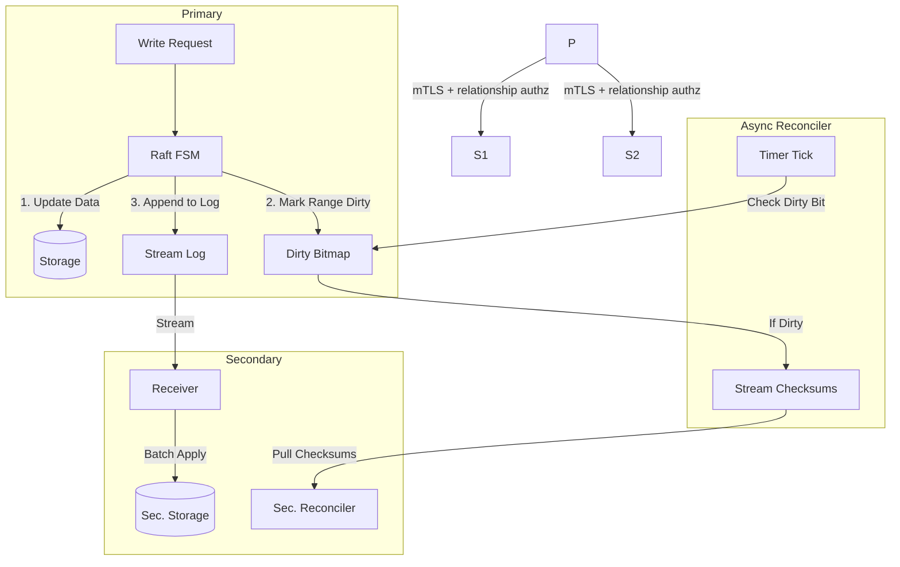
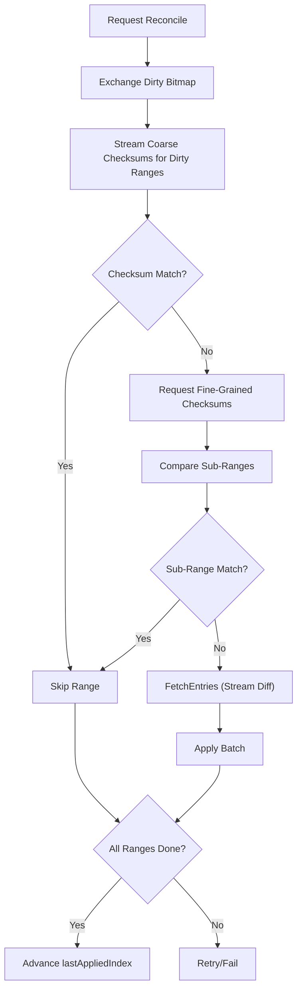

# RFC: Native Cross-Cluster DR Replication for OpenBao

## Status

Draft, implementation-backed.

## Summary

This RFC defines OpenBao Disaster Recovery (DR) replication as a native, cross-cluster feature with security-first bootstrap and fail-closed reconciliation.

The current architecture uses:

- Two (or more) independent Raft clusters (primary and one or more secondaries)
- Entry-level change streaming for normal operation with transactional batching
- Disk-backed stream journal replay to extend reconnect horizon beyond in-memory ring depth
- Immutable disk-backed checkpoint artifact store for checkpoint-fenced fetches
- Ordered hash-stream reconciliation for recovery (Dirty-range optimized)
- Ciphertext-domain reconciliation/apply below the barrier
- Convergence controller with lag-slope/rate-ratio fallback triggering
- Primary ingress write backpressure with DR-aware bounded admission
- Strict relationship authorization (cert fingerprint + relationship state)
- Wrapped root-key bootstrap (no plaintext root-key transfer)
- Strict mTLS transport model (no insecure fallback)
- Multi-relationship primary support

## Problem Statement

OpenBao needed DR replication that is:

- Cross-cluster (true failure-domain isolation)
- Efficient for steady-state streaming and disconnection recovery
- Safe under revocation and partial failures
- Explicitly relationship-scoped for trust and lifecycle management
- Operable under high-keyspace and hotspot divergence without unbounded memory or bandwidth use

## Goals

1. Provide native DR with independent primary/secondary clusters.
2. Keep normal replication low-latency via ordered change stream.
3. Make recovery bandwidth scale with mismatch regions/diffs, not full keyspace.
4. Enforce strict security invariants (no plaintext root-key transfer, no insecure transport fallback).
5. Support multiple concurrently active DR relationships from one primary.
6. Fail closed on authorization, budget breaches, and partial apply failures.
7. Optimize throughput via transactional batching to minimize storage IOPS impact.
8. Decouple reconciliation scaling from storage size via Dirty Bitmaps.

## Non-Goals

1. Keyspace partitioning by tenant/namespace.
2. Merkle-tree or WAL-shipping reconciliation.

## Architecture Overview

### Topology

- Primary cluster: source of truth, serves DR gRPC and reconciliation artifacts.
- Secondary cluster: independent Raft cluster, applies streamed/reconciled updates locally.
- Relationship model: one primary may serve multiple independent secondaries, each with its own `relationship_id`, certificate identity, and lifecycle state.



### Runtime Modes

1. Streaming mode:
   - Primary emits ordered `ChangeStreamEntry` mutations.
   - Primary retains replay history in in-memory ring plus on-disk stream journal segments.
   - Secondary applies mutations in transactional batches (where supported) to maximize throughput.
   - Secondary tracks `lastAppliedIndex` and updates it upon successful batch commit.

2. Reconciliation mode:
   - Triggered on stream gaps/disconnects or explicit catch-up failure.
   - Uses dirty-map optimized ordered hash streaming.
   - Fetched entries are applied in transactional batches to prevent timeouts and ensure catch-up speed exceeds arrival rate.

### Security Invariants

1. No plaintext root key is transferred.
2. DR transport fails closed if trusted cert context is unavailable (no plaintext/insecure DR link path).
3. Every DR RPC is relationship-authorized.
4. Revoked relationships are denied across all DR RPCs.

## Protocol and API Surface

### System API Endpoints

| Use | Method | Path |
|---|---|---|
| DR status | GET | `sys/replication/dr/status` |
| Enable primary | POST | `sys/replication/dr/primary/enable` |
| Disable primary | POST | `sys/replication/dr/primary/disable` |
| Generate activation token | POST | `sys/replication/dr/primary/secondary-token` |
| Register secondary cert | POST | `sys/replication/dr/primary/register-secondary` |
| List relationships | GET | `sys/replication/dr/primary/relationships` |
| Relationship status | GET | `sys/replication/dr/primary/relationships/:id/status` |
| Revoke relationship | POST | `sys/replication/dr/primary/relationships/:id/revoke` |
| Enable secondary | POST | `sys/replication/dr/secondary/enable` |
| Disable secondary | POST | `sys/replication/dr/secondary/disable` |
| Promote secondary | POST | `sys/replication/dr/secondary/promote` |
| Trigger secondary resnapshot | POST | `sys/replication/dr/secondary/resnapshot` |
| Read DR tuning | GET | `sys/replication/dr/tuning` |
| Update DR tuning | POST | `sys/replication/dr/tuning` |

Auth model notes:

- `sys/replication/dr/status` is unauthenticated.
- `sys/replication/dr/primary/register-secondary` is unauthenticated and bootstrap-token authenticated by payload.
- Other DR system endpoints follow normal `sys/` root protections.
- While in DR secondary mode, write requests are read-only blocked except:
  - `sys/replication/dr/secondary/promote`
  - `sys/replication/dr/secondary/disable`
  - `sys/replication/dr/secondary/resnapshot`
  - `sys/replication/dr/tuning`
  - `sys/seal`
  - `sys/step-down`
  - namespace-prefixed variants of the same paths.

### gRPC Service

`vault/dr_replication_service.proto` defines:

- `StreamChanges`
- `RequestCheckpoint`
- `ExchangeDirtyBitmap`
- `ExchangeRangeChecksums`
- `ExchangeRangeDigests` (Fine-grained drill-down)
- `FetchEntries`
- `Heartbeat`
- `SyncKeyring`

Additive range-aware protocol elements:

- `RangeSpan`
- `DirtyBitmapMessage`
- `RangeDigest`
- `CheckpointResponse.range_plan_version`
- `RangeDigestRequest` / `RangeDigestResponse`
- `checkpoint_index` fencing fields on reconcile-phase requests (`RangeChecksumRequest`, `RangeDigestRequest`, `FetchEntriesRequest`)
- `RangeChecksumRequest.range_ids` (based on dirty bitmap)
- `FetchEntriesRequest.ranges`
- `FetchEntriesRequest.items` (`FetchItem.kid`, `FetchItem.expected_vid`) for provenance-safe point fetches
- `EntryChange.kid` for delete reconciliation when key text is unavailable

## Relationship and Bootstrap Model

### DRActivationToken

Relationship-scoped activation token fields:

- `cluster_id`
- `relationship_id`
- `primary_addr`
- `primary_api_addr`
- `repl_salt`
- `ca_cert`
- `primary_api_ca_cert` (optional)
- `primary_api_server_name` (optional)
- `bootstrap_token`

### DRRelationship Persistence

Per-relationship stored data:

- `relationship_id`
- `state` (`pending`, `registered`, `active`, `revoked`)
- `secondary_cert_fingerprint`
- `secondary_ca_cert`
- `bootstrap_token`
- `created_at`
- `last_seen_at`
- `expires_at`
- `failed_attempts`
- `locked_until`
- `registered_from_ip`
- `revoked_at`
- `last_error`

### Bootstrap Security

Bootstrap uses ECDH + AEAD wrapping:

1. Secondary sends `client_ephemeral_pubkey` and `client_nonce`.
2. Primary returns:
   - `wrapped_root_key`
   - `server_ephemeral_pubkey`
   - `wrap_nonce`
   - `wrap_aad_version`
   - encrypted `core/keyring` and `core/root-key` entries
3. Secondary unwraps locally and adopts key material.

No plaintext root key flow exists.

## Replication Data Model

Reconciliation operates over encrypted storage identity pairs:

- `KID = HMAC(repl_salt, canonical_storage_key)`
- `VID = SHA256(ciphertext_bytes || seal_wrap_flag)` for present entries, tombstone representation for deletes.

This keeps reconciliation below the barrier while preserving confidentiality of key names and values.

### Replication Domain Exclusions

DR intentionally excludes cluster-local/internal paths from both stream fanout and reconciliation so local node/cluster state does not pollute cross-cluster convergence.

- Never-replicate (stream + reconcile): local seal/recovery/lock/raft/leader/cluster-local metadata and DR manager persistence paths (for example `core/hsm/barrier-unseal-keys`, `core/seal-config`, `core/recovery-config`, `core/recovery-key`, `core/lock`, `core/initialize-lock`, `core/cluster/local/*`, `core/leader/*`, `core/raft/*`, `core/dr-replication/*`).
- Reconcile-only exclusion: `core/keyring` (handled by `SyncKeyring` bootstrap and stream updates rather than anti-entropy scan/fetch).

## Reconciliation Algorithm (Ordered Hash Streams)

### Digest Design and Guarantees

The reconciliation protocol uses two digest layers with distinct properties:

**Phase A -- CRC64-XOR (coarse prefilter):**

- `ComputeRangeChecksum` produces a 64-bit XOR of `CRC64(KID) ^ CRC64(VID)` per item, plus `count`.
- CRC64-XOR is a fast, non-cryptographic prefilter. A Phase A match (checksum and count equal) causes the range to be skipped without entering Phase B. The false-equality probability per range is bounded by 2^-64 for the CRC64 component (count must also match). Across 1024 ranges per reconciliation cycle, the probability of any undetected divergence is approximately 2^-54, which is negligible for the non-Byzantine threat model.
- CRC64-XOR is commutative (order-independent). This is correct for set comparison: two sets with the same (KID, VID) pairs produce the same checksum regardless of iteration order.

**Phase B -- RangeDescriptor (authoritative equality):**

- `RangeDescriptor` contains `(count, XORKeyHash, XORValueHash)` where `XORKeyHash = XOR_i SHA256(KID_i)` and `XORValueHash = XOR_i SHA256(KID_i || VID_i)`. Both are 256-bit accumulators.
- This is the authoritative equality check used during fine-grained drill-down (`ExchangeRangeDigests`). The false-equality probability is bounded by 2^-256, which is cryptographically negligible.
- XOR of SHA256 outputs proves equality of the *set* of pairs, not ordering. This is intentional: reconciliation compares sets of (KID, VID) items, not sequences.

**Invariants:**

- Range descriptors assume a canonical set: each KID appears at most once per checkpoint. Duplicates would cause XOR cancellation. This invariant is enforced by the scanner which builds `KIDToVID` as a map (last-writer-wins) and by immutable checkpoint artifacts which are point-in-time snapshots.
- Threat model is non-Byzantine. Digests are for divergence detection between a trusted primary and its secondaries, not for detecting a malicious primary producing adversarial checkpoint artifacts.

### Phase A: Dirty Bitmap & Coarse Checksums

1. Primary maintains a "Dirty Bitmap" of modified ranges (1024 static shards).
2. On Reconcile, Primary sends `DirtyBitset` to Secondary.
3. Secondary identifies matching dirty ranges.
4. For each dirty range, Primary and Secondary exchange CRC64-XOR checksums plus entry count.
5. If checksum and count match, the range is treated as converged (see "Digest Design and Guarantees" for false-equality bounds). If either differs, the range enters Phase B.

### Phase B: Fine-Grained Drill-down

1. For each mismatched range from Phase A, Secondary requests fine-grained digests (sub-ranges) via `ExchangeRangeDigests`.
2. Primary splits the mismatched range in half, computes a `RangeDescriptor` (256-bit SHA256-XOR pair + count) for each sub-range, and returns them.
3. Secondary compares sub-range `RangeDescriptor` digests against its local data, narrowing the diff to the smallest mismatched sub-ranges.
4. Drill-down repeats recursively up to a configurable split depth limit.

### Phase C: Stream the Diff

1. Secondary identifies specific sub-ranges that differ (from Phase B).
2. Secondary requests `FetchEntries` for those sub-ranges.
3. Primary streams raw KV pairs for those ranges.
4. Secondary applies updates in transactional batches.

### Dirty Bitmap Optimization

- **Mechanism:** Bitset of modified ranges.
- **On Write:** Flag range ID as `dirty`.
- **On Reconcile:** Only scan `dirty` ranges. Clean ranges are skipped entirely.

### Phase D: Commit Rule

`lastAppliedIndex` advances only if all admitted range work succeeds:

- no unresolved `failed_kids`
- no apply failures
- no unresolved range failures
- no checkpoint/session fence violations

Any unresolved failure is a reconciliation failure and retries later.

## Automatic Resnapshot Fallback

To handle sustained lag where reconcile throughput cannot catch up with incoming writes, the secondary supports a hard-cutover fallback:

1. Trigger conditions (configurable):
   - lag-growth window (`convergence_stall_seconds`) exceeded
   - apply/write rate ratio (`secondary_apply_rate_eps / primary_write_rate_eps`) below `convergence_min_rate_ratio`
   - lag (`primary_index - last_applied_index`) above threshold
   - and/or failure window threshold reached for `budget_exceeded|stalled|decode_exhausted`
2. Secondary enters `resnapshotting` state.
3. Secondary requests a fresh checkpoint and performs protocol-scoped full-copy fetch for full hash span.
4. Secondary applies fetched entries, deletes local-only entries under checkpoint/session fencing, sets `lastAppliedIndex=checkpoint.commit_index`, and resumes streaming.
5. Cooldown and per-hour limits bound fallback frequency.



## Ordering and Correctness

1. Change stream delivery is ordered by Raft index.
2. Gap detection fails closed on forward jumps.
3. Stale/old entries (`< lastAppliedIndex`) are ignored safely.
4. Seal-wrap metadata is preserved in replication operations.
5. Catch-up replay is inclusive on `last_applied_index` so reconnect can recover same-index multi-operation Raft entries.
6. Reconciliation scanning is transactional-snapshot aware and fail-closed on `ListPage/Get` errors.
7. Reconcile session fencing (`checkpoint_id` + `checkpoint_index`) is enforced across all range/fetch/prefix phases.
8. Reconcile/resnapshot fetches are served from immutable checkpoint artifacts only; live primary storage drift is not consulted for checkpoint-fenced reads.

## Resource Controls and Fail-Closed Behavior

### Checkpoint Cache (Primary)

- Global budget: 1 GiB
- Per-relationship budget: 256 MiB
- Max checkpoints per relationship: 8
- Max checkpoints global: 16
- TTL: 30 minutes

Eviction order:

1. Expired
2. Oldest within relationship
3. Oldest global

If admission still fails, `RequestCheckpoint` fails with precondition error.

### Checkpoint Artifact Store (Primary)

- Enabled by default.
- Immutable per-checkpoint records persisted on disk (`checkpoint_id`, `checkpoint_index`, KID/VID/key/sealwrap/tombstone/value_ref).
- Value blobs are content-addressed and reused per artifact.
- Independent budgets and TTL:
  - Global budget: 8 GiB (default)
  - Per-relationship budget: 2 GiB (default)
  - TTL: 30 minutes (default)
- Fetches fail closed with explicit reasons when artifacts are missing/expired.

### Checkpoint Build Throttling (Primary)

- Primary may temporarily deny `RequestCheckpoint` under high stream pressure (`budget_exceeded: primary stream pressure (...)`).
- Throttling is bounded and bypassed periodically to prevent permanent starvation.
- Status exposes throttle counters and stream-pressure telemetry.

### Stream Replay Horizon (Primary)

- In-memory ring remains the first replay source.
- Disk-backed stream journal extends replay horizon and is consulted when catch-up start index is older than the oldest buffered entry.
- Journal replay is relationship-authorized and index-ordered; if missing/expired, reconnect fails closed and secondary must reconcile.

### Reconcile Budgets (Secondary)

- Max top ranges: 1024
- Max reconcile RPC bytes: 128 MiB
- Max reconcile wall time: 30 minutes
- Max inflight range tasks: 16 (bounded worker pool)

### Pipelined Stream Application & Flow Control

The stream pipeline decouples Raft FSM apply from replication I/O and uses credit-based flow control to prevent both Head-of-Line blocking and unnecessary reconnect-reconcile cycles.

#### Pipeline Stages

1. **OnChange Fan-Out (Primary)**: The Raft FSM hook (`OnChange`) appends mutations to an in-memory ring buffer and pushes them into a bounded channel (`bufMaxSize` capacity) per subscriber. This operation is non-blocking: if a subscriber's channel is full, the subscriber's context is cancelled, forcing a reconnect. The fan-out never stalls the Raft apply path.

2. **StreamChanges Send Loop (Primary)**: Each subscriber has a dedicated goroutine that reads entries from its channel and sends them to the Secondary via the bidirectional `StreamChanges` gRPC stream as `EntryBatch` messages. Entries are accumulated into batches (up to 64 entries or 1 MiB per batch) to reduce per-message gRPC framing overhead. Before each batch send, the loop consumes one credit per entry from the subscriber's credit counter. If no credits are available, it blocks (with a configurable timeout) until the Secondary replenishes them. Catch-up replay (from ring buffer and disk-backed journal) also batches entries for throughput.

3. **Receive & Apply Queue (Secondary)**: The Secondary receives `EntryBatch` messages from the stream, unpacks individual entries, and pushes them into an internal `applyCh` (capacity = 4x batch size). Gap detection on Raft index discontinuities triggers a reconciliation fallback.

4. **Apply Worker (Secondary)**: Consumes entries from `applyCh` in transactional batches (configurable max entries, bytes, and time window). After each successful flush, it sends the number of flushed entries to a credit-replenishment channel.

5. **Credit Sender (Secondary)**: A dedicated goroutine reads from the credit-replenishment channel and sends `WindowUpdate` messages to the Primary, allowing it to resume sending.

#### Credit-Based WindowUpdate Flow Control

The `StreamChanges` RPC is bidirectional. The Secondary sends a `StreamChangesUpstream` envelope:

- **First message**: `init` carrying `StreamChangesRequest` with `initial_window` (default: 4096 entries).
- **Subsequent messages**: `WindowUpdate{credits: N}` sent after each batch flush, where N is the number of flushed entries.

The Primary maintains a per-subscriber atomic credit counter:

| Condition | Behavior |
| --- | --- |
| `credits > 0` | Send immediately, decrement counter |
| `credits == 0` | Block up to `drCreditWaitTimeout` (default: 30s) for replenishment |
| Timeout fires | Cancel subscriber (ResourceExhausted), secondary reconnects |
| Channel overflow | Cancel subscriber immediately (unchanged safety net) |

This creates natural end-to-end backpressure: the Primary sends at most as fast as the Secondary can flush, without requiring the Secondary to pre-negotiate a fixed rate.

#### Reconnection & Catch-Up

When a subscriber is cancelled (by credit timeout or channel overflow), the Secondary detects the stream error and re-enters `runStream`. The Primary's `StreamChanges` handler attempts catch-up from its in-memory ring buffer or disk-backed stream journal. If the gap is too old for both, it returns `FailedPrecondition` and the Secondary falls back to full reconciliation.

#### Heartbeat Pressure Signaling

Independently, the Secondary sends its `lastAppliedIndex` every 2s via the `Heartbeat` RPC. The Primary uses this for DR-aware ingress admission (write throttling) -- a coarser-grained mechanism that protects the entire system, complementing the per-subscriber credit flow control.

## Performance & Limits

| Feature | Scaling Limit | Optimization |
| --- | --- | --- |
| **Range Scanning** | Halts Primary FSM | **Dirty Bitmaps**: Only scan ranges modified since last check. |
| **Stream Applier** | Serial application slow | **Batch Commit**: Group entries into 10-50ms commit batches. |
| **Tombstones** | Infinite growth on high churn | **Epoch-Based GC**: Prune tombstones acknowledged by all peers. |

### Epoch-Based Tombstone GC

- **Mechanism:** Tag tombstones with `RaftIndex`.
- **Cleanup:** Primary safe-deletes tombstones with `index < secondary_last_applied_index`.
- **Safety:** "Global Low Watermark" for disconnected nodes (forced resnapshot if > days).

### Reconcile Retry Control

- Failure classes are tracked (`budget_exceeded`, `decode_exhausted`, `checkpoint_tuple_mismatch`, `checkpoint_artifact_missing`, `checkpoint_provenance_mismatch`, `apply_failed`, `auth_revoked`, `unknown`).
- Per-class retry caps are enforced with cooldowns to avoid infinite hot-loop retries under sustained contention.
- Checkpoint tuple/artifact/provenance classes use explicit cooldown paths before next attempt.

### DR-Aware Backpressure (Primary)

- A pressure controller computes `healthy|degraded|critical` from primary write rate, minimum secondary apply rate, lag, and stream horizon.
- External mutating requests (`create|update|delete|patch`) are admitted with a bounded per-second cap in degraded/critical states.
- Exempt paths: `sys/replication/dr/*`, `sys/health`, `sys/seal-status`.
- Overflow is rejected with HTTP 429 and explicit status telemetry.

### Fallback Policy (Secondary)

- Automatic fallback is enabled by default.
- Default stall threshold: 180s.
- Default failure-window trigger: 3 failures in a 10-minute window (`budget_exceeded|stalled`).
- Default minimum lag trigger: `2 * stream_buffer_max_entries` if not explicitly configured.
- Cooldown and frequency limits: 10 minutes cooldown, max 2 fallback events per hour.

## Revocation and Authz Behavior

1. Revoke marks relationship state as `revoked` and persists it.
2. Trusted cert material for that relationship is removed.
3. Active streams for that relationship are terminated immediately.
4. Other relationships remain unaffected.
5. Stream path also performs periodic auth revalidation.

## Token Abuse Resistance

Bootstrap registration policy defaults:

- TTL: 15 minutes
- Max failed attempts: 5
- Lockout: 30 minutes
- Source-IP recording on successful registration

On failed validation:

- failed attempts are incremented and persisted
- lockout is applied when threshold is reached
- error context is recorded (`last_error`)
- expired pending relationships are periodically garbage-collected from storage

## Heartbeat and Persistence Throttling

- In-memory liveness updates are immediate.
- Persistent `last_seen_at` writes are throttled to once per 30 seconds per relationship.
- Durable writes are forced on key state transitions (for example registration/activation/revocation paths).

## Observability

### Status Endpoint

`GET sys/replication/dr/status` includes:

- Mode and cluster metadata
- Secondary counters/state (`primary_index`, `last_applied_index`, `reconcile_count`, `connect_retries`, `connect_failures`)
- `reconcile_ranges_inflight`
- `reconcile_ranges_failed`
- `reconcile_budget_remaining_bytes`
- `reconcile_active_checkpoint_id`
- `reconcile_active_checkpoint_index`
- `reconcile_fail_reason_last`
- `reconcile_rpc_bytes_used`
- `scan_failures_total`
- `checkpoint_conflicts_total`
- `reconcile_retries_total`
- `reconcile_queue_depth`
- `reconcile_task_retries_total`
- `reconcile_stalled_total`
- `reconcile_stuck_seconds`
- `last_applied_age_seconds`
- `reconcile_max_rpc_bytes`
- `reconcile_max_wall_time_seconds`
- `reconcile_max_inflight_tasks`
- `stream_batch_max_entries`
- `stream_batch_max_bytes`
- `stream_batch_max_wait_milliseconds`
- `checkpoint_cache_bytes`
- `checkpoint_cache_items`
- `checkpoint_cache_evictions`
- `checkpoint_meta_bytes`
- `checkpoint_value_bytes`
- `checkpoint_admission_failures`
- `checkpoint_throttle_total`
- `checkpoint_throttle_bypass_total`
- `stream_buffer_entries`
- `stream_buffer_bytes`
- `stream_lagging_subscribers_total`
- `stream_lagging_subscribers_active`
- `stream_subscribers_active`
- `stream_buffer_horizon_seconds`
- `checkpoint_ttl_seconds`
- `checkpoint_global_budget_bytes`
- `checkpoint_per_relationship_budget_bytes`
- `revoked_streams_terminated`
- `relationship_count_by_state`
- `fallback_active`
- `fallback_count`
- `fallback_last_reason`
- `fallback_last_at`
- `reconcile_task_rate`
- `primary_write_rate_eps`
- `secondary_apply_rate_eps`
- `lag_entries`
- `lag_slope_eps`
- `predicted_catchup_seconds`
- `stream_journal_bytes`
- `stream_journal_segments`
- `stream_journal_oldest_index`
- `journal_replay_attempts_total`
- `journal_replay_success_total`
- `journal_range_too_old_total`
- `reconcile_put_workers_active`
- `reconcile_delete_phase_seconds`
- `checkpoint_artifact_bytes`
- `checkpoint_artifact_items`
- `checkpoint_artifact_evictions`
- `checkpoint_artifact_build_seconds`
- `checkpoint_conflicts_storage_drift_total`
- `dr_backpressure_state`
- `dr_backpressure_rejections_total`
- `dr_backpressure_effective_qps_cap`

### Metrics

Representative metrics emitted include:

- stream subscribers/buffer/drop counters
- checkpoint cache bytes/items/evictions
- range reconciliation counts (`ranges_total`, `ranges_mismatched`, `ranges_dirty`)
- budget exceeded counts
- RPC bytes usage

## Failover

Secondary promotion path:

1. Stop DR ingest.
2. Transition from DR secondary semantics to standalone operation with DR mode set to `disabled`.
3. Resume serving client writes on the promoted cluster.
4. Operator may explicitly re-enable DR primary mode to accept new secondaries.

## Testing Expectations

Core validation includes:

1. DR stream replication and gap handling.
2. Disconnect + reconcile flows.
3. Read-only enforcement on secondary.
4. Revoke isolation and active stream termination.
5. Bootstrap hardening (expiry, lockout, source IP tracking).
6. Range-path scenarios:
   - deterministic dirty bitmap tracking
   - sparse range checksumming
   - batch application
   - manual drill-down to fine-grained checksums
   - budget-exceeded failure
   - no index advance on partial failure
   - multi-relationship isolation
   - revoke during reconcile abort

## Rationale and Alternatives

Chosen approach:

- Cross-cluster replication for true DR isolation.
- Entry stream + checkpointed set reconciliation for correctness and efficiency.
- Ordered hash-stream flow for better large-keyspace/hotspot behavior.
- Dirty bitmaps to decouple reconciliation from storage size.

Alternatives rejected:

- **WAL shipping** -- Couples replication to storage-engine internals and leaks Raft log structure across cluster boundaries. A logical entry-level stream decouples replication from the storage engine and simplifies cross-version compatibility.
- **IBLT (Invertible Bloom Lookup Tables)** -- In our implementation, IBLT construction required scanning large portions of the keyspace and incurred repeated full-range scans on decode failure, creating unacceptable contention with the write path. Decode failures under high divergence (common during sustained disconnection) produced cascading retries with no monotonic progress guarantee. An ordered segmentation approach reuses the storage engine's sequential-read locality and provides monotonic progress: each refinement strictly narrows the search space.
- **Merkle-tree reconciliation** -- Imposes a hierarchical hash composition where parent digests are derived from child digests, creating a persistent tree structure that must be maintained on the write path. Our flat segmentation approach computes digests directly from items on demand, avoiding write-path overhead and patent-adjacent tree maintenance semantics.
- **Plaintext root-key bootstrap** -- Violates security invariants; replaced with ECDH + AEAD wrapped key exchange.
- **Insecure transport fallback** -- Fails-open on network compromise; rejected in favor of strict mTLS with no fallback path.

## Operational Notes

1. Range partitioning is a performance partitioning mechanism, not a security or tenancy boundary.
2. Additive protocol evolution is used; no protocol version bump was required for current range fields.
3. Change-stream replay intentionally includes entries at `last_applied_index` to safely recover reconnects that split same-index operation batches.
4. Checkpoint cache is metadata-first; checkpoint-fenced `FetchEntries` values are served from immutable checkpoint artifacts (not live storage), and artifact/cache metrics expose memory/disk pressure separately.
5. No legacy compatibility reconciliation path is retained; `top_ranges` are required.

## Implementation Mapping

### Core Replication and Reconciliation

| RFC Area | Primary Implementation | Secondary/Supporting Implementation |
|---|---|---|
| DR primary server, subscriber model, and batched streaming | `vault/dr_replication.go` (`drReplicationPrimary`, `OnChange`, `StreamChanges`, `sendBatch`, credit-gated batch drain) | `vault/dr_replication_secondary.go` (`drReplicationSecondary`, `runStream` batch receive + unpack, `runStreamApplyWorker`) |
| Stream application (Transactional Batching) | N/A | `vault/dr_replication_secondary.go` (`applyStreamTxn`, `runStreamApplyWorker`) |
| Stream journal append/replay/retention | `vault/dr_replication.go` (`OnChange`, `StreamChanges`) | `vault/dr_stream_journal.go` |
| Checkpoint creation and cache admission | `vault/dr_replication.go` (`RequestCheckpoint`, `cacheCheckpoint`, checkpoint eviction helpers) | `vault/dr_replication_secondary.go` (`runReconciliation`) |
| Immutable checkpoint artifact materialization and lookup | `vault/dr_checkpoint_artifact_store.go` | `vault/dr_replication.go` (`buildAndCacheCheckpoint`, `readCheckpointEntryChange`) |
| Range manifest generation | `vault/dr_replication.go` (`RequestCheckpoint`) | `physical/replication/reconciler/range.go` (`BuildRangeChecksums`) |
| Range-scoped Checksum exchange | `vault/dr_replication.go` (`ExchangeRangeChecksums`) | `vault/dr_replication_secondary.go` (`runRangeReconciliation`, `processRangeTask`) |
| Range-scoped drill-down | `vault/dr_replication.go` (`ExchangeRangeDigests`) | `vault/dr_replication_secondary.go` (`runRangeDrillDown`) |
| Range/range+bucket fetch semantics | `vault/dr_replication.go` (`FetchEntries`) | `vault/dr_replication_secondary.go` (`fetchEntriesForDiff`, `fetchAndApplyEntriesWithBudget`, `applyFetchedTxn`) |
| Convergence telemetry and fallback triggering | `vault/dr_replication_secondary.go` (`updateConvergenceTelemetry`, `convergenceFallbackEligible`, `shouldTriggerFallback`) | `vault/dr_replication_secondary.go` (`performFallback`, `performResnapshot`) |
| Credit-based WindowUpdate flow control | `vault/dr_replication.go` (`StreamChanges` bidi handler, `waitForCredit`, credit-reader goroutine) | `vault/dr_replication_secondary.go` (`runStream` bidi init + credit-sender goroutine, `runStreamApplyWorker` credit replenishment) |

### Protocol Surface

| RFC Area | Proto Definition |
|---|---|
| DR service + RPCs | `vault/dr_replication_service.proto` (`service DRReplication`) |
| Stream entry + batched delivery + resume request + flow control | `vault/dr_replication_service.proto` (`EntryChange`, `EntryBatch`, `StreamChangesUpstream`, `StreamChangesRequest`, `WindowUpdate`) |
| Checkpoint + range checksum fields | `vault/dr_replication_service.proto` (`CheckpointResponse`, `RangeChecksum`, `RangeSpan`) |
| Range digest RPC (fine-grained drill-down) | `vault/dr_replication_service.proto` (`RangeDigestRequest`, `RangeDigestResponse`, `RangeDigest`) |
| Dirty Bitmap exchange | `vault/dr_replication_service.proto` (`DirtyBitmapMessage`) |
| Provenance-safe fetch and range/bucket fetch | `vault/dr_replication_service.proto` (`FetchEntriesRequest`, `FetchItem`, `EntryBatch`) |
| Heartbeat and wrapped bootstrap exchange | `vault/dr_replication_service.proto` (`DRHeartbeat*`, `SyncKeyring*`) |

### Security and Relationship Lifecycle

| RFC Area | Implementation |
|---|---|
| Activation token schema and manager config | `vault/dr_replication_state.go` (`DRActivationToken`, `DRConfig`) |
| Relationship schema/state model | `vault/dr_replication_state.go` (`DRRelationship`, `DRRelationshipState`) |
| Token generation and expiry fields | `vault/dr_bootstrap_registration.go` (`GenerateActivationToken`) |
| Bootstrap validation, lockout, source IP | `vault/dr_bootstrap_registration.go` (`ValidateBootstrapAndStoreCertWithSourceIP`) |
| Relationship authorization checks | `vault/dr_relationship_authz.go` (`ValidateRelationshipAccess`) and `vault/dr_replication.go` (`authorizeRelationship`) |
| Revocation semantics | `vault/dr_relationship_authz.go` (`RevokeRelationship`) and `vault/dr_replication.go` (`RevokeRelationship`) |
| Heartbeat last-seen throttling | `vault/dr_relationship_authz.go` (`MarkRelationshipSeen`) |
| Cluster cert trust and fingerprint propagation | `vault/dr_cluster.go` and `vault/dr_replication.go` (`peerCertFingerprintFromContext`) |

### API and Operational Wiring

| RFC Area | Implementation |
|---|---|
| System DR routes and handlers | `vault/logical_system_dr.go` |
| Auth/unauth path registration | `vault/logical_system.go` |
| Status handler fields | `vault/logical_system_dr.go` (`handleDRStatus`) |
| DR tuning/status wiring for artifact + backpressure knobs | `vault/logical_system_dr.go` (`handleDRTuningRead`, `handleDRTuningWrite`) |
| Core manager wiring/load on unseal | `vault/core.go` (`NewCore`, `postUnseal`) |
| Secondary write enforcement exceptions | `vault/request_handling.go` + `vault/dr_replication_state.go` (`isDRSecondaryAllowedPath`) |
| Primary write ingress backpressure gate | `vault/request_handling.go` (`switchedLockHandleRequest`) + `vault/dr_replication.go` (`allowWriteRequest`) |
| Failover/promotion path | `vault/dr_failover.go` and `vault/dr_replication_state.go` (`PromoteSecondary`) |

### Storage/Hook Plumbing

| RFC Area | Implementation |
|---|---|
| Public change-stream interface | `sdk/physical/physical.go` (`ChangeStreamEntry`, `ChangeStreamBackend`) |
| Raft backend hook registration | `physical/raft/raft.go` (`HookChangeStream`) |
| Ordered FSM batch hook emission | `physical/raft/fsm.go` (`hookChangeStream`, `ApplyBatch`) |
| Seal-wrap propagation in transaction log ops | `physical/raft/raft.go` (`Put`) and `physical/raft/transaction.go` (`Put`, `Commit`) |
| Strict scanner semantics + ciphertext domain | `physical/replication/reconciler/reconciler.go` (`Scan`, `ScanPhysical`, `ComputeKID`, `ComputeVID`, `beginScanSnapshot`, `beginScanSnapshotPhysical`) |

### Budgets and Defaults

| RFC Area | Implementation |
|---|---|
| Bootstrap policy defaults | `vault/dr_replication_state.go` (bootstrap constants block) |
| Last-seen persistence throttle | `vault/dr_replication_state.go` (`drLastSeenPersistInterval`) |
| Checkpoint cache budgets, cardinality, TTL | `vault/dr_replication.go` (constants + `NewDRReplicationPrimary`) |
| Range reconcile limits | `vault/dr_replication_secondary.go` (range budget constants + checks) |
| Reconcile retry caps/cooldowns | `vault/dr_reconcile_session.go` (`shouldRetryReconcile`, `reconcileRetryCap`, `retryCapCooldown`) |
| Deterministic range planner defaults | `physical/replication/reconciler/range.go` (`DefaultRangePlanConfig`) |
| Epoch-based GC intervals | `vault/dr_gc.go` (`DefaultGCInterval`, `MaxTombstoneAge`) |

### Test Coverage Map

| RFC Area | Tests |
|---|---|
| Range manifest determinism | `TestDRIntegration_RangeManifestDeterminism` (`vault/dr_replication_integration_test.go`) |
| Per-range Checksum success | `TestDRIntegration_RangeChecksumSuccess` (`vault/dr_replication_integration_test.go`) |
| Dirty Bitmap tracking | `TestDRIntegration_DirtyBitmapUpdates` (`vault/dr_replication_integration_test.go`) |
| Fine-grained drill down | `TestDRIntegration_RangeDrillDown` (`vault/dr_replication_integration_test.go`) |
| Budget-exceeded fail-closed behavior | `TestDRIntegration_ReconcileFailsOnBudgetExceeded` (`vault/dr_replication_integration_test.go`) |
| No index advance on partial range failure | `TestDRIntegration_NoIndexAdvanceOnPartialRangeFailure` (`vault/dr_replication_integration_test.go`) |
| Multi-relationship isolation | `TestDRIntegration_MultiRelationshipRangeIsolation` (`vault/dr_replication_integration_test.go`) |
| Revoke-during-reconcile abort | `TestDRIntegration_RevokeDuringRangeReconcileAborts` (`vault/dr_replication_integration_test.go`) |
| Stream same-index replay behavior | `TestDRIntegration_StreamAppliesSameRaftIndexBatchEntries`, `TestDRIntegration_PrimaryStreamReplayIncludesLastAppliedIndex` (`vault/dr_replication_integration_test.go`) |
| Scanner fail-closed + transactional enforcement | `physical/replication/reconciler/reconciler_test.go` (`TestScannerFailsClosedOnGetError`, `TestScannerFailsClosedOnListPageError`, `TestScannerRequiresTransactionalSnapshotWhenConfigured`, `TestScannerUsesTransactionHandleForGet`) |
| Checkpoint cache budget and eviction | `vault/dr_replication_test.go` checkpoint cache tests |
| Revoke stream termination isolation | `TestDRRelationshipManager_PrimaryRevokeTerminatesOnlyMatchingStreams` (`vault/dr_replication_test.go`) |
| Bootstrap expiry/lockout/source-IP/throttle | `TestDRRelationshipManager_BootstrapTokenExpires`, `TestDRRelationshipManager_BootstrapTokenAttemptLockout`, `TestDRRelationshipManager_BootstrapTokenSourceIPBinding`, `TestDRRelationshipManager_HeartbeatLastSeenWriteThrottle` (`vault/dr_replication_test.go`) |
| Artifact fetch correctness vs live drift | `TestDRPrimary_ReadCheckpointEntryChange_UsesArtifactNotLiveStorage`, `TestDRPrimary_ReadCheckpointEntryChange_ExpectedVIDMismatch` (`vault/dr_replication_test.go`) |
| Artifact store budget/eviction behavior | `TestDRCheckpointArtifactStore_EvictsByGlobalBudget`, `TestDRCheckpointArtifactStore_RejectsOversizedArtifact` (`vault/dr_replication_test.go`) |
| Dirty bitmap post-restart safety | `TestDRPrimary_ExchangeDirtyBitmap_PostRestartReturnsAllDirty`, `TestDRPrimary_ExchangeDirtyBitmap_InitializedBitmapUsesActual` (`vault/dr_replication_test.go`) |
| Dirty bitmap persistence and reload | `TestDRPrimary_DirtyBitmapPersistenceAndReload` (`vault/dr_replication_test.go`) |
| Tombstone GC watermark computation | `TestDRTombstoneGC_ComputesWatermarkFromSecondaryPressure`, `TestDRTombstoneGC_DisconnectedPeersExcludedFromWatermark`, `TestDRTombstoneGC_NoActivePeersUsesLocalIndex` (`vault/dr_replication_test.go`) |
| Credit-based WindowUpdate flow control | `TestStreamChanges_InitialWindowRespected`, `TestStreamChanges_CreditFlowControl`, `TestStreamChanges_CreditTimeout` (`vault/dr_replication_test.go`) |
| EntryBatch stream batching | `TestStreamChanges_BatchSizeRespected` (`vault/dr_replication_test.go`) |

## Demo (CLI)

### Primary

```bash
bao write sys/replication/dr/primary/enable
bao write -format=json sys/replication/dr/primary/secondary-token > dr-token.json
bao read sys/replication/dr/primary/relationships
bao read sys/replication/dr/status
```

### Secondary

```bash
bao write sys/replication/dr/secondary/enable token="$(jq -r '.data.token' dr-token.json)"
bao read sys/replication/dr/status
```

### Revoke relationship

```bash
bao write sys/replication/dr/primary/relationships/<relationship-id>/revoke
```

### Promote secondary

```bash
bao write sys/replication/dr/secondary/promote
```
