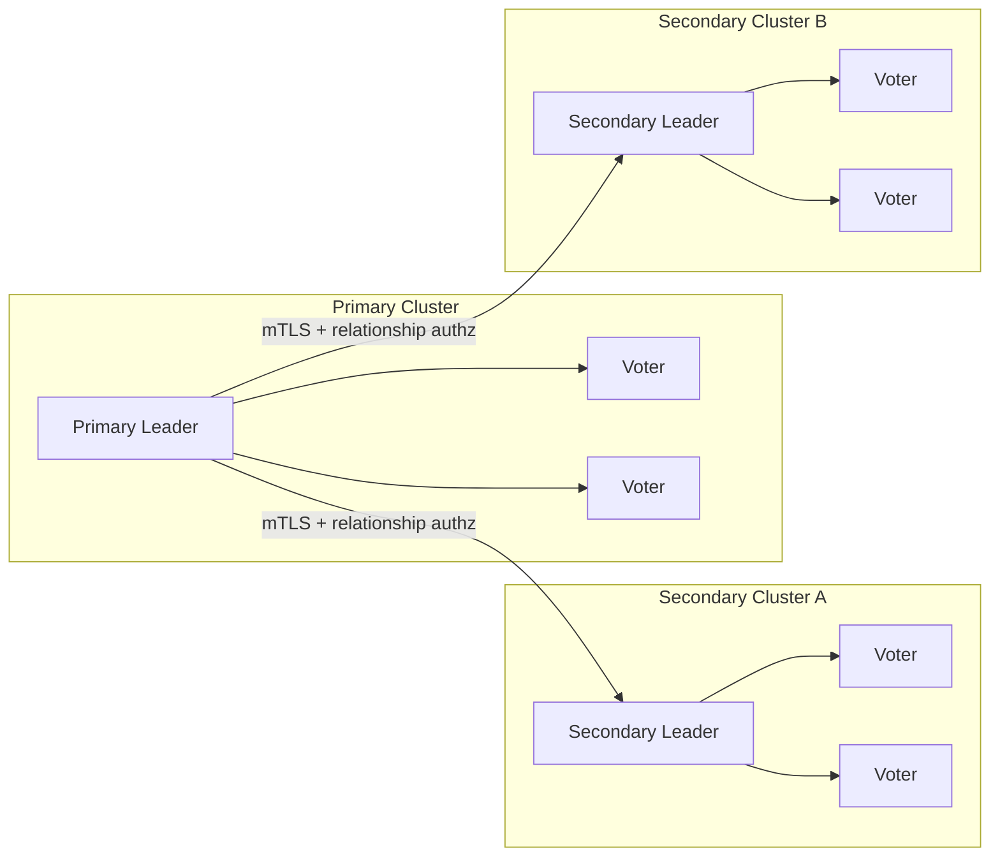
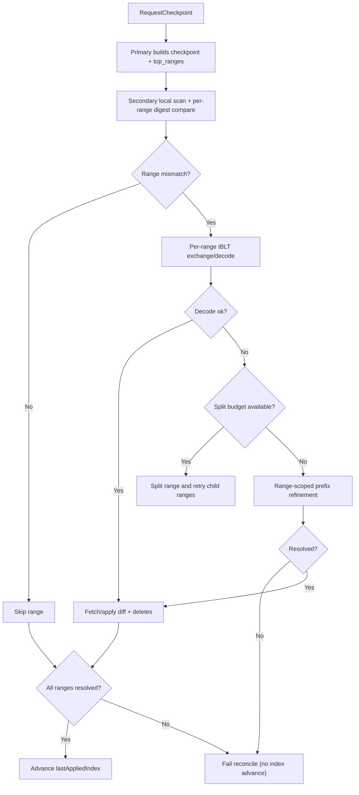

# RFC: Native Cross-Cluster DR Replication for OpenBao

## Status
Draft, implementation-backed.

## Summary
This RFC defines OpenBao Disaster Recovery (DR) replication as a native, cross-cluster feature with security-first bootstrap and fail-closed reconciliation.

The current architecture uses:
- Two (or more) independent Raft clusters (primary and one or more secondaries)
- Entry-level change streaming for normal operation
- Hybrid range-first reconciliation for recovery
- Strict relationship authorization (cert fingerprint + relationship state)
- Wrapped root-key bootstrap (no plaintext root-key transfer)
- Strict mTLS transport model (no insecure fallback)
- Multi-relationship primary support

## Problem Statement
OpenBao needed DR replication that is:
- Cross-cluster (true failure-domain isolation)
- Efficient for steady-state streaming and disconnection recovery
- Safe under revocation and partial failures
- Explicitly relationship-scoped for trust and lifecycle management
- Operable under high-keyspace and hotspot divergence without unbounded memory or bandwidth use

## Goals
1. Provide native DR with independent primary/secondary clusters.
2. Keep normal replication low-latency via ordered change stream.
3. Make recovery bandwidth scale with mismatch regions/diffs, not full keyspace.
4. Enforce strict security invariants (no plaintext root-key transfer, no insecure transport fallback).
5. Support multiple concurrently active DR relationships from one primary.
6. Fail closed on authorization, decode exhaustion, budget breaches, and partial apply failures.

## Non-Goals
1. Keyspace partitioning by tenant/namespace.
2. Merkle-tree or WAL-shipping reconciliation.

## Architecture Overview

### Topology
- Primary cluster: source of truth, serves DR gRPC and reconciliation artifacts.
- Secondary cluster: independent Raft cluster, applies streamed/reconciled updates locally.
- Relationship model: one primary may serve multiple independent secondaries, each with its own `relationship_id`, certificate identity, and lifecycle state.



### Runtime Modes
1. Streaming mode:
   - Primary emits ordered `ChangeStreamEntry` mutations.
   - Secondary applies mutations and tracks `lastAppliedIndex`.

2. Reconciliation mode:
   - Triggered on stream gaps/disconnects or explicit catch-up failure.
   - Uses checkpoint-anchored hybrid range reconciliation.

### Security Invariants
1. No plaintext root key is transferred.
2. DR transport fails closed if trusted cert context is unavailable (no plaintext/insecure DR link path).
3. Every DR RPC is relationship-authorized.
4. Revoked relationships are denied across all DR RPCs.

## Protocol and API Surface

### System API Endpoints
| Use | Method | Path |
|---|---|---|
| DR status | GET | `sys/replication/dr/status` |
| Enable primary | POST | `sys/replication/dr/primary/enable` |
| Disable primary | POST | `sys/replication/dr/primary/disable` |
| Generate activation token | POST | `sys/replication/dr/primary/secondary-token` |
| Register secondary cert | POST | `sys/replication/dr/primary/register-secondary` |
| List relationships | GET | `sys/replication/dr/primary/relationships` |
| Relationship status | GET | `sys/replication/dr/primary/relationships/:id/status` |
| Revoke relationship | POST | `sys/replication/dr/primary/relationships/:id/revoke` |
| Enable secondary | POST | `sys/replication/dr/secondary/enable` |
| Disable secondary | POST | `sys/replication/dr/secondary/disable` |
| Promote secondary | POST | `sys/replication/dr/secondary/promote` |
| Trigger secondary resnapshot | POST | `sys/replication/dr/secondary/resnapshot` |
| Read DR tuning | GET | `sys/replication/dr/tuning` |
| Update DR tuning | POST | `sys/replication/dr/tuning` |

Auth model notes:
- `sys/replication/dr/status` is unauthenticated.
- `sys/replication/dr/primary/register-secondary` is unauthenticated and bootstrap-token authenticated by payload.
- Other DR system endpoints follow normal `sys/` root protections.
- While in DR secondary mode, write requests are read-only blocked except:
  - `sys/replication/dr/secondary/promote`
  - `sys/replication/dr/secondary/disable`
  - `sys/replication/dr/secondary/resnapshot`
  - `sys/replication/dr/tuning`
  - `sys/seal`
  - `sys/step-down`
  - namespace-prefixed variants of the same paths.

### gRPC Service
`vault/dr_replication_service.proto` defines:
- `StreamChanges`
- `RequestCheckpoint`
- `ExchangeIBLT`
- `ExchangeRangeDigests`
- `ExchangePrefixDigests`
- `FetchEntries`
- `Heartbeat`
- `SyncKeyring`

Additive range-aware protocol elements:
- `RangeSpan`
- `RangeDigest`
- `CheckpointResponse.top_ranges`
- `CheckpointResponse.range_plan_version`
- `RangeDigestRequest` / `RangeDigestResponse`
- `IBLTMessage.span`
- `checkpoint_index` fencing fields on reconcile-phase requests (`IBLTMessage`, `PrefixDigestRequest`, `FetchEntriesRequest`, `RangeDigestRequest`)
- `PrefixDigestRequest.span`
- `FetchEntriesRequest.ranges`
- `FetchEntriesRequest.items` (`FetchItem.kid`, `FetchItem.expected_vid`) for provenance-safe point fetches
- `EntryChange.kid` for delete reconciliation when key text is unavailable

## Relationship and Bootstrap Model

### DRActivationToken
Relationship-scoped activation token fields:
- `cluster_id`
- `relationship_id`
- `primary_addr`
- `primary_api_addr`
- `repl_salt`
- `ca_cert`
- `primary_api_ca_cert` (optional)
- `primary_api_server_name` (optional)
- `bootstrap_token`

### DRRelationship Persistence
Per-relationship stored data:
- `relationship_id`
- `state` (`pending`, `registered`, `active`, `revoked`)
- `secondary_cert_fingerprint`
- `secondary_ca_cert`
- `bootstrap_token`
- `created_at`
- `last_seen_at`
- `expires_at`
- `failed_attempts`
- `locked_until`
- `registered_from_ip`
- `revoked_at`
- `last_error`

### Bootstrap Security
Bootstrap uses ECDH + AEAD wrapping:
1. Secondary sends `client_ephemeral_pubkey` and `client_nonce`.
2. Primary returns:
   - `wrapped_root_key`
   - `server_ephemeral_pubkey`
   - `wrap_nonce`
   - `wrap_aad_version`
   - encrypted `core/keyring` and `core/root-key` entries
3. Secondary unwraps locally and adopts key material.

No plaintext root key flow exists.

## Replication Data Model
Reconciliation operates over encrypted storage identity pairs:
- `KID = HMAC(repl_salt, canonical_storage_key)`
- `VID = hash(ciphertext bytes / tombstone representation)`

This keeps reconciliation below the barrier while preserving confidentiality of key names and values.

### Replication Domain Exclusions
DR intentionally excludes cluster-local/internal paths from both stream fanout and reconciliation so local node/cluster state does not pollute cross-cluster convergence.

- Never-replicate (stream + reconcile): local seal/recovery/lock/raft/leader/cluster-local metadata and DR manager persistence paths (for example `core/hsm/barrier-unseal-keys`, `core/seal-config`, `core/recovery-config`, `core/recovery-key`, `core/lock`, `core/initialize-lock`, `core/cluster/local/*`, `core/leader/*`, `core/raft/*`, `core/dr-replication/*`).
- Reconcile-only exclusion: `core/keyring` (handled by `SyncKeyring` bootstrap and stream updates rather than anti-entropy scan/fetch).

## Reconciliation Algorithm (Current)

### Phase A: Checkpoint + Range Manifest
1. Secondary requests checkpoint from primary.
2. Primary scans checkpoint state and computes deterministic fixed hash-interval top ranges (`top_ranges`) from KID space.
3. Primary caches checkpoint artifacts under strict budgets.

### Phase B: Local Compare by Range
1. Secondary performs local scan for the checkpoint.
2. Secondary computes local digest for each top range.
3. Matching ranges are skipped.
4. Mismatched ranges enter a work queue.

### Phase C: One-Shot Per-Range IBLT
For each mismatched range:
1. Secondary sizes IBLT from estimated diff and attempts adaptive sizes (`x1`, `x2`, `x4`, capped).
2. Secondary requests range-scoped `ExchangeIBLT(span=...)` per attempt.
3. If decode succeeds:
   - fetch missing or changed items
   - stage deterministic delete set for secondary-only items
4. Range tasks run in a bounded worker pool (`max_inflight_range_tasks`) for decode/fetch, while apply remains deterministic and session-fenced.

### Phase D: Adaptive Split on Decode Failure
If decode fails:
1. Split the range into two child spans.
2. Query child digests using `ExchangeRangeDigests`.
3. Enqueue only child spans whose local/remote digests mismatch.
4. Retry per-child IBLT while split budgets permit.
5. Continue until decoded or limits are reached.

### Phase E: In-Range Prefix Refinement
If decode remains stubborn:
1. Run range-scoped prefix digest refinement (`p=8 -> 12 -> 16`, bounded).
2. Fetch mismatched in-range buckets/ranges.
3. Apply puts/deletes.

### Phase F: Commit Rule
`lastAppliedIndex` advances only if all admitted range work succeeds:
- no unresolved `failed_kids`
- no apply failures
- no unresolved range failures
- no checkpoint/session fence violations

Any unresolved failure is a reconciliation failure and retries later.

## Automatic Resnapshot Fallback
To handle sustained lag where reconcile throughput cannot catch up with incoming writes, the secondary supports a hard-cutover fallback:

1. Trigger conditions (configurable):
   - `lastAppliedIndex` stall duration exceeded
   - lag (`primary_index - last_applied_index`) above threshold
   - failure window threshold reached for `budget_exceeded|stalled|decode_exhausted`
2. Secondary enters `resnapshotting` state.
3. Secondary requests a fresh checkpoint and performs protocol-scoped full-copy fetch for full hash span.
4. Secondary applies fetched entries, deletes local-only entries under checkpoint/session fencing, sets `lastAppliedIndex=checkpoint.commit_index`, and resumes streaming.
5. Cooldown and per-hour limits bound fallback frequency.



## Ordering and Correctness
1. Change stream delivery is ordered by Raft index.
2. Gap detection fails closed on forward jumps.
3. Stale/old entries (`< lastAppliedIndex`) are ignored safely.
4. Seal-wrap metadata is preserved in replication operations.
5. Catch-up replay is inclusive on `last_applied_index` so reconnect can recover same-index multi-operation Raft entries.
6. Reconciliation scanning is transactional-snapshot aware and fail-closed on `ListPage/Get` errors.
7. Reconcile session fencing (`checkpoint_id` + `checkpoint_index`) is enforced across all range/fetch/prefix phases.

## Resource Controls and Fail-Closed Behavior

### Checkpoint Cache (Primary)
- Global budget: 1 GiB
- Per-relationship budget: 256 MiB
- Max checkpoints per relationship: 8
- Max checkpoints global: 16
- TTL: 30 minutes

Eviction order:
1. Expired
2. Oldest within relationship
3. Oldest global

If admission still fails, `RequestCheckpoint` fails with precondition error.

### Checkpoint Build Throttling (Primary)
- Primary may temporarily deny `RequestCheckpoint` under high stream pressure (`budget_exceeded: primary stream pressure (...)`).
- Throttling is bounded and bypassed periodically to prevent permanent starvation.
- Status exposes throttle counters and stream-pressure telemetry.

### Reconcile Budgets (Secondary)
- Top ranges max: 256
- Max total ranges after split: 1024
- Max split depth: 6
- Max IBLT cells per range: 32768
- Max reconcile RPC bytes: 128 MiB
- Max reconcile wall time: 30 minutes
- Max inflight range tasks: 16 (bounded worker pool)

Budget breach is explicit failure (`budget_exceeded`), not silent degradation.

### Reconcile Retry Control
- Failure classes are tracked (`budget_exceeded`, `decode_exhausted`, `checkpoint_conflict`, `apply_failed`, `auth_revoked`, `unknown`).
- Per-class retry caps are enforced with cooldowns to avoid infinite hot-loop retries under sustained contention.
- `checkpoint_conflict` class uses an explicit cooldown path before next attempt.

### Fallback Policy (Secondary)
- Automatic fallback is enabled by default.
- Default stall threshold: 180s.
- Default failure-window trigger: 3 failures in a 10-minute window (`budget_exceeded|stalled|decode_exhausted`).
- Default minimum lag trigger: `2 * stream_buffer_max_entries` if not explicitly configured.
- Cooldown and frequency limits: 10 minutes cooldown, max 2 fallback events per hour.

## Revocation and Authz Behavior
1. Revoke marks relationship state as `revoked` and persists it.
2. Trusted cert material for that relationship is removed.
3. Active streams for that relationship are terminated immediately.
4. Other relationships remain unaffected.
5. Stream path also performs periodic auth revalidation.

## Token Abuse Resistance
Bootstrap registration policy defaults:
- TTL: 15 minutes
- Max failed attempts: 5
- Lockout: 30 minutes
- Source-IP recording on successful registration

On failed validation:
- failed attempts are incremented and persisted
- lockout is applied when threshold is reached
- error context is recorded (`last_error`)
- expired pending relationships are periodically garbage-collected from storage

## Heartbeat and Persistence Throttling
- In-memory liveness updates are immediate.
- Persistent `last_seen_at` writes are throttled to once per 30 seconds per relationship.
- Durable writes are forced on key state transitions (for example registration/activation/revocation paths).

## Observability

### Status Endpoint
`GET sys/replication/dr/status` includes:
- Mode and cluster metadata
- Secondary counters/state (`primary_index`, `last_applied_index`, `reconcile_count`, `connect_retries`, `connect_failures`)
- `reconcile_ranges_inflight`
- `reconcile_ranges_failed`
- `reconcile_budget_remaining_bytes`
- `reconcile_active_checkpoint_id`
- `reconcile_active_checkpoint_index`
- `reconcile_fail_reason_last`
- `range_manifest_count`
- `range_split_count`
- `reconcile_rpc_bytes_used`
- `scan_failures_total`
- `checkpoint_conflicts_total`
- `reconcile_retries_total`
- `reconcile_queue_depth`
- `reconcile_task_retries_total`
- `reconcile_decode_failures_total`
- `reconcile_stalled_total`
- `reconcile_stuck_seconds`
- `last_applied_age_seconds`
- `reconcile_max_rpc_bytes`
- `reconcile_max_wall_time_seconds`
- `reconcile_max_inflight_tasks`
- `stream_batch_max_entries`
- `stream_batch_max_bytes`
- `stream_batch_max_wait_milliseconds`
- `checkpoint_cache_bytes`
- `checkpoint_cache_items`
- `checkpoint_cache_evictions`
- `checkpoint_meta_bytes`
- `checkpoint_value_bytes`
- `checkpoint_admission_failures`
- `checkpoint_throttle_total`
- `checkpoint_throttle_bypass_total`
- `stream_buffer_entries`
- `stream_buffer_bytes`
- `stream_lagging_subscribers_total`
- `stream_lagging_subscribers_active`
- `stream_subscribers_active`
- `stream_buffer_horizon_seconds`
- `checkpoint_ttl_seconds`
- `checkpoint_global_budget_bytes`
- `checkpoint_per_relationship_budget_bytes`
- `revoked_streams_terminated`
- `relationship_count_by_state`
- `fallback_active`
- `fallback_count`
- `fallback_last_reason`
- `fallback_last_at`
- `reconcile_task_rate`

### Metrics
Representative metrics emitted include:
- stream subscribers/buffer/drop counters
- checkpoint cache bytes/items/evictions
- range reconciliation counts (`ranges_total`, `ranges_mismatched`, `ranges_split`)
- decode failures
- budget exceeded counts
- RPC bytes and IBLT cell usage

## Failover
Secondary promotion path:
1. Stop DR ingest.
2. Transition from DR secondary semantics to standalone operation with DR mode set to `disabled`.
3. Resume serving client writes on the promoted cluster.
4. Operator may explicitly re-enable DR primary mode to accept new secondaries.

## Testing Expectations
Core validation includes:
1. DR stream replication and gap handling.
2. Disconnect + reconcile flows.
3. Read-only enforcement on secondary.
4. Revoke isolation and active stream termination.
5. Bootstrap hardening (expiry, lockout, source IP tracking).
6. Range-path scenarios:
   - deterministic manifest
   - per-range IBLT success
   - adaptive split
   - in-range prefix refinement
   - budget-exceeded failure
   - no index advance on partial failure
   - multi-relationship isolation
   - revoke during reconcile abort

## Rationale and Alternatives
Chosen approach:
- Cross-cluster replication for true DR isolation.
- Entry stream + checkpointed set reconciliation for correctness and efficiency.
- Hybrid range-first flow for better large-keyspace/hotspot behavior.

Alternatives rejected:
- WAL shipping
- Merkle-tree reconciliation
- plaintext root-key bootstrap
- insecure transport fallback

## Operational Notes
1. Range partitioning is a performance partitioning mechanism, not a security or tenancy boundary.
2. Additive protocol evolution is used; no protocol version bump was required for current range fields.
3. Change-stream replay intentionally includes entries at `last_applied_index` to safely recover reconnects that split same-index operation batches.
4. Checkpoint cache is metadata-first; entry values are fetched on demand during `FetchEntries`, and cache metrics expose metadata/value byte split.

## Implementation Mapping

### Core Replication and Reconciliation
| RFC Area | Primary Implementation | Secondary/Supporting Implementation |
|---|---|---|
| DR primary server and subscriber model | `vault/dr_replication.go` (`drReplicationPrimary`, `OnChange`, `StreamChanges`) | `vault/dr_replication_secondary.go` (`drReplicationSecondary`, `runStream`) |
| Checkpoint creation and cache admission | `vault/dr_replication.go` (`RequestCheckpoint`, `cacheCheckpoint`, checkpoint eviction helpers) | `vault/dr_replication_secondary.go` (`runReconciliation`) |
| Range manifest generation | `vault/dr_replication.go` (`RequestCheckpoint`) | `physical/replication/reconciler/range.go` (`BuildRangeManifest`) |
| Range-scoped IBLT exchange | `vault/dr_replication.go` (`ExchangeIBLT`) | `vault/dr_replication_secondary.go` (`runRangeReconciliation`, `processRangeTask`) |
| Range-scoped prefix refinement | `vault/dr_replication.go` (`ExchangePrefixDigests`) | `vault/dr_replication_secondary.go` (`runRangePrefixRefinement`) |
| Range/range+bucket fetch semantics | `vault/dr_replication.go` (`FetchEntries`) | `vault/dr_replication_secondary.go` (`fetchEntriesForDiff`, `fetchAndApplyEntriesWithBudget`) |

### Protocol Surface
| RFC Area | Proto Definition |
|---|---|
| DR service + RPCs | `vault/dr_replication_service.proto` (`service DRReplication`) |
| Stream entry + resume request | `vault/dr_replication_service.proto` (`EntryChange`, `StreamChangesRequest`) |
| Checkpoint + range manifest fields | `vault/dr_replication_service.proto` (`CheckpointResponse`, `RangeDigest`, `RangeSpan`) |
| Range digest RPC for split-informed enqueue | `vault/dr_replication_service.proto` (`RangeDigestRequest`, `RangeDigestResponse`) |
| IBLT and prefix exchanges | `vault/dr_replication_service.proto` (`IBLTMessage`, `PrefixDigestRequest`, `PrefixDigestResponse`) |
| Provenance-safe fetch and range/bucket fetch | `vault/dr_replication_service.proto` (`FetchEntriesRequest`, `FetchItem`, `EntryBatch`) |
| Heartbeat and wrapped bootstrap exchange | `vault/dr_replication_service.proto` (`DRHeartbeat*`, `SyncKeyring*`) |

### Security and Relationship Lifecycle
| RFC Area | Implementation |
|---|---|
| Activation token schema and manager config | `vault/dr_replication_state.go` (`DRActivationToken`, `DRConfig`) |
| Relationship schema/state model | `vault/dr_replication_state.go` (`DRRelationship`, `DRRelationshipState`) |
| Token generation and expiry fields | `vault/dr_bootstrap_registration.go` (`GenerateActivationToken`) |
| Bootstrap validation, lockout, source IP | `vault/dr_bootstrap_registration.go` (`ValidateBootstrapAndStoreCertWithSourceIP`) |
| Relationship authorization checks | `vault/dr_relationship_authz.go` (`ValidateRelationshipAccess`) and `vault/dr_replication.go` (`authorizeRelationship`) |
| Revocation semantics | `vault/dr_relationship_authz.go` (`RevokeRelationship`) and `vault/dr_replication.go` (`RevokeRelationship`) |
| Heartbeat last-seen throttling | `vault/dr_relationship_authz.go` (`MarkRelationshipSeen`) |
| Cluster cert trust and fingerprint propagation | `vault/dr_cluster.go` and `vault/dr_replication.go` (`peerCertFingerprintFromContext`) |

### API and Operational Wiring
| RFC Area | Implementation |
|---|---|
| System DR routes and handlers | `vault/logical_system_dr.go` |
| Auth/unauth path registration | `vault/logical_system.go` |
| Status handler fields | `vault/logical_system_dr.go` (`handleDRStatus`) |
| Core manager wiring/load on unseal | `vault/core.go` (`NewCore`, `postUnseal`) |
| Secondary write enforcement exceptions | `vault/request_handling.go` + `vault/dr_replication_state.go` (`isDRSecondaryAllowedPath`) |
| Failover/promotion path | `vault/dr_failover.go` and `vault/dr_replication_state.go` (`PromoteSecondary`) |

### Storage/Hook Plumbing
| RFC Area | Implementation |
|---|---|
| Public change-stream interface | `sdk/physical/physical.go` (`ChangeStreamEntry`, `ChangeStreamBackend`) |
| Raft backend hook registration | `physical/raft/raft.go` (`HookChangeStream`) |
| Ordered FSM batch hook emission | `physical/raft/fsm.go` (`hookChangeStream`, `ApplyBatch`) |
| Seal-wrap propagation in transaction log ops | `physical/raft/raft.go` (`Put`) and `physical/raft/transaction.go` (`Put`, `Commit`) |
| Strict scanner semantics | `physical/replication/reconciler/reconciler.go` (`Scan`, `BuildIBLTFromScan`, `beginScanSnapshot`) |

### Budgets and Defaults
| RFC Area | Implementation |
|---|---|
| Bootstrap policy defaults | `vault/dr_replication_state.go` (bootstrap constants block) |
| Last-seen persistence throttle | `vault/dr_replication_state.go` (`drLastSeenPersistInterval`) |
| Checkpoint cache budgets, cardinality, TTL | `vault/dr_replication.go` (constants + `NewDRReplicationPrimary`) |
| Range reconcile limits | `vault/dr_replication_secondary.go` (range budget constants + checks) |
| Reconcile retry caps/cooldowns | `vault/dr_reconcile_session.go` (`shouldRetryReconcile`, `reconcileRetryCap`, `retryCapCooldown`) |
| Deterministic range planner defaults | `physical/replication/reconciler/range.go` (`DefaultRangePlanConfig`) |

### Test Coverage Map
| RFC Area | Tests |
|---|---|
| Range manifest determinism | `TestDRIntegration_RangeManifestDeterminism` (`vault/dr_replication_integration_test.go`) |
| Per-range IBLT success | `TestDRIntegration_RangeIBLTDecodeSuccess` (`vault/dr_replication_integration_test.go`) |
| Adaptive split path | `TestDRIntegration_RangeIBLTDecodeAdaptiveSplit` (`vault/dr_replication_integration_test.go`) |
| In-range prefix refinement | `TestDRIntegration_RangeRefinementPrefixFallback` (`vault/dr_replication_integration_test.go`) |
| Budget-exceeded fail-closed behavior | `TestDRIntegration_ReconcileFailsOnBudgetExceeded` (`vault/dr_replication_integration_test.go`) |
| No index advance on partial range failure | `TestDRIntegration_NoIndexAdvanceOnPartialRangeFailure` (`vault/dr_replication_integration_test.go`) |
| Multi-relationship isolation | `TestDRIntegration_MultiRelationshipRangeIsolation` (`vault/dr_replication_integration_test.go`) |
| Revoke-during-reconcile abort | `TestDRIntegration_RevokeDuringRangeReconcileAborts` (`vault/dr_replication_integration_test.go`) |
| Stream same-index replay behavior | `TestDRIntegration_StreamAppliesSameRaftIndexBatchEntries`, `TestDRIntegration_PrimaryStreamReplayIncludesLastAppliedIndex` (`vault/dr_replication_integration_test.go`) |
| Scanner fail-closed + transactional enforcement | `physical/replication/reconciler/reconciler_test.go` (`TestScannerFailsClosedOnGetError`, `TestScannerFailsClosedOnListPageError`, `TestScannerRequiresTransactionalSnapshotWhenConfigured`, `TestScannerUsesTransactionHandleForGet`) |
| Checkpoint cache budget and eviction | `vault/dr_replication_test.go` checkpoint cache tests |
| Revoke stream termination isolation | `TestDRRelationshipManager_PrimaryRevokeTerminatesOnlyMatchingStreams` (`vault/dr_replication_test.go`) |
| Bootstrap expiry/lockout/source-IP/throttle | `TestDRRelationshipManager_BootstrapTokenExpires`, `TestDRRelationshipManager_BootstrapTokenAttemptLockout`, `TestDRRelationshipManager_BootstrapTokenSourceIPBinding`, `TestDRRelationshipManager_HeartbeatLastSeenWriteThrottle` (`vault/dr_replication_test.go`) |

## Demo (CLI)

### Primary
```bash
bao write sys/replication/dr/primary/enable
bao write -format=json sys/replication/dr/primary/secondary-token > dr-token.json
bao read sys/replication/dr/primary/relationships
bao read sys/replication/dr/status
```

### Secondary
```bash
bao write sys/replication/dr/secondary/enable token="$(jq -r '.data.token' dr-token.json)"
bao read sys/replication/dr/status
```

### Revoke relationship
```bash
bao write sys/replication/dr/primary/relationships/<relationship-id>/revoke
```

### Promote secondary
```bash
bao write sys/replication/dr/secondary/promote
```
