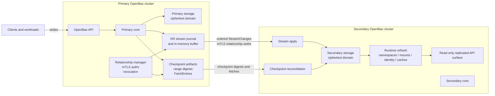

# Native cross-cluster DR replication

**Status**: draft, local engineering prototype. The prototype has strong
data-correctness validation across streaming, reconciliation, HA handoff,
promotion, reseed, runtime refresh, and P0 security boundaries. Availability
under adversarial HA handoff, production defaults, rolling upgrades,
dependency-backed engine profiles, and operator UX still need hardening.

## Summary

This RFC proposes native disaster recovery (DR) replication between independent
OpenBao clusters. A primary cluster streams ordered physical storage mutations
to one or more secondary clusters. Secondaries recover from stream gaps through
checkpoint-fenced reconciliation, not by trusting live-storage reads or partial
range fetches.

The design is single-primary, warm-standby DR. It is not active-active
replication, tenant-selective replication, automatic failback, or automatic
merge after split-brain.

The core safety properties are:

- DR transport uses mTLS with relationship-scoped authorization.
- Bootstrap never transfers the root key in plaintext activation material.
- Streaming advances `lastAppliedIndex` only after durable secondary apply.
- Reconciliation is bound to immutable checkpoint tuples.
- Fetched range contents must prove completeness before deletes are inferred.
- Runtime metadata is refreshed from replicated storage before a secondary or
  promoted cluster relies on it.
- Promotion is a one-way authority transition with explicit lineage fencing.

Detailed design notes are split out of this RFC:

- [DR_PROTOCOL_DESIGN.md](DR_PROTOCOL_DESIGN.md): streaming, checkpoints,
  reconciliation, flat accumulators, local KID index, and resource controls.
- [DR_SECURITY_DESIGN.md](DR_SECURITY_DESIGN.md): bootstrap, mTLS,
  `SyncKeyring`, certificate lifecycle, revocation, and unauthenticated
  endpoint boundaries.
- [DR_FAILOVER_DESIGN.md](DR_FAILOVER_DESIGN.md): planned switchover,
  disaster promotion, old-primary fencing, reseed, and data-loss semantics.
- [DR_RUNTIME_REFRESH_DESIGN.md](DR_RUNTIME_REFRESH_DESIGN.md): replication
  domain, local exclusions, namespaces, mount/auth/audit tables, identity, and
  route-backed cache refresh.

Validation evidence and reproducibility live separately:

- [DR_VALIDATION_RESULTS.md](DR_VALIDATION_RESULTS.md)
- [DR_VALIDATION_RUNS.json](DR_VALIDATION_RUNS.json)
- [DR_TEST_MATRIX.md](DR_TEST_MATRIX.md)
- [DR_BUG_TRACKER.md](DR_BUG_TRACKER.md)

## Review questions for maintainers

This RFC is asking for maintainer feedback on:

1. Whether native DR replication between independent Raft-backed clusters is an
   acceptable direction for OpenBao.
2. Whether the proposed first scope is correct: single primary, one or more
   warm-standby secondaries, integrated storage/Raft first, no active-active,
   no automatic failback, and no automatic merge.
3. Whether the correctness boundary is acceptable: ordered streaming when
   replay coverage exists, checkpoint-fenced reconciliation when it does not,
   and proof-before-delete for inferred deletes.
4. Whether the security model is acceptable: single-use bootstrap, mTLS
   relationship authorization, certificate fingerprint binding, `SyncKeyring`
   wrapping, fail-closed revocation, and generic unauthenticated errors.
5. Whether the authority/failover model is acceptable: planned switchover,
   clean disaster promotion, forced disaster promotion, explicit
   acknowledgements, stale-lineage fencing, and explicit reseed.
6. Whether the replication domain is correct: ciphertext physical storage plus
   runtime metadata, with cluster-local paths excluded and runtime refresh
   required before serving from replicated state.
7. What validation evidence maintainers would require before this moves from
   RFC/design review toward production implementation.

## Problem statement

OpenBao does not currently provide native cross-cluster DR replication. Users
who need a warm recovery cluster must rely on external backup/restore,
snapshot, storage replication, or custom automation. Those approaches do not
give OpenBao a relationship-scoped control plane, do not naturally bind to
OpenBao seal and key lifecycle, and leave failover state, promotion semantics,
and divergence handling to operator-specific procedures.

The desired system is an OpenBao-native protocol that keeps a secondary close
to the primary while failing closed during disconnects, revocation, failover,
stream gaps, partial reconciliation, and high write load.

## User-facing description

Operators enable DR primary mode on a source cluster, create a secondary
activation token, and enable DR secondary mode on one or more independent
clusters. The activation token bootstraps relationship identity and trust, not
a reusable plaintext copy of root-key material.

In normal operation, clients write to the primary. The secondary is read-only
for replicated state and applies ordered ciphertext storage changes from the
primary. The secondary exposes status for state, lag, last applied index,
stream/reconnect/reconcile activity, and safety counters.

If the stream disconnects and the primary can prove replay coverage from the
secondary's last applied index, the secondary resumes streaming. If replay
coverage cannot be proven, the secondary reconciles against a checkpoint:
compare range metadata, drill down mismatched ranges, fetch checkpoint-scoped
entries, validate fetched completeness, apply primary entries, infer deletes
only from proven absence, then advance the checkpoint.

If the primary is permanently unavailable, an operator can promote a secondary.
Promotion makes the secondary a standalone write authority, terminates the old
relationship lineage, and prevents stale old-primary credentials or activation
tokens from reviving the previous relationship. If the secondary cannot prove
that it is fully caught up, promotion requires explicit data-loss
acknowledgement.

Secondaries that were not promoted do not automatically follow the promoted
cluster. They must be explicitly reseeded or re-enabled from fresh activation
tokens issued by the promoted authority.

## Goals

1. Provide native DR replication across independent OpenBao clusters.
2. Support one primary with one or more secondary relationships.
3. Keep steady-state replication low-latency through ordered streaming.
4. Recover from stream gaps using checkpoint-fenced reconciliation.
5. Avoid plaintext root-key transfer in activation material.
6. Keep replicated secret data in the ciphertext storage domain.
7. Replicate the runtime metadata needed for a recovery cluster to be usable:
   namespaces, mount/auth/audit tables, policies, identity state, and
   route-backed backend state.
8. Preserve cluster-local state: seal configuration, local root-key wrapping,
   local cluster identity, HA coordination state, and DR configuration.
9. Make promotion, data-loss risk, old-primary fencing, and reseed semantics
   explicit to operators.
10. Fail closed on authorization, checkpoint, proof, budget, apply, delete, and
    revocation failures.

## Non-goals

1. Active-active writes across clusters.
2. Namespace-selective or tenant-selective replication.
3. Compatibility with Vault Enterprise replication protocols, activation
   tokens, operation tokens, WAL streams, Merkle indexes, or replication state.
4. Storage-layer replication outside OpenBao.
5. Persistent hierarchical Merkle trees as the primary reconciliation state.
6. Automatic merge after both the old primary and promoted cluster accept
   writes.
7. Automatic failback to the former primary.
8. Transparent client routing, load-balancer failover, or old-primary network
   isolation.
9. Running dependency-backed engines in the default local test profile.

## Technical description

### Initial scope

The initial target is integrated-storage/Raft-backed OpenBao clusters. The
protocol uses ordered physical mutation indexes and assumes transactional local
apply semantics on the secondary. Other physical storage backends are future
work unless they can provide equivalent ordering, durable replay boundaries,
and safe local transaction semantics.

### Architecture

The design has five planes:

1. **Relationship/control plane**: primary/secondary modes, relationship IDs,
   activation tokens, revocation, certificate rotation, and promotion lineage.
2. **Transport/security plane**: DR transport CA, mTLS, certificate
   fingerprint binding, `SyncKeyring`, audit redaction, and unauthenticated
   endpoint limits.
3. **Streaming data plane**: ordered physical mutations, stream journal,
   credit-based flow control, durable secondary apply, and `lastAppliedIndex`.
4. **Anti-entropy plane**: checkpoints, KID/VID range metadata, digest
   drill-down, checkpoint-scoped fetches, proof-before-delete, flat
   accumulators, and local KID index acceleration.
5. **Runtime refresh/failover plane**: namespace/mount/auth/audit/identity
   refresh, cache invalidation, promotion, stale-lineage rejection, and
   promoted-authority reseed.

### State transition sketch

The detailed relationship and promotion state machines live in the protocol,
security, and failover notes. The core review invariants are:

| From | Event | To | Allowed? | Notes |
| --- | --- | --- | --- | --- |
| pending bootstrap | register secondary certificate | registered | yes | Bootstrap token is single-use and expiry-bound. |
| registered | `SyncKeyring` succeeds | active secondary | yes | This is the relationship activation point. |
| active relationship | revoke | revoked | yes | Active streams and reconnects must fail closed. |
| secondary streaming | planned switchover | promoted | yes | Requires authority-transfer confirmation and final drain proof. |
| secondary streaming | clean disaster promotion | promoted | yes | Requires primary-unreachable confirmation and clean promotion proof. |
| secondary reconciling | clean promotion | promoted | no | Forced promotion only, with data-loss acknowledgement. |
| promoted | old token, cert, or relationship reused | rejected | yes | Stale lineage fence prevents old authority revival. |

### Replication domain

DR operates below the barrier in the ciphertext storage domain. The replicated
domain includes storage-backed runtime state required for recovery:

- mount, auth, and audit tables
- namespace records and namespace-scoped mount/auth state
- ACL policies
- identity entities, groups, aliases, and identity mount metadata
- route-backed backend metadata such as PKI, transit, SSH, TOTP, and database
  configuration

Local-only paths must never be replicated or inferred as deletes. Examples
include seal configuration, local root-key wrapping, local cluster identity,
DR relationship configuration, HA coordination locks, and topology-local audit
sink assumptions.

### Streaming and reconciliation

The normal path is ordered physical mutation streaming. The secondary only
advances `lastAppliedIndex` after durable apply. The primary maintains an
in-memory stream buffer and a disk-backed stream journal; if either proves
coverage from the secondary cursor, reconnect can resume without
reconciliation.

Secondary stream apply uses transactional batching and may adapt its local
flush cadence under backlog or commit pressure. The adaptive wait window is
bounded and only changes how many already-ordered stream entries are committed
per secondary transaction; it does not change the ordering, relationship
authorization, accumulator/cursor atomicity, or reconciliation semantics.

When replay coverage cannot be proven, reconciliation is mandatory. A
checkpoint gives the secondary a stable primary view. Every range checksum,
range digest, fetched entry batch, and delete decision is bound to the
checkpoint tuple.

Reconciliation uses KID/VID metadata:

- KID: keyed identifier derived from storage key and replication salt.
- VID: value identifier derived from ciphertext value and seal-wrap metadata,
  or a tombstone marker for explicit point-delete fetches.

Top-level range checksums are only filters. Mismatched ranges require digest
drill-down, and fetched spans must prove completeness before the secondary can
infer that a local key absent from the primary should be deleted.

The secondary maintains a flat accumulator over top-level KID ranges and a
local-only KID-to-key point index. The index stores stable key identity only;
VIDs are recomputed from local physical values when an indexed repair loads a
mismatched bucket. Its metadata tracks key-set changes and may lag the value
accumulator after value-only batches. These are accelerators, not authority.
If they are absent, stale, relationship-mismatched, cluster-mismatched, or fail
bucket proof validation, reconciliation falls back to a full local scan.

### Runtime refresh

Physical storage convergence is not enough. OpenBao also has in-memory
namespace stores, route tables, identity stores, and backend caches. DR apply
must refresh the affected runtime state after storage commit and before the
secondary or promoted cluster depends on the replicated view.

The refresh order is:

1. namespace store
2. mount and auth tables
3. identity route and identity artifacts
4. route-backed backend cache invalidation

This is a first-class correctness requirement, not an implementation detail.

### Promotion

Promotion is a one-way authority transition. A promoted secondary stops DR
activity, clears secondary read-only enforcement, persists promotion lineage,
and rejects stale pre-promotion relationship material. The old primary, if it
returns, is a separate possible authority and must not automatically reconnect
or merge.

The design distinguishes planned switchover, clean disaster promotion, and
forced disaster promotion. Planned switchover confirms authority transfer while
the primary is reachable. Disaster promotion confirms primary unreachability.
Forced disaster promotion additionally requires explicit data-loss
acknowledgement even when the observed primary/secondary index gap is zero if
the secondary cannot provide a clean promotion proof.

## Rationale and alternatives

### Why OpenBao-native replication

OpenBao-native replication can enforce invariants that storage replication and
snapshot workflows cannot express cleanly: relationship authorization, seal and
key lifecycle, ciphertext-domain apply, local path exclusions,
checkpoint-scoped fetches, runtime refresh, and fail-closed promotion.

### Why checkpoint-fenced reconciliation

Reconciling against live primary storage races with writes. A checkpoint gives
the secondary an immutable target and lets every digest, fetch, and delete
decision share one authority tuple.

### Why proof-before-delete

Deletes are inferred from absence. Absence is only meaningful if the primary
response is complete for the relevant checkpoint span. Digest proof validation
turns "the primary did not send this key" into a defensible delete decision.

### Why flat accumulators instead of a persistent Merkle tree

The proposed accelerator is a flat materialized view over top-level KID ranges.
It has no persisted hierarchy, parent/child traversal state, or independent
diff authority. This keeps the correctness boundary in checkpoint proofs while
still avoiding full local scans for common reconnect and bounded-repair cases.

### Differentiation from Vault Enterprise replication

This proposal is not wire-compatible with Vault Enterprise DR replication and
does not implement Vault Enterprise activation tokens, operation tokens, WAL
streams, Merkle indexes, or replication state.

The design uses familiar replication patterns, but combines them differently:
ordered physical mutation streaming for normal operation, checkpoint-fenced
range/digest/KID/VID proof recovery for gaps, complete range selection before
checkpoint advancement, proof-before-delete, explicit promoted-authority
reseed, and no automatic failback or merge.

This is a technical design boundary, not a patent or license-clearance
opinion. Any external legal review must happen separately.

### Alternatives rejected

Full snapshot on every disconnect is simple but too expensive and unnecessary
for small stream gaps.

Backend WAL shipping as the authoritative protocol is efficient where a
storage backend exposes a stable WAL contract, but it couples DR to backend
internals and does not naturally express OpenBao relationship authorization,
local path exclusion, promotion lineage, or checkpoint-scoped delete safety.

IBLT/prefix-digest reconciliation remains interesting as a future optimization
inside checkpoint-fenced ranges, but stress testing showed it cannot be the
authority boundary for safe deletes, checkpoint identity, live-storage drift,
or high-water advancement.

Dirty bitmaps are useful scheduling hints, but a bitmap false negative can
silently skip divergence. They are not authority.

## Downsides

This is a large protocol surface. It introduces relationship state, mTLS
credential lifecycle, streaming, checkpoint artifacts, range proof validation,
runtime refresh, promotion lineage, tuning, observability, and operational
runbook requirements.

The conservative reconciliation model costs CPU and IO when acceleration state
is unavailable or invalidated. That cost is intentional: correctness depends on
complete range selection and proof-before-delete.

Runtime refresh is inherently fragile because OpenBao behavior is not only a
function of physical storage bytes. Namespaces, routes, identity state, and
backend caches must be refreshed in the right order without overwriting
protected local cluster state.

Failover semantics deliberately avoid automatic merge and failback. This is
safer but pushes traffic routing, old-primary isolation, and site rebuild
decisions into operational procedures.

## Security implications

The design changes the security boundary: a bootstrapped secondary becomes a
usable recovery copy of the replicated cluster. Compromise of a bootstrapped
secondary is therefore a serious cluster-data compromise.

The design mitigates bootstrap and transport risk by using:

- single-use activation/bootstrap material
- verifier-only bootstrap storage
- mTLS with certificate fingerprint binding
- `SyncKeyring` wrapping bound to relationship, cluster, primary identity,
  secondary fingerprint, AAD version, and fresh nonces
- relationship-scoped authorization on every DR RPC
- fail-closed revocation
- generic public errors on unauthenticated bootstrap and rotation state checks
- explicit audit redaction for tokens, certificates, signatures, and key
  material

The primary remains trusted as data authority. The digest and fetch proofs are
not a defense against a malicious primary; they defend against races, partial
responses, stale views, transport attackers without credentials, and local
implementation mistakes.

Independent security review and sustained resource-abuse testing are required
before production use.

## User/developer experience

Operators get a first-class DR workflow and status surface instead of
assembling backup, snapshot, and routing procedures. Promotion responses should
make the safety proof visible: class, proof availability, forced reason codes,
last applied index, last known primary index, estimated gap, and whether
data-loss acknowledgement was required and accepted.

Developers get a protocol with explicit phases and failure classes. Tests can
target bootstrap, mTLS authz, keyring sync, stream replay, checkpoint tuple
binding, digest coverage, fetch proof validation, delete safety, runtime
refresh, revocation, promotion, and reseed independently.

The repo-local Docker topology and `scripts/dr_local_test.sh` harness are part
of the current development workflow. The default matrix is self-contained;
dependency-backed engines and topology-specific audit sinks belong in opt-in
profiles.

## Unresolved questions

1. Should planned switchover be part of the first version, or should the first
   version only support disaster promotion?
2. Should secondaries remain strict warm standbys for replicated state in the
   first version, or should any stale/read-only replicated API be supported?
   This RFC currently recommends strict standby semantics.
3. What rolling-upgrade and protocol-version compatibility guarantees must the
   first production version support?
4. How should DR transport CA rotation work without requiring full
   relationship replacement?
5. What final UI/API wording should be used for planned authority transfer,
   disaster promotion, forced-promotion reasons, and data-loss estimate basis?

## Productionization and validation follow-ups

These items are important before production use, but they are not design
direction blockers for this RFC:

- choose production defaults for checkpoint retention, journal retention,
  backpressure, split depth, fetch batch sizing, adaptive stream batching, and
  resource budgets
- define availability targets for HA active handoff under sustained DR backlog
  pressure
- validate WAN latency, packet loss, proxy, and load-balancer behavior
- add dependency-backed engine profiles for auth/secret engines that require
  external services
- add a deterministic audit-device topology profile for audit-table validation
- run larger-scale keyspace validation, including billion-key-oriented
  reconciliation and accumulator stress tests

## Related issues

This RFC is currently local to the prototype branch. If this work is recreated
for an upstream contribution path, it should reference the OpenBao issue or
discussion used to track native DR replication and should be prepared through
the project's accepted contribution process.

## Proof of Concept

The local prototype currently includes the main relationship, transport,
streaming, reconciliation, promotion, reseed, runtime refresh, and security
paths described above. Validation has produced a strong data-correctness signal
under stress, including HA handoff, out-of-horizon reconciliation, cold restart,
promoted-authority reseed, and engine/runtime lifecycle checks.

Current validation summary:

- [DR_VALIDATION_RESULTS.md](DR_VALIDATION_RESULTS.md)
- [DR_VALIDATION_RUNS.json](DR_VALIDATION_RUNS.json)

Current reproducibility matrix:

- [DR_TEST_MATRIX.md](DR_TEST_MATRIX.md)

Known issues and separable bugs:

- [DR_BUG_TRACKER.md](DR_BUG_TRACKER.md)
