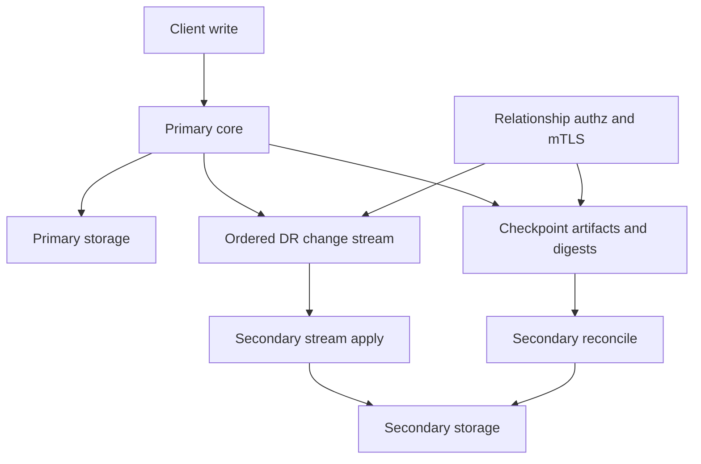

# Native cross-cluster DR replication

**Status**: draft, local engineering prototype with correctness, HA, failover,
and P0 security validation. Resource limits, upgrade behavior, dependency-backed
engine parity, and operator UX remain under hardening.

## Summary

This RFC proposes native disaster recovery (DR) replication for OpenBao across
independent clusters. A primary cluster streams ordered storage mutations to one
or more secondary clusters, and secondaries use checkpoint-fenced
reconciliation to recover from stream gaps or disconnects.

The design is intentionally fail-closed:

- DR transport uses mTLS with relationship-scoped authorization.
- Bootstrap never transfers the root key in plaintext.
- Reconciliation is bound to immutable checkpoint tuples.
- Fetched range contents must prove completeness before deletes are inferred.
- Replicated runtime state, including namespaces and mount/auth metadata, is
  refreshed from the replicated storage view before it is exposed on a
  secondary.
- A secondary only advances `lastAppliedIndex` after every required apply and
  delete phase succeeds.

This RFC reflects the current local prototype after stress-test and security
hardening. The implementation has exercised streaming, checkpoint-fenced
reconciliation, forced failover, promoted-authority reseed, certificate
rotation, revocation, runtime-state refresh, and self-contained engine/runtime
parity. It still treats dirty bitmaps, stream replay, and partial range fetches
as non-authoritative unless their coverage and completeness are proven.

## Problem statement

OpenBao does not currently provide native cross-cluster DR replication. Users
who need a warm disaster recovery cluster must rely on external backup,
restore, snapshot, or storage-level replication workflows. Those approaches
have several limitations:

- They do not provide a relationship-scoped OpenBao control plane.
- They are not naturally tied to OpenBao authorization, seal, or key lifecycle.
- They can couple primary and secondary failure domains.
- They make failover state and promotion semantics operator-specific.
- They do not give OpenBao a way to reason about stream gaps, divergence, or
  partial reconciliation failures.

The desired system is an OpenBao-native replication protocol that keeps a
secondary cluster close to the primary while preserving strict safety during
disconnects, revocation, failover, and high write load.

## User-facing description

Operators enable DR primary mode on a source cluster, create a bootstrap token
for each secondary relationship, and enable DR secondary mode on one or more
independent clusters.

In normal operation, the secondary is read-only for replicated data and applies
changes streamed from the primary. The secondary exposes status showing
relationship state, last applied index, reconnect/reconcile activity, lag, and
fallback counters.

If the stream disconnects and replay is still available, the secondary resumes
from its last applied index. If replay is not available, the secondary enters
reconciliation. Reconciliation compares checkpoint-fenced range digests,
fetches proven mismatched spans, applies fetched primary entries, deletes
secondary-local entries that are absent from the proven primary set, and then
advances its checkpoint.

If the primary is permanently unavailable, an operator can promote a secondary.
Promotion is a one-way safety boundary: the secondary becomes a standalone
authority for future writes, the previous relationship is terminated, and the
old primary cannot automatically rejoin or merge. If the secondary is not known
to be fully caught up, promotion must require an explicit data-loss
acknowledgement.

Secondaries that were not promoted do not automatically follow the promoted
cluster. They remain tied to the old relationship lineage until an operator
explicitly re-enables or reseeds them from a fresh activation token issued by
the promoted authority.

## Goals

1. Provide native DR replication across independent OpenBao clusters.
2. Support multiple secondary relationships from one primary.
3. Keep steady-state replication low-latency with ordered change streaming.
4. Recover from stream gaps without requiring full keyspace copy when possible.
5. Fail closed on authorization, checkpoint, transport, proof, budget, and apply
   failures.
6. Avoid plaintext root-key transfer during bootstrap.
7. Keep replicated data in the ciphertext storage domain.
8. Replicate and refresh the runtime metadata required to make the replicated
   dataset usable, including mount tables, auth tables, audit tables,
   namespaces, policies, identity state, and route-backed backend caches.
9. Preserve local-only cluster state such as seal configuration, local cluster
   identity, HA coordination state, and DR relationship configuration.
10. Provide explicit promotion semantics for disaster recovery failover.
11. Provide failover guardrails that make split-brain and data-loss risks
    explicit to operators.

## Non-goals

1. Active-active writes across clusters.
2. Selective tenant or namespace-level replication. Namespace state is
   replicated as part of whole-cluster DR, but per-namespace inclusion,
   exclusion, or independent failover is out of scope.
3. Compatibility with any legacy DR protocol.
4. Storage-layer replication outside OpenBao.
5. Merkle tree persistence as the primary reconciliation strategy.
6. A guarantee that secondaries can serve stale reads while still in secondary
   mode.
7. Automatic merge or conflict resolution after both the old primary and a
   promoted secondary accept writes.
8. Automatic failback to the former primary. Failback is modeled as a new DR
   relationship or rebuild from the promoted authority.
9. Transparent client traffic routing, old-primary isolation, or load-balancer
   failover. Those are operational controls around the DR protocol.
10. Running every dependency-backed auth or secrets engine in the default local
    test profile. Dependency-backed engines need opt-in topology profiles.

## Technical description

### Topology

The topology has one primary OpenBao cluster and one or more secondary OpenBao
clusters.

The primary cluster remains the source of truth while DR is active. It serves
DR gRPC endpoints, relationship management APIs, change streams, checkpoint
metadata, range digests, and checkpoint-fenced entry fetches.

Each secondary cluster is an independent OpenBao cluster with its own storage,
seal, Raft state, and cluster identity. Secondary mode makes replicated data
read-only to clients while allowing DR control operations.

The repo-local validation topology exercises both single-node and HA clusters.
The HA profile connects DR endpoints directly to node addresses rather than
through a proxy or load balancer, so proxy behavior remains an operational
deployment concern outside the protocol.



### Relationship lifecycle

A DR relationship is identified by a `relationship_id` and is bound to the
secondary's certificate identity. Request-supplied relationship IDs are not
trusted on their own; primary-side authorization derives the caller identity
from the mTLS peer certificate and checks persisted relationship state.

The relationship lifecycle is:

1. Operator enables DR primary mode.
2. Primary generates or loads DR transport CA state.
3. Operator creates a secondary activation token, which creates a pending
   relationship on the primary.
4. Secondary enables DR using that activation token and generates stable DR
   client certificate material.
5. Secondary registers its certificate with the primary HTTP API using the
   activation token's single-use bootstrap token.
6. Secondary connects to the primary over DR mTLS and performs keyring
   bootstrap through `SyncKeyring`; successful keyring sync is the
   linearization point from registered relationship to active relationship.
7. Primary authorizes every DR RPC against the relationship record and the
   mTLS peer certificate.
8. Operator can revoke the relationship, which denies further RPCs and
   terminates matching streams.
9. After promotion, any later relationship to the promoted authority is a new
   lineage. Old-primary activation tokens, old relationship IDs, and stale
   secondary certificate fingerprints must not revive the pre-promotion
   relationship.

### Bootstrap

Bootstrap establishes trust and transfers only wrapped key material.

The activation token carries:

- `relationship_id`
- primary DR cluster identity
- primary DR gRPC addresses
- primary HTTP API address for certificate registration
- DR transport CA certificate
- optional primary API CA certificate and server name
- replication salt for KID derivation
- single-use bootstrap token for secondary certificate registration

The bootstrap token is accepted only while the relationship is pending and
unexpired. The primary stores only a relationship-bound verifier hash for the
bootstrap token; the bearer token itself exists only in the activation token.
Successful registration clears the verifier and records the certificate
fingerprint. Expiry is terminal for the pending relationship, and repeated
failed attempts revoke the relationship and clear remaining bootstrap material.
Replay against a registered or revoked relationship must be rejected without
mutating the relationship. Certificate fingerprint uniqueness is enforced across
all relationship lineages, including revoked records, so stale secondary
credential material cannot be reused to create or revive a relationship.

The activation token does not directly carry the primary root key. After the
secondary registers its certificate, it establishes DR mTLS and calls
`SyncKeyring` with an ephemeral public key and nonce. The primary reads the
encrypted keyring and root-key entries, wraps the plaintext root key to the
secondary's ephemeral key, and returns the wrapped root key together with the
encrypted storage entries.

Root-key wrapping is bound to the primary DR identity, secondary certificate
fingerprint, relationship ID, DR cluster ID, client nonce, server nonce, and
protocol AAD version. This prevents cross-cluster replay and
unknown-key-share attacks.

After bootstrap, the secondary installs the primary keyring, persists the
primary root key under the secondary's seal, and removes or preserves
local-only state according to the replication exclusion rules below. Operators
continue to use the secondary cluster's local unseal mechanism.

Successful keyring bootstrap also persists a local
`secondary_keyring_bootstrapped` marker in DR configuration. This marker is not
authority for the relationship; the primary relationship record remains
authoritative. It is a secondary-local HA restore guard that prevents a new
active secondary node from retrying the one-time `SyncKeyring` exchange after
the primary has already moved the relationship to `active`.

### Transport trust model

DR traffic uses mTLS. The primary owns a dedicated DR transport CA. Primary
nodes present leaf certificates signed by this CA. The secondary pins the DR
transport CA from the activation token and rejects primary certificates that do
not chain to it.

Each secondary persists its DR client certificate and private key in local DR
configuration. The primary accepts that certificate only after successful
single-use bootstrap registration and binds subsequent RPC authorization to the
registered certificate fingerprint.

Heartbeat responses can propagate active primary leaf certificates, but those
certificates are only accepted if they chain to the pinned DR transport CA. This
avoids trust-on-first-use behavior.

The protocol has no insecure fallback. If trusted certificate context is
missing or invalid, DR connection establishment fails.

### Certificate lifecycle

The primary-side DR transport CA is a long-lived trust anchor stored in barrier
storage. Active primary nodes mint short-lived DR transport leaf certificates
from this CA using the node's current cluster key. Leaf certificates are
renewed in the background before expiry and are advertised to secondaries in
heartbeat responses. A secondary may accept a newly seen primary leaf only if it
chains to the pinned DR transport CA from the activation token.

The secondary-side DR client certificate is the relationship credential. It is
generated when secondary mode is enabled, persisted in local DR configuration,
registered once with the primary through the bootstrap endpoint, and then used
for mTLS on every DR RPC. The primary binds authorization to the registered
certificate fingerprint and the relationship record.

The design does not silently renew secondary relationship credentials. Healthy
relationships use a first-class two-phase rotation protocol: stage a new
secondary certificate with a request signed by the current relationship
credential, trust both current and pending certificates while the rotation is
pending, then finalize with a request signed by the pending credential. Final
confirmation promotes the pending certificate, records the previous fingerprint,
clears pending state, and terminates active streams so the secondary reconnects
with the new credential. Pending rotation state is time-bounded; if
confirmation does not arrive before expiry, the pending credential is rejected
and trust returns to the current credential only.

Operator-driven relationship replacement remains the recovery path when the
current secondary credential is expired, lost, suspected compromised, revoked,
or stale after promotion. Replacement creates a new activation token from the
current authority, re-enables or rebuilds the secondary, and retires the old
relationship. The original bootstrap token is never reused for rotation.

### Replication domain

DR replication operates below the barrier in the ciphertext storage domain.
Fetched values and streamed values are stored as encrypted physical entries.
This avoids decrypting secrets for replication and preserves storage-level
representation.

The replicated domain includes the storage-backed runtime state needed for a
secondary to make the copied dataset usable after bootstrap, reconnect,
reconcile, promotion, or reseed:

- mount, auth, and audit tables
- namespace records and namespace-scoped mount/auth entries
- ACL policy state
- identity entities, groups, aliases, and identity mount metadata
- route-backed backend storage, such as PKI and transit metadata

Audit tables are replicated because they are storage-backed runtime
configuration. Audit device validation is topology-dependent, however: the
secondary can only validate a replicated audit device if the corresponding sink
or file path exists in that cluster. The default self-contained validation
matrix therefore treats audit parity as a topology-specific profile rather than
an API-driven engine check.

Some paths are cluster-local and must not be replicated. Examples include local
seal configuration, local root-key wrapping state, local mount/auth/audit tables
when they represent secondary-local configuration, local cluster identity, DR
relationship configuration, and leadership coordination locks.

The implementation must centralize these exclusions and apply them consistently
to stream apply, fetched entry apply, and inferred deletes.

### Runtime state refresh

Replicated physical writes alone are not sufficient for correctness. OpenBao
also has in-memory route tables, namespace stores, identity stores, and backend
caches that normally update through local write paths. DR secondaries apply
replicated mutations below those local paths, so stream apply and reconciliation
must refresh affected runtime state after the storage commit.

Runtime refresh treats mount, auth, audit, namespace, identity, and
route-backed backend paths as triggers. The normative refresh order is:
namespace store first, mount and auth tables second, identity route and
identity store artifacts third, and route-backed cache invalidation last. This
order lets namespace-scoped routes resolve their namespace before mount or
identity reload work depends on them.

The refresh protects root-local singleton routes such as root `sys/`, root
`token/`, and cubbyhole, while still mounting namespace-scoped singleton routes
such as namespace `sys/`, namespace `token/`, and namespace `identity/` because
those are required for replicated namespaces to function.

Identity is replicated DR state even though it is a singleton mount type. The
secondary refresh remounts the identity route from the replicated mount table
when the router still points at the old local UUID/accessor, and reconnects
`core.identityStore` to the replicated identity backend. After namespace and
route refresh, the secondary resets the identity store's in-memory artifacts and
reloads entities, groups, aliases, and OIDC clients from replicated storage in
read-only mode.

Route-backed backends can cache storage reads. DR apply therefore invalidates
affected route-backed keys after replicated storage commits. This is separate
from runtime-state refresh: namespace records are refreshed through the
namespace store and must not be sent through generic invalidation because that
can collide with already-mounted namespace singleton routes.

### Streaming mode

Streaming mode is the normal operating mode.

The primary emits ordered physical storage changes with Raft indexes. The
secondary applies those changes in deterministic batches. `lastAppliedIndex`
only advances after the relevant batch has been durably applied.

The stream supports reconnect. If the primary can replay from the secondary's
last applied index, the secondary resumes streaming. If replay is unavailable
or a gap is detected, the secondary enters reconciliation.

The current prototype includes an in-memory stream buffer and disk-backed stream
journal.
The design intent is that journal replay extends the reconnect horizon and
survives primary-node restarts and leader changes.

Final replay-horizon sizing, retention defaults, and backpressure behavior are
resource-policy decisions and remain separate from the correctness rule that a
secondary must reconcile when replay coverage cannot be proven.

### Steady streaming mental model

Steady streaming is ordered physical log shipping:

```text
primary Raft-applied physical changes
  -> filter cluster-local paths
  -> append to the DR stream journal
  -> active primary leader fans out to secondary subscribers
  -> secondary writes ciphertext bytes directly to physical storage
  -> secondary advances lastAppliedIndex after durable apply
```

The primary stream has two replay horizons:

- an in-memory ring buffer for short reconnects
- a disk-backed stream journal for longer reconnects and HA leader handoff

Primary HA followers also append the filtered stream journal. When leadership
moves, the new active primary should already have journal coverage for changes
that occurred while it was a follower. This allows secondaries to reconnect to
the new leader and catch up from journal before falling back to reconciliation.

Flow control is credit-based. The secondary opens `StreamChanges` with its
current `lastAppliedIndex` and an initial window. The primary sends entry
batches only while credits are available. The secondary replenishes credits only
after the apply worker has durably flushed entries, so stream throughput is
bounded by secondary apply progress rather than by unbounded buffering.

If a Raft batch contains only cluster-local paths, the primary sends an
index-advance marker instead of a storage mutation. The marker lets the
secondary advance `lastAppliedIndex` for lag accounting without writing any
replicated storage entry.

For transactional physical backends, the secondary coalesces duplicate
mutations for the same physical key within a single streamed transaction before
writing to storage. Only the final `Put` or `Delete` for that key is materialized
in the local transaction. This is safe because the batch is applied atomically:
intermediate states are not externally visible, `lastAppliedIndex` still
advances to the highest accepted Raft index, and keyring/root-key/runtime-state
refresh hooks are preserved if any coalesced mutation touched those paths.

Streaming fails closed. A lagging subscriber is disconnected instead of silently
dropping entries. On reconnect, the primary tries journal and buffer replay from
the secondary's last applied index. If replay coverage cannot be proven, the
secondary must enter checkpoint reconciliation.

### Checkpoints

A checkpoint is an immutable primary-side view of replicated storage at a
specific commit index.

Checkpoint identity is a tuple:

- checkpoint ID
- checkpoint commit index
- relationship identity

All reconciliation RPCs are bound to that tuple. A secondary rejects fetched
entry batches, range checksums, range digests, or delete phases that do not
match the active checkpoint tuple.

The primary stores checkpoint artifacts so `FetchEntries` reads from the
checkpoint view rather than live storage. This prevents live storage drift from
corrupting reconciliation.

### Reconciliation overview

Reconciliation repairs divergence when streaming cannot safely resume.

The high-level flow is:

1. Secondary requests a checkpoint.
2. Secondary scans local physical storage into KID/VID maps.
3. Secondary selects ranges that require verification.
4. Primary and secondary compare top-level range checksums.
5. Mismatched ranges enter mandatory digest drill-down.
6. Primary returns child range digests that fully cover each parent span.
7. Secondary fetches mismatched spans.
8. Secondary validates fetched content against the advertised digest proofs.
9. Secondary applies fetched primary entries.
10. Secondary deletes local-only keys only after the fetched remote set is
    proven complete.
11. Secondary advances `lastAppliedIndex` only after all phases succeed.

### KID and VID model

Reconciliation compares storage entries by:

- KID: keyed identifier derived from the storage key and replication salt.
- VID: value identifier derived from the ciphertext value and seal-wrap flag,
  or a tombstone value for deletes.

The primary and secondary compare KID/VID metadata first, then fetch concrete
entries only for mismatched spans.

### KID/VID projection mental model

OpenBao physical storage is conceptually a key/value table:

```text
storage key                         value bytes
---------------------------------------------------------
auth/userpass/users/alice           ...
secret/data/app/config              ...
identity/entity/id/123              ...
```

Reconciliation projects that table into comparison metadata:

```text
storage key                         KID = H(key, salt)    VID = H(value)
----------------------------------------------------------------------------
auth/userpass/users/alice           0x91ab...             0x4410...
secret/data/app/config              0x04c2...             0xa183...
identity/entity/id/123              0x60fe...             0xff02...
```

The implementation then sorts by KID and divides the one-dimensional KID space
into deterministic ranges. Range checksums and digests are aggregates over the
KID/VID pairs in each span:

```text
0x0000...                                                0xffff...
| range 0 | range 1 | range 2 | ... | range 1023 |
    same      diff      same              same
               |
               +-- drill down, fetch proven mismatched spans, apply puts,
                   then infer deletes only after fetch completeness is proven
```

This is not a two-dimensional matrix in implementation. The useful mental model
is a key/value table projected into a sorted hash space. Hashing keys into KID
space keeps range distribution independent of OpenBao's path prefixes, while
VIDs represent the value state for each KID.

### Flat accumulator materialized view

The secondary maintains a flat accumulator over the top-level KID ranges. Each
bucket stores the count and checksum for the KID/VID pairs that fall into that
range. This is not a tree: there are no persisted parent/child nodes, no
hierarchical traversal state, and no persistent diff-sync state machine.

During stream apply, the secondary computes the old and new VID for each
replicated physical mutation, XORs the old contribution out of the bucket, and
XORs the new contribution in. For transactional physical backends, the
secondary writes the replicated storage mutations and a lightweight applied
cursor in the same local transaction. The cursor is stored under a
never-replicated local DR path and lets restart recover the physical applied
index without trusting an accumulator snapshot.

The full serialized accumulator snapshot is written on a bounded cadence and
on graceful stream shutdown, rather than on every stream transaction. Snapshot
cadence is controlled by applied-entry delta and elapsed-time tuning. A snapshot
is also stored under a never-replicated local DR path and is bound to the
relationship ID, DR cluster ID, range version, checksum algorithm, and primary
commit index.

When a full snapshot is skipped by cadence, the secondary writes a local-only
delta batch in the same transaction as the replicated storage mutations and the
applied cursor. Each delta batch records the commit index, the snapshot index it
extends, and the KID/old-VID/new-VID contribution changes needed to advance the
flat accumulator. Empty delta batches are still written for cursor-only
advances, so restart can prove coverage up to the durable cursor. When a later
full snapshot is persisted, delta batches at or below that snapshot index are
pruned.

When a streamed transaction contains multiple changes to the same key, the
flat accumulator is updated from the pre-transaction value directly to the final
coalesced value. A `Put` followed by a later `Delete` therefore removes the old
contribution without adding an intermediate contribution, and repeated `Put`s
add only the final value's contribution.

This makes warm reconnects cheap in two ways:

- If the primary stream journal still covers the secondary's last applied
  index, the secondary resumes streaming and performs no reconciliation.
- If reconciliation is required and the persisted flat accumulator is at or
  behind the checkpoint commit index, the secondary can compare top-level range
  checksums without scanning local storage. If every range matches, the
  secondary finalizes the checkpoint and advances the accumulator to that
  checkpoint. If a mismatched range is provably empty locally, the secondary can
  fetch and apply the primary's range contents directly because there are no
  local-only keys to delete.
- If a mismatched range has local entries, the secondary still falls back to the
  full local scan. The flat accumulator can identify the divergent bucket, but
  it does not contain the KID-to-key mapping needed to delete local-only keys
  safely. Avoiding that scan for non-empty divergent buckets requires a separate
  local bucketed KID-to-key/VID index, not just the flat checksums.

On process restart, a secondary that has already completed keyring bootstrap
and has a restored applied cursor attempts stream replay first. It does not run
initial reconciliation merely because in-memory state was lost. If replay is no
longer available, the primary explicitly requires reconciliation and the
secondary enters the checkpoint-fenced reconciliation path.

The persisted accumulator is fail-closed. If restart finds a cursor ahead of
the full accumulator snapshot, it replays persisted delta batches from the
snapshot index to the cursor index. If coverage is complete and all deltas
validate, the secondary restores the accumulator at the cursor without scanning
local storage. If any delta batch is missing, incompatible, corrupt, or fails
the accumulator apply checks, restart restores only the applied cursor and
deletes the stale accumulator state instead of trusting it. The next
reconciliation must then rebuild by scanning local storage or by finishing a
later proven reconciliation. Before any non-atomic reconciliation repair or
resnapshot mutation is applied, the secondary deletes the persisted accumulator.
If the process crashes mid-repair, restart cannot reload a stale accumulator for
partially repaired storage. After reconciliation or resnapshot finalizes
successfully, the accumulator is reseeded from the verified local KID/VID set
and persisted at the finalized checkpoint index.

### Range checksums

Top-level range checksums are a coarse filter. They identify likely mismatched
ranges but are not sufficient to prove fetched completeness.

A checksum match may skip the range only if range selection itself is proven
complete for the checkpoint. A checksum mismatch always requires digest
drill-down.

### Mandatory digest drill-down

For each mismatched range, the secondary calls `ExchangeRangeDigests` with a
parent span. The primary returns child digest descriptors.

Each digest descriptor includes:

- child span
- count
- XOR of SHA-256 over KIDs
- XOR of SHA-256 over KID/VID pairs
- approximate value bytes for planning

The secondary rejects digest responses that:

- are nil or empty
- contain invalid spans
- contain spans outside the parent
- overlap
- leave gaps in parent coverage
- fail to advance split depth for a splittable parent
- omit digest hash fields

Because this is a greenfield feature, unsupported or failing drill-down does
not fall back to an unproven fetch path. It fails reconciliation.

### Fetch completeness proof

For every fetched span, the secondary recomputes digest accumulators over the
received entries and compares them to the primary's advertised digest.

The secondary rejects fetched output that:

- has a nil batch
- has a checkpoint tuple mismatch
- contains `failed_kids`
- contains an entry without a resolvable KID
- contains duplicate KIDs
- contains KIDs outside the requested spans
- omits entries required by the span digest
- includes entries that make the recomputed digest differ

Only after digest validation succeeds can the secondary treat the fetched set
as the complete primary set for those spans.

### Delete inference

Range fetches stream primary-present entries. They do not naturally list
secondary-local keys that no longer exist on the primary.

After fetch completeness is proven, the secondary compares local KIDs in the
fetched spans against remote KIDs received from the primary. Local KIDs absent
from the proven remote set become candidate deletes.

Deletes are applied after fetched puts complete. This ordering prevents
transient replacement ordering issues and keeps the delete phase separately
auditable. Delete application is fail-closed and checkpoint-bound.

### Range selection completeness

Dirty bitmaps are useful for reducing work, but they must not be treated as
authority. A checkpoint cannot be marked applied unless the secondary has
verified every relevant range or has a tuple-bound proof that skipped ranges
were unchanged since the secondary's resume point.

The required invariant is:

> `lastAppliedIndex` must not advance for a checkpoint unless range selection
> is complete for that checkpoint.

The current prototype implements the conservative design: every checkpoint
reconciliation verifies the complete top-level range partition before it can
advance. Dirty bitmaps are accepted only as ordering hints. Bitmap-marked
ranges are checked first, then every unmarked top-level range is checked in a
deterministic order.

This costs one checksum pass over all top-level ranges per checkpoint
reconciliation, but it removes the false-negative bitmap failure mode. A future
optimization can skip ranges only if the primary supplies a checkpoint-bound
coverage proof for the skipped ranges.

### Apply and commit rule

Reconciliation has distinct phases:

1. range comparison and drill-down
2. fetch proof validation
3. fetched put application
4. inferred delete application
5. checkpoint finalization

If any phase fails, the secondary does not advance `lastAppliedIndex`. A later
reconciliation attempt can retry from the previous committed state.

### Resnapshot fallback

When bounded reconciliation cannot converge, the secondary may perform a full
resnapshot from a checkpoint. Resnapshot still uses checkpoint-fenced fetches
and fail-closed apply semantics.

Fallback is a recovery mechanism, not a way to bypass reconciliation proofs.
It should be triggered by explicit operator action or by configured convergence
policy after repeated bounded failures.

The current implementation has operator-triggered resnapshot API wiring and
proof validation, but resnapshot has not been exercised as deeply as normal
streaming, checkpoint reconciliation, promotion, and promoted-authority reseed.

### Failover and promotion

Promotion converts a DR secondary into a standalone authority for the
replicated dataset. It is not a reversible replication mode transition. It is
the point where operators choose the secondary as the new write authority and
accept that the previous primary relationship is severed.

Promotion must:

- stop DR stream/reconciliation activity
- clear secondary read-only enforcement
- prevent use of stale primary relationship state
- leave the promoted cluster with local ownership of future writes
- persist a promotion lineage record
- invalidate old relationship credentials for future DR use

Promotion does not preserve an active relationship to the old primary. If the
old primary later becomes reachable, it is a separate cluster that may have
diverged. The old primary must not automatically reconnect, resume streaming,
or merge with the promoted cluster.

This is a protocol boundary, not a complete operational fence. If the old
primary is restarted or remains reachable to clients, it can still serve its
own timeline until operators decommission, isolate, or rebuild it. The protocol
must prevent automatic merge or stale relationship reuse, and operational
runbooks must prevent clients from writing to both authorities after failover.

The design supports two promotion classes:

1. Clean promotion: the secondary is streaming, has lag 0, is not reconciling,
   and its last applied index remains stable across a short quiesce window.
2. Forced promotion: the operator has confirmed that the primary is
   unavailable, but the secondary is lagging, reconciling, or cannot prove that
   it is fully caught up.

Clean promotion can proceed with primary-unreachable confirmation only when the
secondary still has a stable streaming proof across the promotion quiesce
window: it must be in streaming state before and after the quiesce window, have
lag 0, and keep `lastAppliedIndex` stable. If primary loss causes the secondary
to disconnect, reconnect, or enter reconciliation before or during the quiesce
window, promotion is forced even if the estimated missing-entry count is zero.
Forced promotion requires a second explicit acknowledgement such as
`accept_data_loss=true`. Estimated data loss is an observed
primary-index/last-applied-index gap; a zero estimate is not a clean-promotion
proof by itself. The promotion response must report:

- `promotion_class`
- `clean_promotion_eligible`
- `clean_promotion_proof_available`
- `forced_promotion_requires_acknowledgement`
- `forced_promotion_reason_codes`
- `forced_promotion_reason_details`
- `data_loss_accepted`
- `last_applied_index`
- `last_known_primary_index`
- `estimated_data_loss_entries`
- `estimated_data_loss_entries_basis`

After promotion, failback is not automatic. Returning service to the old site
requires a rebuild, restore, or a new DR relationship from the promoted
authority. The protocol does not attempt bidirectional reconciliation or
conflict resolution.

If multiple secondaries exist, promotion of one secondary does not transfer the
other secondary relationships. Non-promoted secondaries remain tied to the old
relationship lineage and must be re-enabled against the promoted cluster with
new relationship state.

When the promoted cluster should become the new DR authority, operators enable
DR primary mode on the promoted cluster and explicitly reseed or re-enable
other secondaries from fresh activation tokens generated by that promoted
authority. Old-primary-only data must not merge into the promoted timeline as
part of this flow.

Re-enabling a non-promoted secondary from a fresh promoted-authority activation
token is a new lineage, not a resume of the old relationship. The secondary
must clear local replication cursor state from the old lineage, including
checkpoint high-water marks, before reconciling from the promoted authority.

The promoted cluster must reject stale activation tokens that reference the old
primary cluster ID or old relationship ID recorded in its promotion lineage. It
must also reject the old secondary certificate fingerprint if that credential is
presented during a later bootstrap registration. The promotion lineage record
must survive restart and repeated promotion/reseed cycles so this stale-lineage
fence continues to apply after promoted-cluster recovery, HA active handoff, and
later failover events.

The promotion lineage record should include:

- promotion ID
- promotion timestamp
- old primary cluster ID
- old relationship ID
- old secondary certificate fingerprint
- inherited stale primary cluster IDs from earlier promotions
- inherited stale relationship IDs from earlier promotions
- inherited stale secondary certificate fingerprints from earlier promotions
- local cluster ID at promotion time
- last applied index
- last known primary index
- clean or forced promotion class
- estimated data-loss entries
- data-loss estimate basis
- whether data-loss acknowledgement was accepted
- forced-promotion reason codes and operator-facing details, if any

### API surface

The intended HTTP API shape is:

- `sys/replication/dr/primary/enable`
- `sys/replication/dr/primary/disable`
- `sys/replication/dr/primary/secondary-token`
- `sys/replication/dr/primary/register-secondary`
- `sys/replication/dr/primary/rotate-secondary-certificate`
- `sys/replication/dr/primary/confirm-secondary-certificate`
- `sys/replication/dr/primary/relationships`
- `sys/replication/dr/primary/relationships/:id/status`
- `sys/replication/dr/primary/relationships/:id/revoke`
- `sys/replication/dr/secondary/enable`
- `sys/replication/dr/secondary/disable`
- `sys/replication/dr/secondary/rotate-certificate`
- `sys/replication/dr/secondary/promote`
- `sys/replication/dr/secondary/resnapshot`
- `sys/replication/dr/tuning`
- `sys/replication/dr/status`

`sys/replication/dr/secondary/promote` must require
`confirm_primary_unreachable=true`. If the secondary cannot prove clean
promotion conditions, the request must also require an explicit data-loss
acknowledgement. The response must include enough lineage and index information
for operators to audit the failover decision, including clean-promotion
eligibility, proof availability, forced-promotion acknowledgement state,
machine-readable forced reason codes, operator-facing forced reason details,
the last applied index, the last known primary index, the estimated missing
entry count, and the estimate basis.

`sys/replication/dr/primary/register-secondary` is a bootstrap-only endpoint.
It accepts the pending relationship ID, the single-use bootstrap token, and the
secondary certificate material. It is the handoff point between activation-token
bootstrap and normal DR mTLS authorization.

All administrative DR HTTP endpoints must require root or sudo capability:
primary enable/disable, activation-token generation, relationship listing and
revocation, secondary enable/disable, secondary local credential rotation,
promotion, resnapshot, and tuning.

`sys/replication/dr/primary/register-secondary` is intentionally
unauthenticated at the ACL layer because the bootstrap token is its credential.
The endpoint must bound request sizes before expensive decode or parse work,
must authenticate only pending unexpired bootstrap material, and must clear
bootstrap verifier material after terminal success or failure. Pending
relationship records must not persist plaintext bootstrap tokens. Request
fields that carry bootstrap credentials or certificate material must remain
HMAC-redacted in audits and must not be logged.

`sys/replication/dr/primary/rotate-secondary-certificate` and
`sys/replication/dr/primary/confirm-secondary-certificate` are intentionally
unauthenticated at the ACL layer because the current or pending relationship
certificate signs each request. Rotation must require an active relationship,
fresh request timestamp, client-generated operation ID, bounded certificate and
signature sizes, fingerprint uniqueness across current, pending, previous, and
revoked relationship records, bounded pending-rotation lifetime, and rejection
of stale promotion lineage.

Bootstrap registration and credential-rotation failure responses must not act
as unauthenticated relationship-state or fingerprint oracles. Field-shape
failures such as missing fields, invalid base64, or bounded-size violations may
remain specific, but failures from relationship lookup, token validation,
signature validation, relationship state, duplicate fingerprint checks, stale
lineage checks, lockout, or pending-rotation state must return generic public
errors. Detailed reasons belong in server logs, persisted relationship audit
metadata, and root-protected relationship status.

The complete unauthenticated DR HTTP surface is limited to:
`sys/replication/dr/status`,
`sys/replication/dr/primary/register-secondary`,
`sys/replication/dr/primary/rotate-secondary-certificate`, and
`sys/replication/dr/primary/confirm-secondary-certificate`. No other DR path
should be added to the unauthenticated special-path list. Schema metadata for
activation-token responses, secondary enable tokens, bootstrap tokens,
secondary CA material, and rotation signatures must mark those fields
sensitive, and default audit output must HMAC the raw values.

`sys/replication/dr/secondary/rotate-certificate` is the local operator wrapper
for healthy secondary credential rotation. It generates new local certificate
material, stages it on the primary using the current credential, persists the
new material as local pending rotation state, confirms the rotation on the
primary using the pending credential, then promotes the pending material to the
active local credential and reconnects. If confirmation is interrupted, the
local pending state allows a later retry before the pending-rotation TTL
expires.

`sys/replication/dr/status` may remain unauthenticated for health checks and
operator visibility. It must not expose activation tokens, bootstrap tokens,
certificate material, old relationship IDs, old primary IDs, or certificate
fingerprints from promotion lineage. Root-protected promotion and relationship
APIs may return lineage details needed to audit an operator action.

Relationship list and relationship status responses are root-protected operator
surfaces. They may expose relationship IDs, state, current certificate
fingerprints, failed-attempt counters, lockout timestamps, and registration
source metadata needed for audit and troubleshooting. They must not serialize
stored relationship records directly and must not return plaintext bootstrap
tokens, bootstrap verifier hashes, certificate DER/PEM material, pending or
previous certificate fingerprints, pending rotation operation IDs, or private
key material.

`sys/replication/dr/secondary/resnapshot` is an operator-triggered fallback. It
must require explicit acknowledgement because it resets the secondary's
checkpoint high-water mark and allows the secondary to accept an older
checkpoint as the new full-copy base.

The expected gRPC protocol includes:

- `StreamChanges`
- `Heartbeat`
- `RequestCheckpoint`
- `ExchangeDirtyBitmap`
- `ExchangeRangeChecksums`
- `ExchangeRangeDigests`
- `FetchEntries`
- `SyncKeyring`

All DR gRPC calls require mTLS and relationship authorization.
`StreamChanges`, `Heartbeat`, `RequestCheckpoint`, `ExchangeDirtyBitmap`, and
`SyncKeyring` authorize against the request relationship ID only after deriving
the caller identity from the mTLS peer certificate. Checkpoint-scoped RPCs
(`ExchangeRangeChecksums`, `ExchangeRangeDigests`, and `FetchEntries`) also
carry `relationship_id`; the primary authorizes that relationship against the
mTLS peer fingerprint before checkpoint lookup, then requires the checkpoint's
persisted relationship ID to match the authorized relationship.

### Resource controls

The protocol needs bounded resource use:

- checkpoint artifact retention budgets
- checkpoint build throttling
- max concurrent checkpoint artifact builders across relationships
- stream replay horizon budgets
- max in-flight reconcile tasks
- max RPC bytes per reconciliation
- max wall time per reconciliation
- max split depth
- max split count
- batch sizes for fetched puts and deletes
- byte limits for `FetchEntries` response batches, including fail-closed
  handling for a single entry that cannot fit in one response batch
- bounded stream apply queues
- primary-side backpressure when secondaries cannot converge
- tuning inputs validated before persistence or runtime apply, including
  signed-to-unsigned conversion guards and cross-field budget/backpressure
  constraints
- unauthenticated bootstrap and credential-rotation endpoints perform only
  request-shape parsing, base64 decoding, and fixed-size hashing before
  relationship state gates; attacker-supplied certificate parsing and
  proof-of-possession verification are deferred until the relationship and
  pending operation state allow the request

Budget exhaustion is a reconciliation failure unless an operator explicitly
chooses a fallback path.

The current prototype has bounds on the unauthenticated bootstrap and rotation
paths, checkpoint build admission, checkpoint fetch response batches, and
secondary reconciliation fetch accounting. DR tuning updates are validated at
the API and manager boundary before persistence or runtime apply. Targeted tests
cover these gates. Production readiness still requires final defaults,
sustained-abuse testing, and tuning guidance for checkpoint retention,
checkpoint build concurrency, stream journal retention, digest split limits,
fetch batch byte limits, and primary-side backpressure.

### Observability

The status API should expose:

- DR mode and secondary state
- non-sensitive promotion summary fields, if the cluster has ever been promoted
- primary index
- last applied index
- active checkpoint tuple
- reconcile phase
- reconnect counters
- fallback counters and last fallback reason
- stream lag and apply rates
- stream transaction batch counts, logical entries, materialized physical
  entries, coalesced entries, and apply/commit timing
- stream batch flush reasons
- flat accumulator cursor writes/index, snapshot count/index, skipped snapshot
  count, byte volume, last snapshot size, persist timing, delta batch counts,
  delta replay counts/failures, empty-bucket repair counts, and cadence tuning
- range task counts
- budget usage
- journal replay health
- backpressure state
- primary relationship counts by state

Root-protected relationship APIs expose relationship IDs and per-relationship
audit state. The broad status endpoint must not expose relationship IDs,
certificate fingerprints, primary API addresses, bootstrap material, or stale
promotion-lineage identifiers.

Metrics should make it possible to distinguish:

- normal streaming
- reconnect replay
- reconciliation
- resnapshot fallback
- authz failures
- checkpoint tuple failures
- fetch proof failures
- apply failures
- budget failures
- delete safety failures

The current prototype exposes enough state for local validation and debugging.
Final operator dashboards, alert thresholds, and runbook wording remain product
and operations work.

## Rationale and alternatives

### Why OpenBao-native replication

OpenBao-native replication can enforce OpenBao-specific invariants that storage
replication and snapshot workflows cannot easily enforce: relationship authz,
seal-aware bootstrap, ciphertext-domain apply, local path exclusions,
checkpoint-fenced fetches, and fail-closed promotion behavior.

### Why checkpoint-fenced reconciliation

Reconciling against live primary storage can race with ongoing writes. A
checkpoint gives the secondary a stable target. Every fetched entry and digest
must be tied to the checkpoint tuple.

### Why digest proof before deletes

Deletes are inferred from absence. Absence is only meaningful if the primary's
response is complete. Digest proof validation turns "the primary did not send
this key" into a defensible statement about the checkpoint.

### Why mandatory drill-down

This is a greenfield feature. There is no compatibility requirement to support
older primaries that lack `ExchangeRangeDigests`. Mandatory drill-down removes
an unsafe fallback path and makes proof validation uniform.

### Implementation lineage: from sketches to checkpoint proofs

The first prototype explored IBLT, strata estimation, and prefix-digest
reconciliation as the primary repair mechanism. The intuition was reasonable:
when two large key/value sets mostly agree, probabilistic set reconciliation can
cheaply identify the small difference set. Prefix digests localize mismatched
buckets, strata estimate divergence, and an IBLT can decode a bounded symmetric
difference without transferring every key.

Stress testing changed the correctness boundary. The hard failures were not
only IBLT decode failures. The larger problem was that probabilistic sketches do
not, by themselves, prove the operational facts DR needs under sustained writes,
HA active handoff, deletes, and reconnect churn:

- both sides compared the same point in time
- fetched values are the same values that were digested
- an omitted key is a real checkpoint absence rather than a live-storage race,
  fetch omission, or stale view
- range selection is complete before `lastAppliedIndex` advances
- decode failure or high divergence cannot silently leave partial progress
  committed

For that reason, the current prototype moved sketches out of the trust boundary.
The authoritative boundary is now the immutable checkpoint tuple,
checkpoint-scoped KID/VID metadata, complete range selection, checkpoint
artifact fetches, digest proof validation, and fail-closed high-water
finalization. IBLT-style reconciliation could still be reintroduced later as an
optimization inside a checkpoint-fenced range, but not as the proof that a
secondary may commit convergence.

### Prior art and design-space positioning

DR replication for stateful systems is a well-established problem. This design
is intentionally assembled from long-published, general-purpose techniques
rather than novel mechanisms. Positioning it against that prior art clarifies
which parts are conventional and which single part is a deliberate
OpenBao-specific tradeoff.

Steady-state change streaming follows the ordered log-shipping pattern that
mainstream databases have used for decades: PostgreSQL streaming replication
(write-ahead log and log sequence numbers), MySQL binary-log replication,
MongoDB oplog tailing, and Raft log replication as used by etcd and Consul. In
all of these a primary emits an ordered operation log, a follower applies it in
order, a monotonic position watermark (LSN, GTID, offset, or log index) tracks
progress, and a retained log window bounds how far a disconnected follower can
resume before it needs a fuller resync. OpenBao's `lastAppliedIndex`, ordered
apply batches, and bounded stream journal occupy the same point in this space.

Gap recovery follows the anti-entropy / range-hash reconciliation pattern
popularized by Amazon's Dynamo (2007) and used by Cassandra, Riak, and
ScyllaDB, in which replicas compare hashes over key ranges and exchange only the
entries in mismatched ranges. The narrower problem of efficiently reconciling
two large sets that mostly agree is itself a studied area, including
Minsky-Trachtenberg-Zippel set reconciliation and invertible Bloom lookup
tables. OpenBao uses range checksums and XOR-of-SHA-256 set digests with
recursive drill-down, which is a standard instance of this family.

Snapshot and base-copy fallback, monotonic fencing across failover (analogous to
Raft terms, ZooKeeper epochs, and fencing tokens), and asynchronous
single-primary warm-standby DR are likewise standard, widely-implemented
patterns.

The one deliberate divergence from the most common implementations is that
OpenBao does not maintain a persistent Merkle or hierarchical diff index between
reconciliations. Range descriptors are still checkpoint-fenced, and the only
persisted comparison cache is a flat local accumulator over top-level KID
ranges. This trades hierarchical index state and its maintenance failure modes
for a simpler materialized view plus a bounded full-range verification pass when
the accumulator is absent or not checkpoint-aligned. It is also the reason the
protocol must prove fetch completeness before inferring deletes (see "Why digest
proof before deletes"). This is an engineering tradeoff over how to schedule and
bound comparison work, not a new reconciliation algorithm.

These techniques are general prior art that predates and is independent of any
specific vendor's replication product. This subsection describes the technical
design lineage only. As stated under "Differentiation from Vault Enterprise
replication," it is not a patent or license-clearance opinion, and any such
clearance must be performed separately.

### Differentiation from Vault Enterprise replication

OpenBao can support the same operator-facing feature category as Vault
Enterprise without implementing Vault Enterprise's replication protocol or
recovery machinery. This is similar to other OpenBao feature areas where the
project provides a familiar capability through an OpenBao-owned design.

This design is not wire-compatible with Vault Enterprise DR replication and
does not attempt to interoperate with Vault Enterprise primaries, secondaries,
activation tokens, operation tokens, WAL streams, Merkle indexes, or
replication state.

The key technical differences are:

- normal mode streams ordered physical entry changes rather than shipping
  Vault Enterprise WAL records
- reconnect uses a bounded entry buffer and stream journal rather than a
  Merkle-root-guarded log shipper
- recovery uses checkpoint-fenced range checksums, range digests, KID/VID
  proofs, and checkpoint artifact fetches rather than a persisted Merkle index
  diff/sync state machine
- range selection is complete for each checkpoint before `lastAppliedIndex`
  advances; dirty bitmaps are only scheduling hints
- deletes require fetch-completeness proof over the relevant checkpoint spans
  before absence can be used as authority
- failback is modeled as explicit rebuild or reseed from the promoted
  authority, not as automatic relationship update or merge

This section is a technical design boundary, not a patent or license clearance
opinion. Any external legal clearance must happen separately from this RFC.

### Alternatives rejected

Full snapshot on every disconnect:
Simple, but too expensive for large installations and unnecessary for small
stream gaps.

Merkle tree persistence:
Useful, but adds persistent index maintenance and failure modes. The current
proposal starts with checkpoint-built range descriptors and can evolve toward
persistent structures later.

IBLT/prefix-digest as the primary authority:
The initial prototype explored this path. It remains attractive for reducing
comparison traffic when divergence is small, but stress testing showed that it
cannot be the correctness boundary. It estimates or decodes set differences; it
does not prove checkpoint identity, fetch completeness, live-storage drift
absence, or safe delete inference.

WAL shipping:
Efficient for storage engines with a native WAL contract, but it couples DR to
backend internals and does not naturally support OpenBao relationship authz or
local path exclusions.

Trusting dirty bitmaps as authority:
Too risky. A bitmap false negative can silently skip divergence. Dirty bitmaps
should optimize scheduling, not define correctness.

## Downsides

This design adds a substantial protocol surface and correctness burden.
Checkpoint artifacts, range descriptors, stream journals, and proof validation
all require careful resource management.

Runtime-state refresh is a first-class source of complexity. Correct DR is not
only physical storage convergence: namespaces, mount tables, auth tables,
identity artifacts, route-backed backends, and backend caches must observe the
replicated storage view without overwriting protected local cluster state.

Mandatory drill-down means older or partially implemented primaries cannot be
used for reconciliation. That is acceptable for a greenfield feature but makes
rolling upgrades a future design topic.

Proof validation adds CPU cost during reconciliation. This is the cost of
making delete inference safe.

The current conservative range-selection strategy verifies the complete
top-level range partition for each checkpoint reconciliation. A transactionally
persisted flat accumulator avoids the local O(N) scan when it is at or behind
the checkpoint and all ranges match, or when all divergent ranges are locally
empty and can be filled from primary range fetches. Non-empty divergent ranges
still require a local scan because the flat accumulator does not carry the
KID-to-key mapping needed for safe local-only deletes. An absent, incompatible,
or invalidated accumulator also requires a local scan before reconciliation can
compare ranges. The applied cursor is intentionally smaller and more frequently
written than the full snapshot. Cursor-only recovery preserves restart replay
correctness; snapshot plus delta replay additionally restores the flat
accumulator without scanning when the delta coverage from snapshot to cursor is
complete.

Transactional stream apply now coalesces repeated mutations to the same key
within a batch. This reduces secondary write pressure for hot-key workloads, but
it does not change the replay or reconciliation proof model. The secondary
status response exposes transactional apply counters, flush-reason counters,
apply and commit timing, flat-accumulator cursor/snapshot persistence timing,
delta persistence and replay counters, and empty-bucket repair counters. This
lets stress runs measure avoided physical writes, batch shape, local snapshot
write amplification, snapshot cadence, and restart accumulator recovery directly
instead of inferring the effect only from lag, buffer, and
reconciliation-dwell signals.

Failover semantics deliberately avoid automatic merge or failback. This makes
the protocol safer, but it shifts old-primary fencing, traffic routing, and
site-rebuild decisions into operational runbooks.

## Security implications

The design improves security by avoiding plaintext root-key transfer, requiring
mTLS, binding every RPC to a relationship, and failing closed on revoked
relationships or checkpoint mismatches.

Several P0 security invariants have targeted prototype tests, including
bootstrap single-use behavior, unauthenticated endpoint error oracles,
certificate rotation, gRPC relationship authorization, `SyncKeyring` binding,
revocation, and stale promotion-lineage rejection. This RFC is still not a
substitute for independent security review or sustained abuse testing.

### Trust model

The DR primary is trusted as the data authority for its active relationships.
A DR secondary trusts the primary for replicated ciphertext entries, checkpoint
artifacts, range digests, and promotion status while it remains in secondary
mode.

The network is untrusted. A network attacker may observe, replay, delay,
drop, reorder, or inject packets, but must not be able to authenticate as a
relationship peer without the required certificate material and relationship
state.

The activation token is highly privileged bearer material. Possession of a
valid unused activation token is enough to attempt secondary certificate
registration and then bootstrap a DR relationship. Token lifetime, single-use
semantics, failed-attempt handling, audit logging, and stale-lineage rejection
are therefore security controls.

A bootstrapped secondary holds enough material to become a usable copy of the
replicated cluster. Compromise of a secondary after bootstrap is a serious
cluster-data compromise, not merely a replication-channel compromise.

After promotion, the promoted secondary is a new authority. The old primary, if
it remains reachable, is a separate possible authority on an old timeline. The
protocol must prevent automatic reconnect, merge, or stale relationship reuse;
operators must still fence client traffic and decommission or rebuild the old
site.

### Protected assets

The most sensitive assets are:

- primary root key and keyring material
- activation tokens and bootstrap tokens
- secondary DR client private keys
- DR transport CA private keys and trust anchors
- relationship records, certificate fingerprints, and revocation state
- checkpoint artifacts and provenance metadata
- namespace metadata and namespace-scoped mount/auth state
- local-only storage paths, including seal state, root-key wrapping state,
  cluster identity, DR configuration, and HA coordination state
- promotion lineage records

The main security-sensitive areas are:

- bootstrap token lifetime and single-use enforcement
- endpoint authorization boundaries and audit redaction
- mTLS certificate validation
- secondary certificate registration and persistence
- relationship revocation
- stale activation token replay after promotion
- checkpoint artifact integrity
- local-only path exclusions
- delete inference
- promotion boundaries
- split-brain risk after forced promotion

### P0 security invariants

Bootstrap must not expose the primary root key in plaintext outside the
established cryptographic exchange. `SyncKeyring` wrapping must be bound to the
relationship ID, DR cluster ID, primary identity, secondary certificate
fingerprint, protocol AAD version, and fresh nonces. `SyncKeyring` is a
single-shot transition for a registered relationship: malformed requests must
not activate the relationship, successful wrapping marks it active, and replayed
or repeated keyring-sync requests after activation must be denied.

Every DR RPC must derive authorization from the mTLS peer certificate and the
persisted relationship record. Request-supplied relationship IDs are only
selectors; they are not authority. For checkpoint-scoped RPCs, the checkpoint
ID selects an immutable cached checkpoint tuple only after the request
relationship has been authorized, and the checkpoint's persisted relationship ID
must match that authorized relationship. Revocation must fail closed and
terminate or deny matching active streams. RPCs that can perform substantial
work or return sensitive material must re-check relationship authorization
before returning or continuing: checkpoint creation/reuse, dirty bitmap
exchange, range checksum/digest exchange, fetched-entry streaming, heartbeat
leader hints/cert material, and keyring sync. `SyncKeyring` treats successful
relationship activation as the linearization point; if revocation wins after
the initial authorization but before activation, the wrapped root key is not
returned. Revocation also removes cached current and pending relationship
certificate trust so in-progress credential rotation cannot keep a stale
authorization path alive.

Every DR administrative HTTP endpoint must require root or sudo capability
except `sys/replication/dr/status`,
`sys/replication/dr/primary/register-secondary`,
`sys/replication/dr/primary/rotate-secondary-certificate`, and
`sys/replication/dr/primary/confirm-secondary-certificate`.
Bootstrap registration must treat the single-use bootstrap token as a
credential and reject oversized, stale, expired, replayed, or malformed
material before it can create or revive a relationship. Credential rotation
must treat the current or pending relationship certificate signature as the
credential and must not be usable for revoked, stale, or inactive
relationships. Because bootstrap and rotation are intentionally
unauthenticated, they must also bound work before authentication: perform cheap
shape, size, and timestamp checks first, require the persisted relationship
state and pending rotation operation to match before parsing attacker-supplied
certificates or performing proof-of-possession signature validation, and prefer
stored current or pending certificate material for verification whenever it is
already known.

The unauthenticated status endpoint must expose only operational state and
non-sensitive promotion summary fields. Endpoint metadata tests must lock the
exact unauthenticated set so future DR endpoints do not bypass normal ACL
enforcement by accident.

Unauthenticated bootstrap and credential-rotation endpoints must not expose
relationship existence, current state, lockout timestamps, duplicate
fingerprint binding, stale promotion lineage, pending-rotation operation IDs,
or pending fingerprint mismatches through public failure messages. These
endpoints may return specific request-shape errors before the request reaches
relationship state, but all manager/authz/state failures must be generic to the
caller and detailed only in logs or root-protected status.

Broad status responses and root-protected relationship responses must be built
from explicit allowlists, not by converting persisted DR structs to API
responses. Status must not expose local DR config material, primary API
addresses, relationship IDs, transport CA material, secondary client
credentials, or stale promotion lineage identifiers. Relationship list/status
responses must not expose bootstrap verifier material, certificate bytes,
pending or previous certificate fingerprints, or pending rotation operation
IDs.

Bootstrap registration must be a narrow, auditable transition from pending
relationship to registered relationship. Relationship IDs and bootstrap tokens
must be well-formed, tokens must be single-use and expiry-bound, pending
relationship storage must contain only verifier hashes, failed attempts must be
persisted with audit metadata, terminal bootstrap failures must clear remaining
verifier material, and replayed bootstrap material must not mutate registered
or revoked relationships. Certificate fingerprints must remain bound to their
original relationship lineage even after revocation.

Audit output and logs must not disclose activation tokens, bootstrap tokens,
secondary certificate material, root-key wrapping material, or stale promotion
credential lineage. Registration failures, relationship revocation, promotion,
resnapshot, and tuning changes should leave enough audit or server-log metadata
to diagnose the state transition without logging bearer material. Bootstrap and
credential-rotation request schemas must mark token, certificate, and signature
fields sensitive; audit regression tests must verify the raw values are HMACed
by the default audit formatter.

The secondary must reject malformed, out-of-range, duplicate,
checkpoint-mismatched, or incomplete reconciliation data. A secondary must not
delete local data based on incomplete or unproven primary output.

Local-only paths must be excluded consistently from stream apply, fetched entry
apply, and inferred deletes. Replication must not overwrite or delete local
seal state, local root-key wrapping state, DR relationship configuration,
cluster identity, or HA coordination state. Namespace metadata and
namespace-scoped runtime routes are replicated state, but root-local singleton
routes and local mount/auth/audit paths remain protected.

Promotion must be a security boundary. A promoted cluster must not accept
activation tokens, certificates, or relationship state from the pre-promotion
primary lineage. Reconnecting another secondary to the promoted authority must
require an explicit new relationship created by the promoted cluster. The
promoted authority must preserve enough lineage metadata, including the old
secondary certificate fingerprint and inherited stale lineage identifiers from
earlier promotion cycles, to reject stale pre-promotion credential material even
after restart.

Promotion must not imply safe mergeability. If the old primary and promoted
secondary both accept writes, they are divergent authorities. The protocol must
make that state operator-visible and must not silently reconnect the old
relationship.

Resource budgets are security controls. A valid but compromised secondary must
not be able to exhaust primary memory, disk, CPU, or goroutines through
unbounded checkpoint creation, digest drill-down, range fetches, stream window
updates, or resnapshot requests. Unauthenticated callers must not be able to
force unbounded certificate parsing or signature verification by replaying
stale bootstrap or rotation material.

Certificate lifecycle must fail closed. Primary leaf renewal must preserve the
DR transport CA trust root. Secondary certificates registered through bootstrap
must be currently valid, self-signed relationship trust anchors, and suitable
for client authentication. First-class secondary credential rotation must be
two-phase and proof-of-possession based: the current credential may stage a
pending credential, and only the pending credential may finalize it. The
primary must retain previous fingerprints to prevent stale credential reuse.
The secondary must not fall back to unrelated local cluster certificates for DR
client authentication.

### Security non-goals

DR replication does not protect against a fully compromised primary. A malicious
primary can send malicious but well-formed replicated state to its secondaries.

DR replication does not protect secrets from a fully compromised bootstrapped
secondary. A secondary is a disaster recovery copy of the replicated dataset by
design.

DR replication does not automatically solve split-brain traffic routing after
promotion. The protocol prevents automatic merge and stale lineage reuse, but
operators must still fence the old primary from clients.

## User/developer experience

Operators get a first-class DR workflow instead of composing external backup
and restore steps. Normal workloads continue to write only to the primary.
Secondaries expose read-only replicated state and clear DR status.

During failover, operators get explicit promotion responses that distinguish
clean promotion from forced promotion and show the last applied and last known
primary indexes. Forced promotions also return stable reason codes, readable
details, whether `accept_data_loss=true` was required and accepted, and the
data-loss estimate basis. This makes the safety proof and data-loss tradeoff
visible at the time the cluster becomes writable.

Developers get a protocol with explicit phases and failure classes. Tests can
target each invariant independently: authz, checkpoint tuple binding, digest
coverage, fetch proof validation, delete safety, stream replay, and promotion.

The repo-local Docker topology and `scripts/dr_local_test.sh` harness are now
part of the development workflow. The default profile favors self-contained
engines and deterministic HA/failover validation. Engines that require external
services, audit sinks, or infrastructure-specific credentials should live in
opt-in profiles so the baseline matrix remains reliable on developer machines.

## Unresolved questions

1. What are the final retention defaults for checkpoint artifacts and stream
   journal segments?
2. How should DR transport CA rotation work without relationship re-bootstrap,
   and should the final design use an explicit CA-roll protocol or require
   relationship replacement?
3. What rolling-upgrade guarantees, if any, should DR support?
4. Should secondaries ever serve replicated reads while lagging, or should
   secondary mode remain operationally read-only/standby?
5. What final UI presentation should be used for forced-promotion reason codes,
   data-loss acknowledgement, and estimate-basis wording?
6. What availability guarantees should the feature target during HA active
   handoff while a primary is under sustained DR backlog pressure?
7. Which dependency-backed auth and secrets engines belong in mandatory release
   validation, and which should remain opt-in topology profiles?
8. What declarative audit-device topology should the local harness support so
   replicated audit tables can be validated without relying on environment-local
   sink paths?
9. What production defaults should be used for digest split depth, fetch batch
   sizes, checkpoint retention, stream journal retention, and primary-side
   backpressure?

## Related issues

This RFC is currently local to the prototype branch. If this work is ever
recreated for an upstream contribution path, it should reference the OpenBao
issue or discussion used to track native DR replication and should not treat
local prototype commits as directly upstreamable work.

## Implementation status

The current local prototype includes:

- relationship manager and DR mode state
- activation token flow
- secondary certificate registration with a single-use bootstrap token whose
  pending primary-side state stores only a verifier hash
- stable secondary DR client certificate persistence
- DR mTLS transport setup
- `SyncKeyring` bootstrap with wrapped root-key exchange
- primary change stream
- secondary stream apply
- checkpoint request and artifact-backed fetch
- range checksum and digest RPCs
- mandatory digest drill-down for mismatched ranges
- fetch completeness validation
- inferred local-only deletes
- secondary read-only enforcement
- relationship revocation handling
- promotion API wiring
- primary-unreachable confirmation for promotion
- forced-promotion data-loss acknowledgement
- forced-promotion reason codes/details and estimate-basis reporting
- persisted promotion lineage records
- stale pre-promotion activation token rejection
- status and metrics fields
- durable checkpoint high-water finalization
- operator-triggered resnapshot API
- resnapshot fetch proof validation
- active checkpoint artifact pinning during fetch
- stop/promotion cancellation of reconcile contexts
- repo-local single-node and HA Docker test topology
- explicit promoted-authority reseed flow for non-promoted secondaries
- replicated runtime refresh for mount/auth/audit tables, namespaces, and
  identity routes
- route-backed backend cache invalidation after DR-applied storage writes
- primary-side checkpoint build admission across relationships
- `FetchEntries` response byte budgeting and fetched-value byte accounting in
  secondary reconciliation
- namespace lifecycle validation across initial replication, promotion, and
  promoted-authority reseed
- self-contained engine/runtime parity validation for KV v2, KV v1, transit,
  PKI, SSH, TOTP, database config, userpass, AppRole, cert auth, JWT auth,
  token roles, policies, namespaces, service tokens, and identity artifacts

The prototype is still under hardening, but recent validation produced a strong
data-correctness signal across sustained writes, stream buffer pressure,
reconciliation, active handoff, failover under load, promotion durability, and
explicit secondary reseed. A repo-local HA lifecycle rerun on 2026-05-30 passed
against a rebuilt image and clean HA reset: forced failover smoke,
promoted-cluster restart and active-handoff durability smoke, and explicit
secondary reseed from the promoted authority. A later engine/runtime lifecycle
matrix on 2026-05-30 verified namespace metadata, namespace-scoped KV v2, root
KV v2, KV v1, transit, PKI, SSH, TOTP, database config, userpass, AppRole, cert
auth, JWT auth, token roles, ACL policy, service-token lookup, and identity
state before failover, after promotion, and after promoted-authority reseed.
A dynamic tuning HA load smoke on 2026-05-30 changed primary and secondary
tuning while mixed load was running, forced HA handoffs, returned both
secondaries to `streaming` at lag 0, and exhaustively verified primary,
secondary1, and secondary2 against the stress truth log.

A targeted HA hot-key validation on 2026-05-31 exercised transactional stream
coalescing and flat-accumulator snapshot cadence with a rebuilt image, 48
workers, 80% hot-key traffic, and primary stepdowns every 100 seconds for 5
minutes. Primary, secondary1, and secondary2 all passed exhaustive verification
across 4,544 truth-log keys with zero missing keys, mismatches, or read errors.
Both secondaries converged on the sentinel in 4.0s and 1.0s, ended at
`lag_entries=0`, and reported zero journal drops or status failures. The status
timeline observed a maximum secondary lag of 668/668 entries, a stream-buffer
high-water mark of 44,460 entries, and a maximum horizon of 247s, still below
the configured journal cap.

The same run recorded the secondary apply-path shape directly: the secondaries
applied 6,940/6,970 stream transactions, averaging 9.27/9.28 logical entries
per transaction with rare max-entry flushes, while most flushes were driven by
the 10ms max-wait timer. Coalescing avoided 23/27 physical entries in this
workload. Local apply work averaged about 0.14ms per transaction; storage commit
averaged about 36.5ms and therefore dominated the measured apply path. Cursor
writes tracked the transaction path at 6,955/6,983 writes, while full
flat-accumulator snapshots dropped to 64/63 with 6,891/6,920 skipped snapshots.
This suggests the cursor/snapshot split materially reduces full-snapshot write
amplification without changing data-correctness outcomes; the next optimization
target remains storage transaction pressure and apply scheduling.

A targeted HA accumulator cold-restart smoke on 2026-05-31 stopped a full
secondary cluster after it had advanced from accumulator snapshot index 41 to
cursor index 48, then restarted and unsealed all secondary nodes. The active
secondary restored `flat_accumulator_cursor_index=48` by replaying persisted
delta batches from the snapshot, reported `flat_accumulator_delta_replay_total=1`
with zero replay failures, performed no reconciliation, reported zero scan
failures, and returned both secondaries to `streaming` with `lag_entries=0`.
This validates the restart optimization for the common case where a secondary
has a recent flat snapshot and bounded local deltas.

The main known gap is availability polish during primary HA active handoff
under sustained write and DR backlog pressure; stress runs still observe
transient client-visible errors even when final replicated data converges.
Remaining prototype-hardening work also includes sustained resource-exhaustion
testing, rolling-upgrade behavior, dependency-backed engine profiles, audit
topology validation, and final operator-facing observability.

## Test plan

Tests should cover the following groups:

- bootstrap token expiry, single use, and relationship binding
- DR gRPC data-plane authorization by mTLS fingerprint and persisted
  relationship state
- `SyncKeyring` AAD binding, fresh envelope generation, malformed envelope
  rejection, one-shot activation, and replay denial
- strict TLS and certificate trust behavior
- stream apply ordering and `lastAppliedIndex` advancement
- stream reconnect and replay horizon behavior
- checkpoint tuple mismatch failures
- checkpoint artifact fetch instead of live storage fetch
- digest response coverage failures
- fetch output proof failures
- local-only delete inference
- delete safety when stream boundaries move
- revocation during stream and reconciliation
- fallback/resnapshot behavior
- clean promotion with lag 0 and stable last applied index
- forced promotion while lagging or reconciling
- promotion lineage persistence
- old primary reconnect rejection after promotion
- non-promoted secondary behavior after another secondary is promoted
- promotion durability across promoted-cluster restart
- stale old-primary activation token rejection after promoted-cluster restart
- explicit secondary reseed from the promoted authority
- replicated namespace records and namespace-scoped singleton routes
- route-backed backend cache invalidation for DR-applied storage writes
- identity route replacement from replicated runtime state
- identity artifact reload from replicated storage after runtime refresh
- engine/runtime lifecycle validation before failover, after promotion, and
  after promoted-authority reseed
- opt-in dependency-backed parity profiles for engines that need external
  services, such as LDAP, Kubernetes, RADIUS, Kerberos, RabbitMQ, and live
  database credential issuance
- dirty bitmap false-negative behavior
- stress convergence under sustained writes

The default repo-local matrix should remain self-contained and deterministic.
Dependency-backed engine parity, audit sink validation, longer chaos runs, and
rolling-upgrade validation should be separate profiles so failures identify a
specific external dependency or topology assumption.

The local test matrix is tracked in `DR_TEST_MATRIX.md`. Current validation
results are summarized in `DR_VALIDATION_RESULTS.md`.
